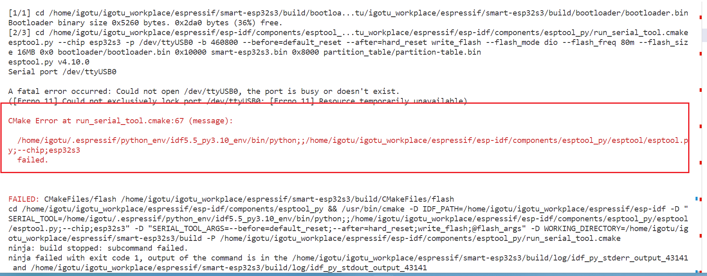
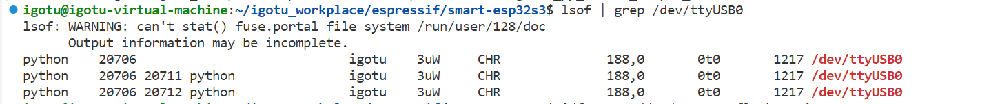

# ESP 开发问题记录
## 2025-08-18
### 快速开始
这里主要是环境的搭建更新、快速上手例程的编译烧录验证、板级支持包使用和一些常见问题的解决，具体参考乐鑫官方的文档就好了
- 参考资料
    - [快速开始](https://docs.espressif.com/projects/esp-idf/zh_CN/v5.5.1/esp32s3/get-started/index.html)    

## 2025-09-04
### 按键
- GPIO的基本使用    
## 2025-09-08
### IMU
## 2025-09-12
### SDCARD
## 2025-09-16
### IO-EXPANDER
## 2025-09-19
### LCD
## 2025-09-19
### CAMERA
## 2025-09-22
### TOUCH
## 2025-10-06
### AUDIO
## 2025-10-09
### LVGL

## 杂项
### 串口占用问题
由于我在另一个终端开启串口看日志，导致本终端无法正常使用串口下载，出现如下的日志

可以使用`lsof | grep /dev/ttyUSB0`来进行查看占用情况，
   
最后在开始串口日志的终端关闭使用就好了