# 开发问题记录
## 2025-02-12
### 内存分区表问题

```
File bootloader.bin size 417296(0x65e10) is bigger than partition size 413696(0x65000)!
```    
需要去dts，对应的flash进行修改       
   
```dts
# 分区表寄存器 = <起始地址，块大小>
part1-reg = <0x0 0x66000>;
part2-reg = <0x66000 0x33000>;    
part3-reg = <0x99000 0x756000>;  
part4-reg = <0x7ef000 0x20000>;  
```
解决方法：更改合适的块起始位置
### HCProgrammer 烧录问题
- 烧录软件的问题：后台进程关不掉
- 固件的DDR问题   
解决方法：目前只有重启解决了
### 编译问题
- 配置不对，导致头文件多包含或则少含    
解决方法：检查配置，只选择项目需要的配置
## 2025-02-13
### 给老Hichip的SDK打补丁，通过BeyondCompare进行比较合并
- 补丁工具和资料：
	- `20250213\WinSCP-6.1.2-Portable.zip`
	- `20250213\海奇补丁获取.pdf`
### 杰里蓝牙烧录
- 烧录工具和资料:
	- `固件升级程序.zip`  
- 按照文档，在`data/config.ini`中修改：    
	``` ini
	[Firmware]
	value = your.fw
	```
`your.fw` 是要烧录升级的固件运行`data/make-package.bat`，打开`固件升级程序_包含固件.exe`
## 2025-02-14
美拍项目**hcscreen** 应用源码阅读，应用对比
### 应用基本配置
- `configs/hichip_hc16xx_db_c3100_v20_projector_hc_bt_bl_defconfig`
- `configs/hichip_hc16xx_db_c3100_v20_projector_hc_bt_defconfig`
### logo, ui, icon比较更改:
- `components/applications/apps-hcscreen/source/hcscreen_app/ui_rsc*`    
- `components/applications/apps-hcscreen/app-hcscreen.mk`
	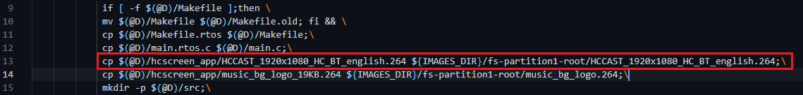    
- `apps-hcscreen/source/com_api.h`    
	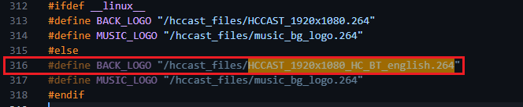
### 屏幕显示驱动比较更改
- `board/hc16xx/common/dts/lcd/lcd_mipi_720_1280_rgb888.dtsi`
- `board/hc16xx/common/dts/hc16xx-db-c3100-v20.dts `  
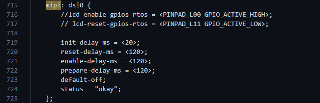         
参考文档：     
	`《hcrtos_lcd_user_guide.pdf》、《hichip_display_tool_ueser_guide.pdf》`
## 2025-02-15
美拍项目**hcscreen** 应用源码阅读，应用对比
### 屏幕分辨率问题
- 蓝牙图层偏移
	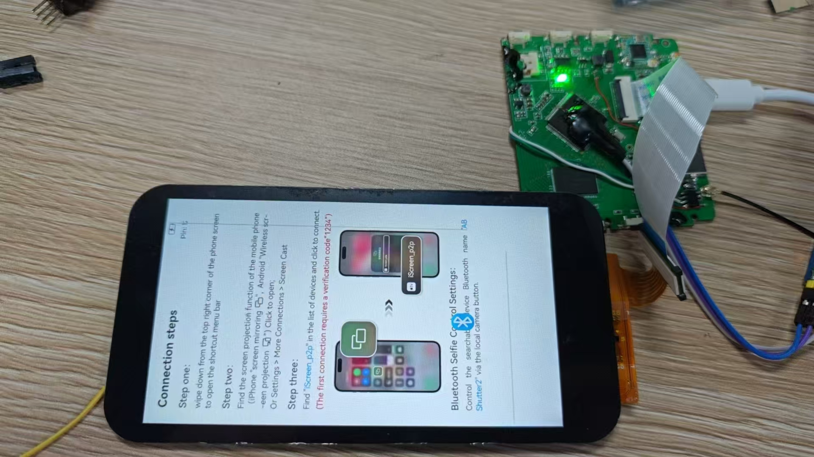
- 屏幕有灰线
	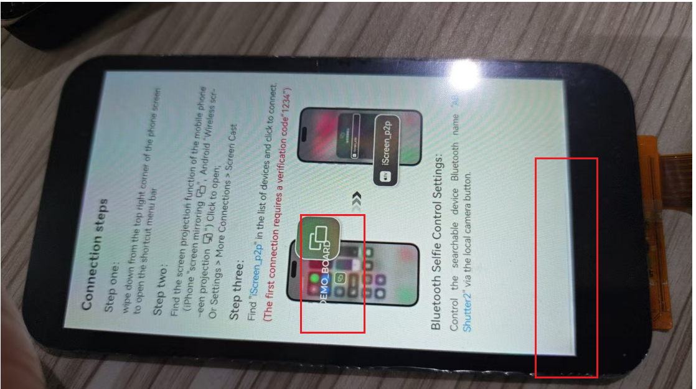
#### 解决方法
- 在**com_api.h**中，有屏幕的分辨率
```c
#define OSD_MAX_WIDTH   720
#define OSD_MAX_HEIGHT  1280
```
- 在**lvgl**的配置中也需要修改
	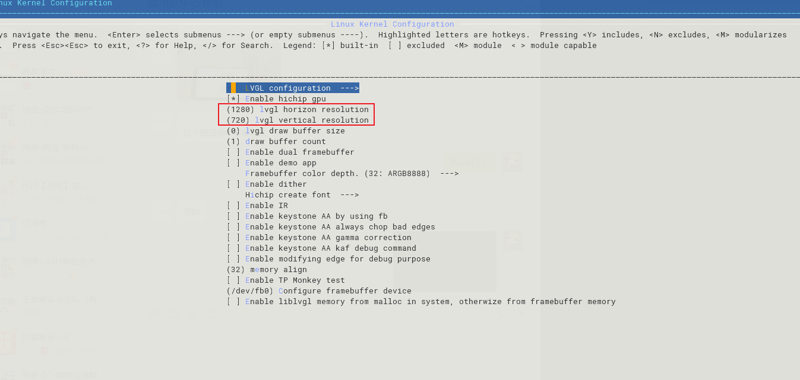  

```bash
# 执行命令
make liblvgl-menuconfig 
make liblvgl-rebuild all     
```
也可以在`components/liblvgl/liblvgl.config`中修改    
```c
CONFIG_LV_HC_SCREEN_HOR_RES=800
CONFIG_LV_HC_SCREEN_VER_RES=1280 
```
### 显示旋转方向修改比较修改
```dts
fb0 {
	bits_per_pixel = <32>;
	xres = <720>;
	yres = <1280>;
	xres_virtual = <720>;
	yres_virtual = <1280>;
	xoffset = <0>;
	yoffset = <0>;

	scale = <720 1280 1080 1920>;

	reg = <CONFIG_FB0_REG 0x1000>;
	/*
	* frame buffer memory from:
	* system : malloc buffer from system heap
	* mmz0   : malloc buffer from mmz0
	* static : use CONFIG_FRAMEBUFFER_STATIC_PHYS and CONFIG_FRAMEBUFFER_STATIC_MEM_SIZE to allocate memory staticly.
	* none   : set buffer by user
	* default is system if the property is missing
	*/
	buffer-source = "system";
	extra-buffer-size = <0x9CA000>;

	buffer-phy-static = <CONFIG_FRAMEBUFFER_STATIC_PHYS CONFIG_FRAMEBUFFER_STATIC_MEM_SIZE>;
	status = "okay";
};

boot-fb0 {
	bits_per_pixel = <32>;
	xres = <720>;
	yres = <1280>;
	xres_virtual = <720>;
	yres_virtual = <1280>;
	xoffset = <0>;
	yoffset = <0>;

	scale = <720 1280 1080 1920>;

	reg = <CONFIG_FB0_REG 0x1000>;
	/*
		* frame buffer memory from:
		* system : malloc buffer from system heap
		* mmz0   : malloc buffer from mmz0
		* none   : set buffer by user
		* default is system if the property is missing
		*/
	buffer-source = "system";
	extra-buffer-size = <0>;

	status = "okay";
};

fb1 {
	reg = <CONFIG_FB1_REG 0x1000>;
	bits_per_pixel = <8>;
	xres = <1280>;
	yres = <720>;
	xres_virtual = <1280>;
	yres_virtual = <720>;
	xoffset = <0>;
	yoffset = <0>;

	scale = <1280 720 1920 1080>;

	/*
	* frame buffer memory from:
	* system : malloc buffer from system heap
	* mmz0   : malloc buffer from mmz0
	* none   : set buffer by user
	* default is system if the property is missing
	*/
	buffer-source = "system";
	pre-multiply = <0>;
	extra-buffer-size = <0>;
	status = "disabled";
};

rotate {
	/*
	* anticlockwise,
	* support 0/90/180/270 degree.
	*/
	rotate = <0>;

	/*
	* value is 0 or 1, support fliping may use more fb memory
	* flip_support = 1, support fb fliped
	*/
	flip_support = <0>;

	/*
	* value is 0 or 1
	* h_flip = 1 is horizontally fliped
	* v_flip = 1 is vertically fliped
	*/
	h_flip = <0>;
	v_flip = <0>;

	status = "okay";
};
```
### 镜像旋转问题修改
1. 在`com_api.c`的`api_transfer_rotate_mode_for_screen`的函数中
	```C
	if (init_rotate == 0 || init_rotate == 180)
	{
		h_flip = *p_h_flip;
		v_flip = *p_v_flip;
	}
	else
	{
		h_flip = *p_v_flip;
		v_flip = *p_h_flip;
	}
	```
2. 在`com_api.c`的`api_get_screen_init_rotate`的函数中
	```c
	uint16_t api_get_screen_init_rotate(void)
	{
		screen_init_rotate = 270;
		return screen_init_rotate;
	}
	```
## 2025-02-20
### 美拍项目修改ADC检测电压值和显示问题
```C
typedef enum
{
	PM_BATTERY_LEVEL_INITVAL = 0,
	PM_BATTERY_LEVEL_NOT = 1,                   // capacity <= 3%
	PM_BATTERY_LEVEL_3 = 1100,                  // capacity <= 3%          3.2V
	PM_BATTERY_LEVEL_25 = 1150,                 // 3% < capacity <= 25%    3.4V
	PM_BATTERY_LEVEL_50 = 1200,                 // 25% < capacity <= 50%   3.6V
	PM_BATTERY_LEVEL_75 = 1250,                 // 50% < capacity <= 75%   3.8V
	PM_BATTERY_LEVEL_100 = 1300,                // capacity >= 75%         4.0V
	PM_BATTERY_LEVEL_CHARGING_FULL = 1400,      // not fully charged state 4.2V
	PM_IN_NOR_CHARGING_STATE = 65531,           // charging state
	PM_IN_CHARGING_STATE = 65532,               // charging state
	PM_NOT_FULL_CHARGED_STATE = 65533,          // not fully charged state
	PM_IN_CHARGING_CHARGING_FULL = 65534,
}pmu_state;
```
* ADC值检测计算方式如下：
	假设电池慢电电压4.2V，低电电压3.2V，靠地电阻是10KΩ，上拉电阻20KΩ     
	- 满电时：4.2V X 10KΩ / 30KΩ = 1400   
	- 低电时：3.3V X 10KΩ / 30KΩ = 1100 

## 2025-02-24
### 尝试编写电池管理系统
在原先的APP下添加 `pmu.c/.h`、`lv_battery_show.c`，修改`win_cast_airp2p.c`、`hc16xx-db-c3100-v20.dts`、`hc_control.c`
- 电压检测原理图    
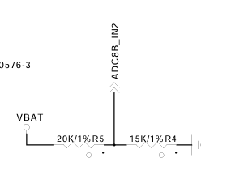
- adc检测电压部分，参考文档 `HCCHIP ADC开发文档5.0.pdf`   
1. `dts`设备树配置部分
	```dts
	// 使用adc通道2进行检测
	queryadc2 {
		devpath = "/dev/queryadc2";
		status = "okay";
	};
	```
2. `Menuoncfig`配置
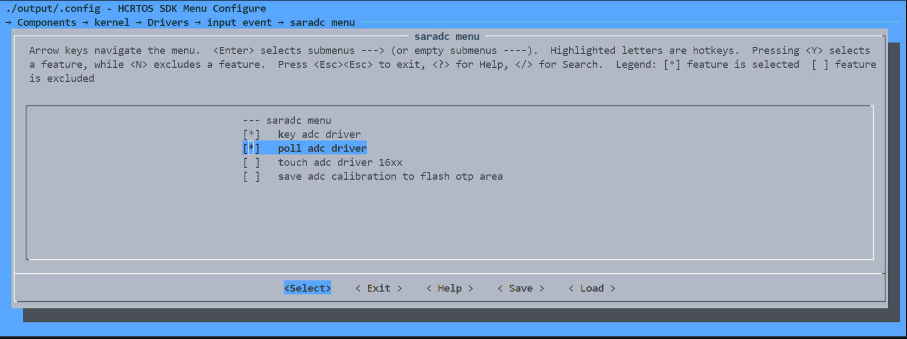    
选中 `poll adc driver`，保存配置，在 `Terminal` 执行
	```bash
	make kernel-rebuild all 
	```
3. 创建电池检测任务
	- 在`pmu.c/.h`中见`int pmu_init(void);` 和 `static void* hc_battery_check_task(void * arg)`
4. adc检测驱动和电压值换算
	```C
	int get_adc_battery_level(void)
	{
		/* adc original value */
		unsigned char adc1_val = 1;
		/* adc after calculated value */
		int battery_check_val = 0;
		/* device file descriptor */
		static int adc_fd1 = -1;

		if (adc_fd1 < 0)
		{
			adc_fd1 = open("/dev/queryadc2", O_RDONLY);
			if (adc_fd1 < 0)
			{
				printf("can't open device %s %d\n", __func__, __LINE__);
				return -1;
			}
		}
		/* reading adc val */
		if (read(adc_fd1, &adc1_val, 1) == -1)
		{
			return -1;
		}

		battery_check_val = adc1_val * 2000 / 255;

		return battery_check_val;
	}
	```
2. lvgl电池图标部分
	1. 图片转 `.c` 文件，使用lvgl官网的 `Image Converter`
	2. 创建电源显示函数   
		- 在 `lv_battery_show.c` 中间 `void lv_battery_show(void)` ，注意待机情况和事件调用
3. 主界面部分
	1. 添加标志位
		- 在 `static int win_cast_airp2p_open(void *arg)` 中添加，`lv_obj_clear_flag(power_label, LV_OBJ_FLAG_HIDDEN);` 将电源标签的图片显示
		- 在 `static int win_cast_airp2p_close(void *arg)` 中添加，`lv_obj_add_flag(power_label, LV_OBJ_FLAG_HIDDEN);` 将电源标签的图片隐藏
	2. 进程管理部分
		- 在 `static win_ctl_result_t win_cast_airp2p_msg_proc(void *arg1, void *arg2)` 的`switchcase` 中添加
		```C
			case MSG_TYPE_PM_BATTERY_MONITOR:
			if(power_label)
				lv_event_send(power_label, LV_EVENT_REFRESH, NULL);
			break;
		```
## 2025-02-25
### 更换logo和背景图片
- 关于logo文件的说明   
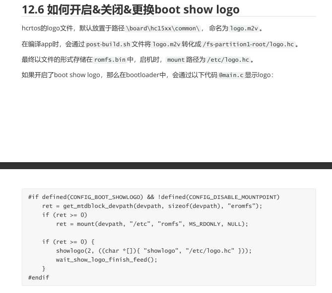
1. 使用 `ffmpeg` 对图片等文件进行格式转换
	- 将图片文件转换为`.264`文件
		```cmd
		ffmpeg.exe -i ".\test.jpg" -vf "scale=out_color_matrix=bt709:flags=full_chroma_int+accurate_rnd,format=yuv420p" -c:v libx264 -profile:v high -x264-params ref=1 -b:v 4000k -f rawvideo logo.264
		```
	- 将`.264`文件转换为图片文件      
		```cmd
		ffmpeg -i picture\to\input.264 -vsync vfr -s 1920x1080 -q:v 2 \picture\to\output.png
		```
		- `-i picture\to\input.264` 指定输入文件
		- `-vsync vfr` 使用可变帧率同步
		- `-s 1920x1080` 设置输出图像分辨率
		- `-q:v 2` 设置输出图像的质量，值越低质量越高
		- `\picture\to\output.png` 图像输出，可以是不同类型的后缀
	- 将图像文件转换为`.m2v`文件
		```cmd
		ffmpeg -f image2 -i logo.bmp -q 1 -r 25 logo.m2v
		```
	- 将```.m2v```文件转换为图像
		```cmd
		ffmpeg -i input.m2v -vf "select=eq(n\,0)" -vframes 1 output.bmp
		```
		- 其中遇到一个问题 `Failed to read PNG signature: file does not start with PNG signature`  
		解决方法： 现图片后缀为 `.png` ，原来图片的后缀不是 `.png` 而是 `.jpg` 或者其他
2. 修改相关配置和一些代码声明
	- 把需要更换的一帧的logo图片 `.m2v` 放入 `board\hc16xx\common` 下，  
	修改 `configs/*defconfig` 中的 `BR2_EXTERNAL_BOOTMEDIA_FILE="${TOPDIR}/board/hc16xx/common/logo.m2v"`
	- 把需要跟换的应用图片 `.264` 放入 `components\applications\apps-hcscreen\source\hcscreen_app`中    
	修改 `components/applications/apps-hcscreen/apps-hcscreen.mk`中   
	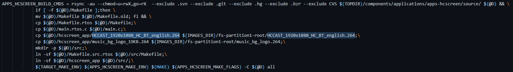    
	修改 `components/applications/apps-hcscreen/source/hcscreen_app/com_api.h` 中图片的定义   
	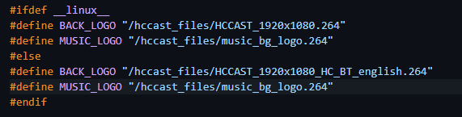
3. 每次修改更换图片都要执行
	```bash
	make O=output-bl all
	make all
	```
4. 一定要注意图片大小的问题
## 2025-02-26
### 电源续航，休眠问题
### 尝试实现adc按键控制
- ADC按键原理图    
	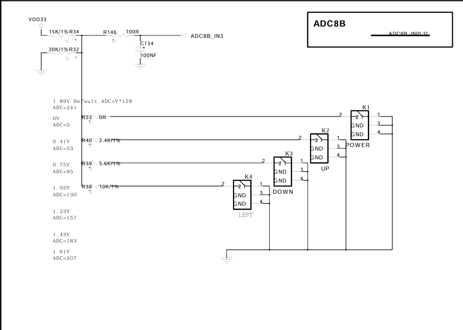
1. `dts`设备树配置部分
	```dts
	key-adc@3 {
		status = "okay";
		adc_ref_voltage = <1890>; 	// range:0-2000mV
		key-num = <4>;
		/* key_map = <voltage_min voltage_max, code> */
		key-map = <0 200 116>,    	// KEY_POWER
				<201 550 103>,		// KEY_UP
				<551 850 108>,		// KEY_DOWN
				<851 1120 105>;		// KEY_LEFT
	};
	```
	- 根据原理图，ADC按键使用的是通道3
	- ADC按键电压的范围设置方式：可根据原理图设计电压，
	比如A键=$800ｍV$、B键=$1200ｍV$、C键=$1500ｍV$；    
	可将B范围设置为 $((800+1200)/2, (1200+1500)/2)$   
	即与相邻按键相加除以２   
	即B键的范围 $(1000, 1350)$
	- ADC按键 `Code` 设置：   
	在 `components/kernel/source/include/uapi/hcuapi/input-event-codes.h` 中有相应的按键动作声明
2. `defconfig`配置   
	   
	选中 `poll adc driver`，保存配置，在 `Terminal` 执行    
	```bash
	make kernel-rebuild all 
	```
3. 串口终端测试
	- `defconfig`配置
	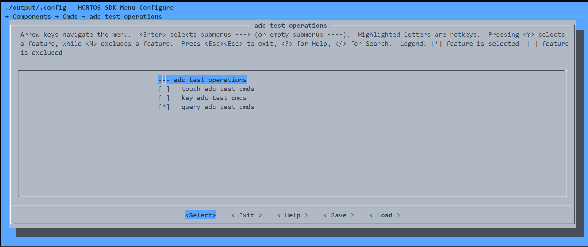    
	配置完成后需要执行
	```bash
	make cmds-rebuild all 
	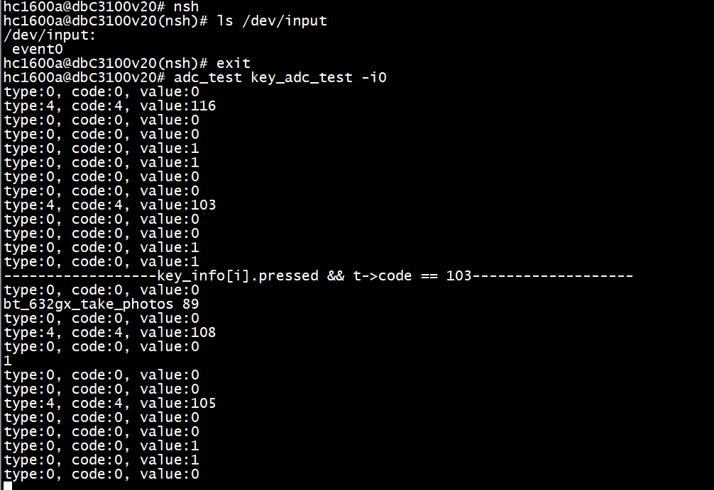
	```
4. 根据原理图编写代码
	- 见`adc_key.c\.h`, 注意按键逻辑，按下、释放、和长按
## 2025-03-01
### 实现按键背光   
- 屏幕背光原理图    
	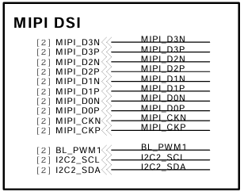    
	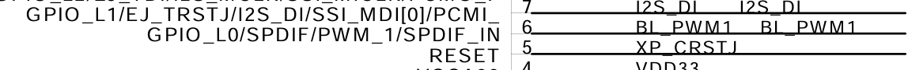
- 参考文档     
	`《HCRTOS_SDK_pwm_userguide.pdf》和《hcrtos_lcd_user_guide.pdf》`   
1. `dts` 设备树配置部分
	- `pwm` 部分
		```dts
		pwm@0 {
			/* pinmux-active = <gpio gpio_function_code> */
			pinmux-active = <PINPAD_L00 4>;
			devpath = "/dev/pwm0";
			polarity = <0>;
			status = "okay";
		};
		```
		其中引脚配置功能可以查看`components/kernel/source/include/uapi/hcuapi/pinmux/hc16xx_pinmux.h`
	- `backlight` 部分
		```dts
		backlight {
			backlight-frequency = <10000>;
			backlight-pwmdev = "/dev/pwm0";
			brightness-levels = <0 25 50 75 100>;
			default-brightness-level = <3>;
			default-off;
			status = "okay";
		};
2. `Menuconfig` 的配置
	- 配置 `bootloader` 的背光
	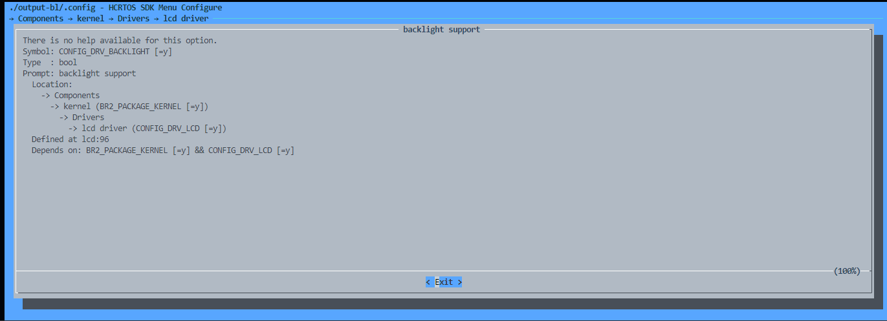
	- 配置主应用程序的背光
	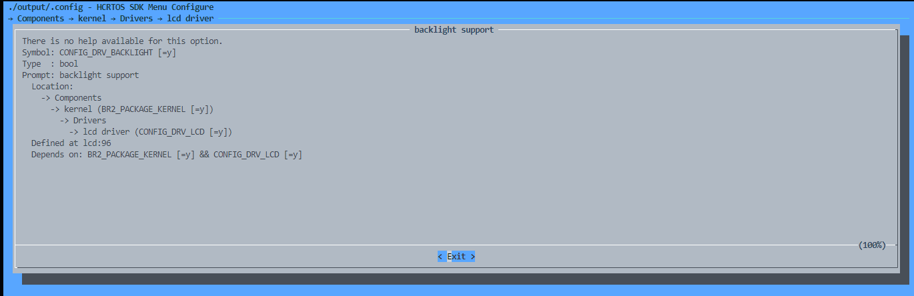
3. 代码实现，编写 `adc_key_backlight.c`、修改`adc_key_control.c\.h`、`data_mgr.c\.h`
## 2025-03-03
### 实现按键开关屏和休眠
- 参考文档
	`《HCRTOS standby驱动使用说明文档.pdf、《hcrtos_lcd_user_guide.pdf》、《HCRTOS_SDK_pwm_userguide.pdf》`
1. `dts` 设备树配置部分
	```dts
	standby {
		/* adc key val */
		adc = <3 0 200>;  	 
	};
	key-adc@3 {
		status = "okay";
		adc_ref_voltage = <1890>; //range:0-2000mV
		key-num = <4>;
		/*key_map = <voltage_min voltage_max, code>*/
		key-map = <0 200 116>, // KEY_POWER
				<201 550 103>,
				<551 850 108>,
				<851 1120 105>;
	};
2. `defconfig`配置
	- 配置主应用程序的休眠
		
	- 配置 `bootloader` 的休眠
		
3. 代码实现，编写 `adc_key_standby.c`
## 2025-03-04
### 实现无线同屏
- 参考文档
`《HCRTOS_user_manual_new.pdf》`
1. 代码修改
	- 更换名字
		```C
		/* data_mgr.c */
		char* data_mgr_get_device_name_custom(void)
		{
			return "iScreen_p2p";
		}
		/* cast_api.c */
		int hccast_mira_callback_func(hccast_mira_event_e event, void* in, void* out)
		{
			...
			str_tmp = data_mgr_get_device_name_custom(); 
			...
		}
		int hccast_air_callback_event(hccast_air_event_e event, void* in, void* out)
		{
			...
			sprintf((char *)in, "%s", data_mgr_get_device_name_custom());
			...
		}
		```
	- 显示设置，显示比例不对有可能是显示方向造成的
		```C
		/* com_api.c */
		uint16_t api_get_screen_init_rotate(void)
		{
			screen_init_rotate = 270;
			return screen_init_rotate;
		}
		```
### 实现蓝牙连接、连接动画和蓝牙拍照
- 参考文档
	`《HCRTOS_user_manual_new.pdf》、《HCRTOS SDK uart userguide》`
- 原理图
	
1. `dts` 设备树配置部分
	```dts
	uart@1 {
		pinmux-active = <PINPAD_L17 2 PINPAD_L18 2>;
		devpath = "/dev/uart1";
		status = "okay";
	};
	uart@3 {
		pinmux-active = <PINPAD_L12 4 PINPAD_L13 4>;
		devpath = "/dev/uart3";
		status = "okay";
	};
	stdio { 
		serial0 = "/hcrtos/uart@3";
	};
	boot-stdio {
		serial0 = "/hcrtos/uart@3";
	};
2. 代码实现，编写 `ble.c\.h、lv_ble_show.c、`，修改`win_cast_airp2p.c、adc_key_control.c`
## 2025-03-18
### 美拍项目开关电路的软件实现
- 参考文档
	`《HCRTOS key-gpio userguide.pdf》、《HCRTOS standby驱动使用说明文档.pdf》`
- 原理图
	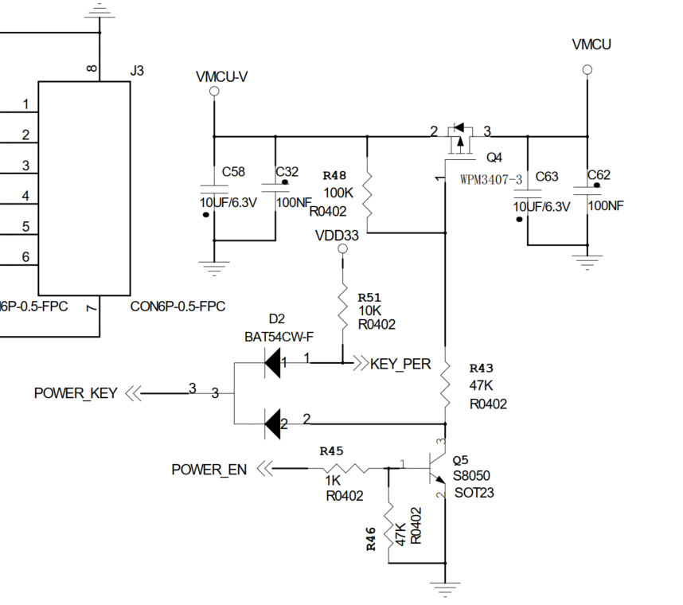
1. `dts` 设备树配置部分
	```dts
	gpio_key {
		status = "okay";
		pinmux-active = <PINPAD_L16 0>;
		debounce = <20>;   /* ms */
		key-num = <1>;
		/*gpio valid_status key_value*/
		gpio-key-map = <PINPAD_L16 GPIO_ACTIVE_LOW 116>;
	};
	gpio-out-def {
		gpio-group = <PINPAD_L15 GPIO_ACTIVE_HIGH>;
		status = "okay";
	};
2. `defconfig`配置
	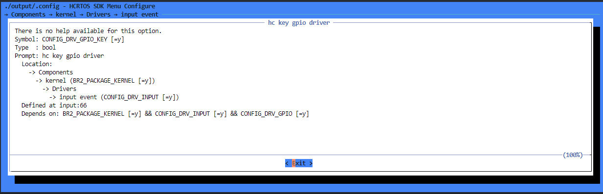
3. 代码实现，修改`key_standby.c、key_control.c`
**注意IO口是否被复用或者占用导致配置失效的问题，配置完设备树之后需要在代码对应的地方添加按键输入事件**

## 2025-04-28
### EC11系列旋钮配置和驱动问题
1. `dts`设备树配置部分
	```dts
	/* rotary key detection */ 
	ec1106s:ec1106s@0 {
		compatible = "hichip,ec1106s";
		gpio-input-a = <PINPAD_B01 GPIO_ACTIVE_HIGH>;
		gpio-input-b = <PINPAD_L10 GPIO_ACTIVE_HIGH>;
		status = "okay";
	};
	- 注意对应的GPIO配置和书写
2. 在`components/kernel/source/drivers/input/rotary_key/es1106s/es1106s.c`中存在一处错误，源码中GPIO配置应该是上边缘或者下边缘触发
	```c
	static int ec1106s_probe(const char* node)
	{
		···
		gpio_configure(ec1106s->input_b, GPIO_DIR_INPUT);
		gpio_configure(ec1106s->input_a, GPIO_DIR_INPUT | GPIO_IRQ_RISING | GPIO_IRQ_FALLING);
		gpio_irq_disable(ec1106s->input_a);
		···
	}
	```
3. `defconfig`配置
	
	该配置可以在`defconifg`中打开相关的宏
4. 代码实现，由于海奇平台适配了`EC11`系列的编码器驱动，只需要注意他们只支持左右即`KEY_LEFT和KEY_RIGHT`，所以按键代码位105和106
## 2025-05-07
### ACM8623功放配置和驱动问题
- 原理图

- 参考文档
	`《audio.pdf》、《HICHIP EC1106S旋转编码器使用说明文档.pdf》、《ACM8623_Datasheet_v1p0.pdf》`      
1. `dts` 设备树配置
	```dts
	i2c@0 {
		pinmux-active = <PINPAD_L17 1 PINPAD_L18 1>;
		devpath = "/dev/i2c0";
		status = "okay";
		baudrate = <100000>;
		mode = "master";
	};
	i2s {
		pinmux-clock = <PINPAD_L02 2 PINPAD_L03 2 PINPAD_L04 2>;
		status = "okay";
		ejtag = "disabled";
		format = "i2s";//lj, rj16, rj24
	};
	acm8623 {
		i2c-devpath = "/dev/i2c0";
		status = "okay";
	};
	i2so {
		pinmux-data = <PINPAD_L05 2>;
		volume = <255>;
		status = "okay";
	};
	```
注意引脚复用问题，对应原理图`i2c、i2s`的接口，根据数据手册需要把功放IC对应的`PDN`引脚拉高，注意`ADR`引脚的上拉电阻和对应的IIC器件地址     
**使用IIC操作对应的器件时，一定要注意器件的IIC地址是7位的还是8位的**
2. `defconfig`配置
- `IIC`配置
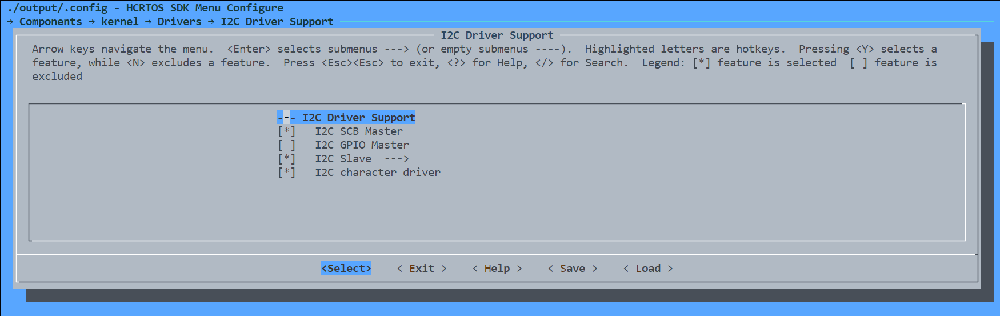
3. 代码实现，驱动层编写`acm8623-dai.c`，修改`i2so_platform_reg.c、Makefile、avinit.c、avinit.h、snd.h`对应的申明和模块注册，应用层修改`data_mgr.c、data_mgr.c、com_api.c/.h`，详细的查看代码，下面列重点    
	- 驱动层
		```c
		// 这个函数主要是解析设备树对应的参数的
		int acm8623_dai_init(void)
		{
			int np;
			const char* status;
			np = fdt_node_probe_by_path("/hcrtos/acm8623");
			if (np < 0)
			{
				return 0;
			}
			if (fdt_get_property_string_index(np, "i2c-devpath", 0, &dai_dev.i2c_dev))
			{
				return 0;
			}
			if (!fdt_get_property_string_index(np, "status", 0, &status) &&
				!strcmp(status, "disabled"))
			{
				return 0;
			}
			fdt_get_property_u_32_index(np, "slave-addr", 0, &i2c_slave_addr);
			snd_soc_register_dai(&acm8623_for_i2so_dai);
			return 0;
		}
		// 这个函数主要是向应用层提供ioctl接口的
		static int acm8623_dai_ioctl(struct snd_soc_dai* dai, unsigned int cmd, void* arg)
		{
			struct dai_device* dev = dai->priv;

			int fd = open(dev->i2c_dev, O_RDWR);
			if (fd < 0)
			{
				printf("[%s]: acm8623 i2c open error\n", __func__);
				return -1;
			}
			ioctl(fd, I2CIOC_TIMEOUT, 100);
			// cmd 命令为宏定义，需要在海奇平台对应的snd框架声明
			switch (cmd)
			{
			case SND_IOCTL_SET_ACM8623_SET_VOLUME:
			{
				int vol = *(int*)arg;
				if (vol < 0)
				{
					vol = 0;
				}
				else if (vol > 16)
				{
					vol = 16;
				}
				acm8623_Write_Reg(fd, 0x00, 0x05);
				acm8623_Write_Reg(fd, 0xc0, ACM86xxVolTable[4 * (16 - vol) + 0]);
				acm8623_Write_Reg(fd, 0xc1, ACM86xxVolTable[4 * (16 - vol) + 1]);
				acm8623_Write_Reg(fd, 0xc2, ACM86xxVolTable[4 * (16 - vol) + 2]);
				acm8623_Write_Reg(fd, 0xc3, ACM86xxVolTable[4 * (16 - vol) + 3]);
				acm8623_Write_Reg(fd, 0xc4, ACM86xxVolTable[4 * (16 - vol) + 0]);
				acm8623_Write_Reg(fd, 0xc5, ACM86xxVolTable[4 * (16 - vol) + 1]);
				acm8623_Write_Reg(fd, 0xc6, ACM86xxVolTable[4 * (16 - vol) + 2]);
				acm8623_Write_Reg(fd, 0xc7, ACM86xxVolTable[4 * (16 - vol) + 3]);
				break;
			}
			case SND_IOCTL_SET_ACM8623_SET_MUTE:
			{
				int	mute = *(int*)arg;
				if (mute)
				{
					acm8623_Write_Reg(fd, 0x00, 0x00);
					acm8623_Write_Reg(fd, 0x04, 0x0e);
				}
				else
				{
					acm8623_Write_Reg(fd, 0x00, 0x00);
					acm8623_Write_Reg(fd, 0x04, 0x03);
				}
				break;
			}
			default:
				break;
			}

			return 0;
		}
	- 应用层：  
		```c
		void api_set_volume(int vol)
		{
			if (vol > 15)
			{
				vol = 15;
			}
			else if (vol < 1)
			{
				vol = 0;
			}
			int snd_fd = open("/dev/sndC0i2so", O_WRONLY);
			if (snd_fd < 0)
			{
				printf("[%s]: open acm8623 /dev/sndC0i2so fail", __func__);
				return;
			}
			// 打开设备，然后使用ioctl发送命令
			ioctl(snd_fd, SND_IOCTL_SET_ACM8623_SET_VOLUME, &vol);
			close(snd_fd);
			data_mgr_volume_set(vol);
		}
### `switch-case`语句语法问题
这里出现一个语法错误`a label can only be part of a statement and a declaration is not a statement`，由于switch的几个case语句在同一个作用域（因为case语句只是标签，它们共属于一个swtich语句块），所以如果在某个case下面声明变量的话，对象的作用域是在俩个花括号之间 也就是整个switch语句，其他的case语句也能看到，这样的话就可能导致错误
#### 解决方案
我们可以通过在case后面的语句加上大括号处理，之所以加大括号就是为了明确我们声明的变量的作用域，就是仅仅在本case之中，其实为了更规范的写`switch-case`语句，我们应该在case语句后边加大括号。在case语句后加一个分号也可以解决问题
## 2025-05-18
### USB有线同屏配置和代码实现（没写完）
- 原理图
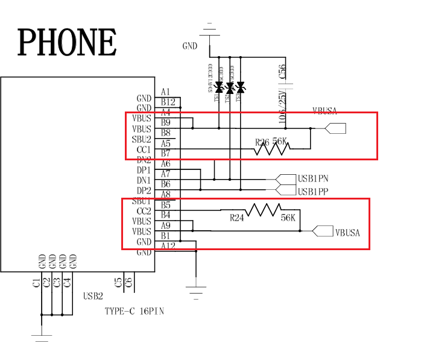
1. `dts` 设备树配置
	```dts
	usb0 {  // usb_host0 / usb_peripheral0
		reg = <0x18844000 0x1000>;
		interrupts = <53>,<52>;
		interrupt-names = "mc","dma";
		dr_mode = "host";  // host/peripheral
		index_num = <0>;
		ctrl_base = <0x18800000>;
		status = "okay";
	};
	usb1 {  // usb_host1/ usb_peripheral1
		reg = <0x18850000 0x1000>;
		interrupts = <51>, <50>;
		interrupt-names = "mc", "dma";
		dr_mode = "host";
		index_num = <1>;
		ctrl_base = <0x18800000>;
		status = "okay";
	};
2. `defconfig`配置
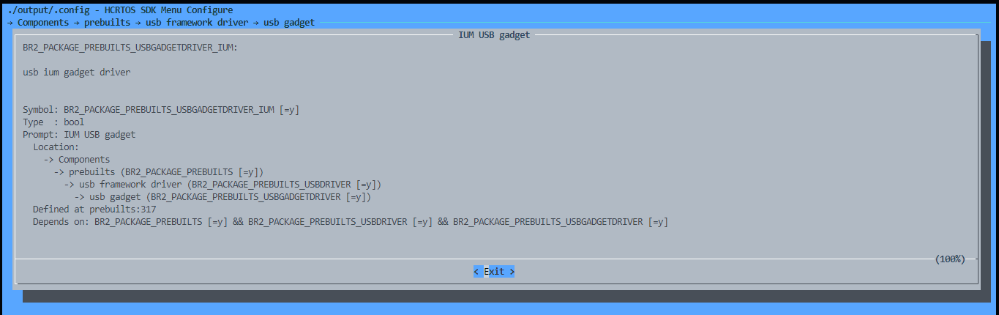
3. 代码实现，具体参照`hcusbcast`和`hcscreenhybrid`的应用，其中有有线和无线同屏的应用功能，一下是需要注意的代码段
	- `cast_api.c\.h`

## 2025-05-22
### 板子手动配网 （没写完）
- 参考文档
	`《hcrtos_wifi_user_guide.pdf》、《HCRTOS_user_manual_new.pdf》、《wifi_iperf测速使用说明文档.pdf》`  
1. `defconfig`配置
	```defconfig
	-------- bootloader --------
	BR2_EXTERNAL_FW_COMPRESS_GZIP=y
	BR2_EXTERNAL_FW_COMPRESS_LZMA=y
	CONFIG_LIB_LZMA=y
	-------- applications --------
	BR2_EXTERNAL_FW_COMPRESS_LZMA=y
	BR2_PACKAGE_PREBUILTS_RTL8733BU=y
	BR2_PACKAGE_PREBUILTS_WPA_SUPPLICANT=y
	BR2_PACKAGE_PREBUILTS_WIFI_WIRELESS_TOOLS=y
	CONFIG_LIB_LZMA=y
	CONFIG_NET=y
	CONFIG_NET_LWIP_SACK=y
	CONFIG_NET_LWIP_SACK_2_1_2=y
	```
2. 串口配网操作基本步骤
	1. 进入`wifi`视角
	2. 在`wifi`视角下，使用`wpa_supplicant`通过配置文件连接受保护的网络
		- 执行`wpa_supplicant`时遇到`EAP`被占用或者相同，可能已经配置过了
		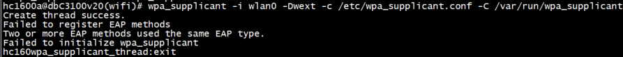