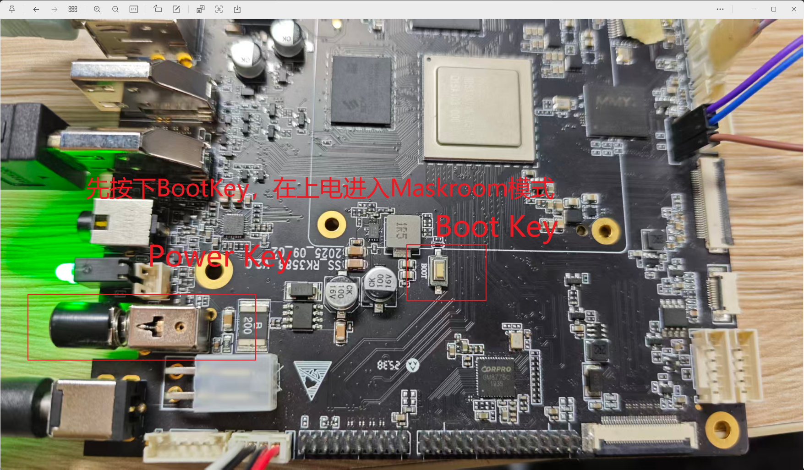

# RK3588 Android 
## 编译
### 全自动编译
1. 选择配置
    ```bash 
    source build/envsetup.sh
    lunch rk3588s_userdebug
    ```
2. 全部编译
    ```bash
    ./build.sh -AUCKuV [Version]
    ```
3. 局部编译
    - android 编译
        ```bash
        ./build.sh -A 
        ```
    - kernel 编译
        ```bash
        ./build.sh -K
        ```
    - uboot 编译
        ```bash
        ./build.sh -U
        # 或者
        cd u-boot
        ./make.sh rk3588
        ```
    - 打包
        ```bash
        ./build.sh -u
        ```
## 烧写工具
- window下使用`"<SDK>\RKTools\windows\RKDevTool_v3.19_for_window\RKDevTool.exe"`进行升级
    - 正常情况下
    识别到adb设备之后可以在`RKDevTool.exe`切换到`loader`模式进行升级，也可以串口进入终端切换模式进行升级
    - 异常状况下
    按住板载`boot`键，按下电源开关进入`maskroom`模式进行全片升级 
    
- SD升级启动使用`"<SDK>\RKTools\windows\SDDiskTool_v1.76\SD_Firmware_Tool.exe"`制作SD卡镜像
- 写号工具使用`RKTools\windows\RKDevInfoWriteTool_Setup_V1.0.3.rar`   