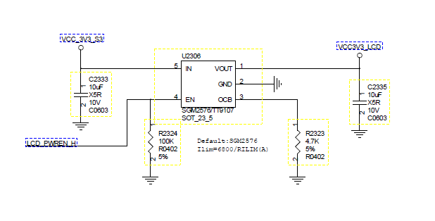
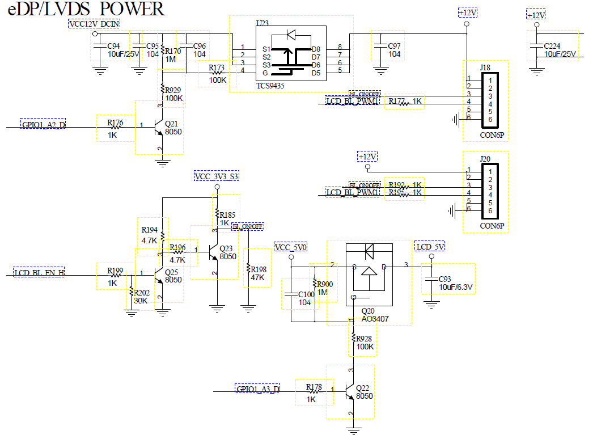
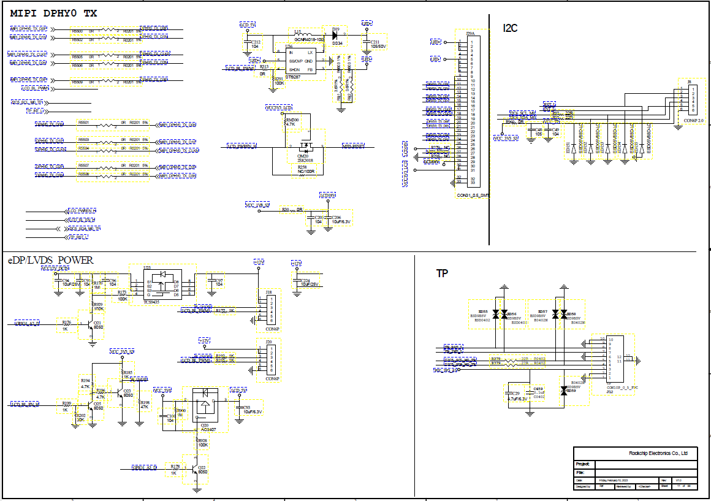
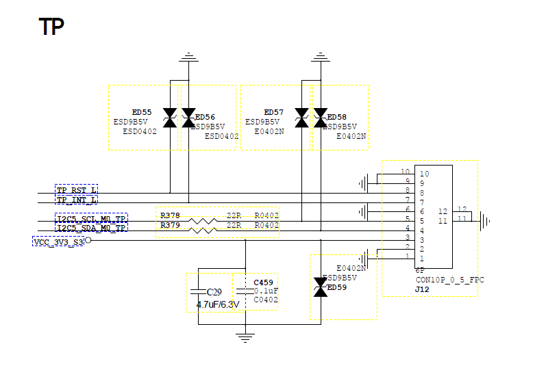

# Rockchip - Android 开发问题记录
## 2025-11-19
板子型号SS-RK3588-V2.0，调试驱动，使用android13系统
- device使用`rockchip_defconfig`
- kernel使用`rockchip_defconfig`
- dts使用`rk3588-evb7-lp4.dtsi`
### 调试屏幕
LCD屏幕一般调试流程：电源、背光、引脚、时序
#### 电源配置
`regulator` 框架是 Linux 内核中用于管理电压和电流调节器（如 LDO、DCDC 转换器等）的一个子系统。它提供了一个抽象层，使得驱动程序和内核的其他部分可以以一致的方式与调节器进行交互，而无需了解底层硬件的细节。
- 参考文档
    ```
    # regulator 的设备树参考文档
    kernel/Documentation/devicetree/bindings/regulator/fixed-regulator.yaml
    ```
- 原理图
    
    
1. `dts` 设备树配置部分 
    ```dts
    vcc12v_lcd_en: vcc12v-lcd-en {
        compatible = "regulator-fixed";
        # regulator-name 名称，用于用户空间识别
        regulator-name = "vcc12v_lcd";
        # 电压范围
        regulator-min-microvolt = <12000000>;
        regulator-max-microvolt = <12000000>;
        # gpio控制
        gpio = <&gpio1 RK_PA2 GPIO_ACTIVE_HIGH>;
        enable-active-high;
        # 系统启动时就开启此regulator
        regulator-boot-on;
        # 系统一直开启此regulator
        regulator-always-on;
        pinctrl-names = "default";
        pinctrl-0 = <&lcd_pwr_en>;
    };

    vcc5v0_lcd_en: vcc5v0-lcd-en { 
        compatible = "regulator-fixed";
        regulator-name = "vcc5v_lcd";
        regulator-min-microvolt = <5000000>;
        regulator-max-microvolt = <5000000>;
        gpio = <&gpio1 RK_PA3 GPIO_ACTIVE_HIGH>;
        vin-supply = <&vcc12v_lcd_en>;
        enable-active-high;
        regulator-boot-on;
        regulator-always-on;
        pinctrl-names = "default";
        pinctrl-0 = <&lcd_pwr_en>;
    };

    vcc3v3_lcd_en: vcc3v3-lcd-en {
        compatible = "regulator-fixed";
        regulator-name = "vcc3v3_en";
        regulator-min-microvolt = <3300000>; 
        regulator-max-microvolt = <3300000>;
        gpio = <&gpio2 RK_PC1 GPIO_ACTIVE_HIGH>;
        vin-supply = <&vcc5v0_lcd_en>;
        enable-active-high;
        regulator-boot-on;
        regulator-always-on;
        pinctrl-names = "default";
        pinctrl-0 = <&lcd_pwr_en>;
    };

    &pinctrl {
    lcd_pwr_en: lcd-pwr-en {
        rockchip,pins =
            <1 RK_PA2 RK_FUNC_GPIO &pcfg_pull_none>,   // vcc12v_lcd_en
            <1 RK_PA3 RK_FUNC_GPIO &pcfg_pull_none>,   // vcc5v0_lcd_en
            <2 RK_PC1 RK_FUNC_GPIO &pcfg_pull_none>;   // vcc3v3_lcd_en
        };
    };
    ```
2. 驱动代码位置`drivers/regulator/`
3. 功能验证
    - 查看regulator是否注册成功
        ```bash
        ls /sys/class/regulator/
        for r in /sys/class/regulator/regulator.*; do
            echo "$r: $(cat $r/name 2>/dev/null)"
        done
        ```
    - 根据原理图贴片图，万用表测量相应电源
#### 屏幕背光
- 参考文档
    ```
    《Rockchip_Developer_Guide_Linux_PWM_CN.pdf》
    Documentation/devicetree/bindings/pwm/pwm.txt
    ```
1. `dts` 设备树配置部分
    ```dts
    backlight: backlight {
        compatible = "pwm-backlight";
        pwms = <&pwm1 0 25000 0>;
        brightness-levels = <
              0  20  20  21  21  ... 254 255
        >;
        default-brightness-level = <100>;
        default-on;
        power-supply = <&vcc3v3_lcd_en>;
        pinctrl-names = "default";
        pinctrl-0 = <&pwm1m0_pins>;
    };

    &pwm1 {
        status = "okay";
    };
    ```
2. 驱动代码位置`drivers/pwm/pwm-rockchip.c`
3. 功能验证
    - 查看是否存在背光设备
        ```bash
        ls /sys/class/backlight/
        ```
    - 查看设备详细信息
        ```bash 
        cat /sys/class/backlight/backlight/
        actual_brightness     brightness max_brightness
        scale type bl_power device/
        power/ subsystem/ uevent
        ```
    - 查看pwm设备
        ```bash
        cat /sys/kernel/debug/pwm
        ```
    - 查看内核日志
        ```bash
        dmesg | grep pwm
        dmesg | grep backlight
        ```
#### MIPI屏
- 参考文档
    ```
    《Rockchip_RK3588_Developer_Guide_MIPI_DSI2_CN.pdf》
    ```   
- 原理图
    
1. `dts` 设备树配置部分
    ```dts
    &dsi0 {
        status = "okay";
            panel@0 {
                # 通用MIPI屏幕驱动
                compatible = "simple-panel-dsi";
                reg = <0>;
                backlight = <&backlight>;
                # 屏幕工作模式
                dsi,flags = <(MIPI_DSI_MODE_VIDEO | MIPI_DSI_MODE_VIDEO_BURST | 
                    MIPI_DSI_MODE_LPM | MIPI_DSI_MODE_EOT_PACKET)>;
                dsi,format = <MIPI_DSI_FMT_RGB888>;
                dsi,lanes = <4>;
                enable-delay-ms = <120>;  //after open backlight delay
                prepare-delay-ms = <120>;    //after enable delay
                # 释放复位信号之后等待120ms
                reset-delay-ms=<120>;
                unprepare-delay-ms = <120>;   //screen low power 
                disable-delay-ms = <120>;
                init-delay-ms = <300>;
                # 屏厂提供的初始化序列，根据对应的格式进行转化
                panel-init-sequence = [
                    39 00 04 FF 98 81 03
                    15 00 02 01 00
                    ......
                    39 00 04 FF 98 81 00
                    15 78 02 11 00
                    15 20 02 29 00
                    ];
                # 屏厂提供的屏参
                display-timings {
                    native-mode = <&timing0>;
                    timing0: timing0 {
                        clock-frequency = <66000000>;
                        hactive = <800>;
                        vactive = <1280>;
                        hback-porch = <18>;
                        hfront-porch = <18>;
                        vback-porch = <8>;
                        vfront-porch = <16>;
                        hsync-len = <18>;
                        vsync-len = <4>;
                        hsync-active = <0>;
                        vsync-active = <0>;
                        de-active = <0>;
                        pixelclk-active = <0>;	
                    };
                };
        };
    };

    &route_dsi0 {
        status = "okay";
        connect = <&vp3_out_dsi0>;
    };

    &dsi0_in_vp2 {
        status = "okay";
    };

    &dsi0_in_vp3 {
        status = "disabled";
    };

    &dsi0_panel {
        reset-gpios = <&gpio0 RK_PD3 GPIO_ACTIVE_LOW>;
        pinctrl-names = "default";
        pinctrl-0 = <&lcd_rst_gpio>;
    };

    ```
2. `menuconfig` 配置部分
    ```bash
    CONFIG_ROCKCHIP_DW_MIPI_DSI=y 
    ```
3. 驱动代码位置`drivers/gpu/drm/rockchip/dw-mipi-dsi2-rockchip.c`
4. dts的屏参部分需要通过平厂提供的参数进行配置
#### TP触摸
- 原理图
     
1. `dts` 设备树配置部分
    ```dts
    &i2c5 {
        status = "okay";
        pinctrl-names = "default";
        pinctrl-0 = <&i2c5m0_xfer>;
        clock-frequency = <400000>;
    
        gt9xx: gt9xx@5d{ 
            compatible = "goodix,gt9271";
            reg = <0x5d>;
            # 中断信号源
            interrupt-parent = <&gpio3>;
            # 低电平触发中断            
            interrupts = <RK_PC0 IRQ_TYPE_LEVEL_LOW>;
            pinctrl-names = "default";
            pinctrl-0 = <&touch_gpio>;
            goodix,rst-gpio = <&gpio3 RK_PC1 GPIO_ACTIVE_HIGH>;
            touch-gpio = <&gpio3 RK_PC0 IRQ_TYPE_LEVEL_LOW>;
            max-x = <800>;
            max-y = <1280>;
            # 坐标翻转
            touchscreen-inverted-x;
            touchscreen-inverted-y;
            status = "okay";
        };
    };
    ```
2. `menuconfig` 配置部分
    ```bash
    CONFIG_INPUT_TOUCHSCREEN=y
    CONFIG_TOUCHSCREEN_GOODIX=y
    ```
3. 驱动代码位置`drivers/input/touchscreen/goodix.c`
4. 功能验证
    - 查看总线上是否有设备
        ```bash\
        i2cdetect -y 5
        ```
    - 查看内核日志
        ```bash
        dmesg | grep goodix
        ```
    - 列出输入设备
        ```bash
        ls /dev/input/
        ```
## 2026-03-02
### 字体修改
[patch](20260302//0001-Increase-the-font-size.patch)
1. Settings 字体挡位 （用户可选范围）
    文件：`packages/apps/Settings/res/values/arrays.xml`
    作用：设置 App 字体大小页面的挡位和对应倍率
    - `entryvalues_font_size`：真正倍率值
    - `entries_font_size`：显示文字
2. 出场默认字体倍率
    文件：`frameworks/base/packages/SettingsProvider/res/values/defaults.xml`
    作用：首次建库时系统 setting 默认值
    - `def_font_size_scale`：修改成想要的倍率，可以跟`entryvalues_font_size`对应
3. 默认值写入数据库开关点
    文件：`frameworks/base/packages/SettingsProvider/src/com/android/providers/settings/DatabaseHelper.java`
    作用：初始化 `settings.db` 时把 `default`写进去
    - `loadFractionSetting(stmt, Settings.System.FONT_SCALE,R.fraction.def_font_size_scale, 1);`
4. Framework层状态栏基础尺寸（全局基线）
    文件：`frameworks/base/core/res/res/values/dimens.xml`
    作用：全系统基础 `dimen(android.R)`，SystemUI 也会用
    - `status_bar_height_portrait`：状态栏高度
    - `status_bar_height_landscape`：横屏高度
    - `status_bar_icon_size`：状态栏图标容器
    - `statis_bar_system_icon_size`：系统图标目标尺寸
    - `status_bar_system_icon_intrinsic_size`：图标本征尺寸兜底
5. SystemUI 层状态栏具体实现尺寸
    文件：`frameworks/base/packages/SystemUI/res/values/dimens.xml`
    作用：只影响 System UI（状态栏/通知栏/锁屏）的具体表现
    - `status_bar_clock_size` 状态栏时间字大小
    - `status_bar_icon_drawing_size` 通知小图标绘制尺寸
    - `status_bar_icon_scale_factor` 图片整体缩放系数
    - `status_bar_battery_icon_height` 电池图标高
    - `status_bar_battery_icon_weight` 电池图标宽，建议按 height * 0.6 计算
6. 字体文件映射
    文件：`frameworks/base/data/fonts/fonts.xml`
    作用：字体家族、字重、ttf文件映射，所以它只管字体文件映射，不控制字体大小
### 修改电池电量显示
[patch](20260302/0001-Battery-Optimization.patch)
#### 系统电池链路分析 
1. Hardware/PMU
    电池+PMIC 在DTS处定义了参数，文件：`kernel/arch/arm64/boot/dts/rockchip/rk3566-rk817-tablet.dts`
2. Kernel
    内核驱动采用 `power supply` 子系统，文件放置在`kernel/drivers/power/supply`
    - `rk817_battery.c` 注册了 `battery` 电源设备
    - `rk817_charger.c` 注册了 `usb/ac` 电源设备
3. health HAL / healthd
    ```
    system/core/healthd/BatteryMonitor.cpp
    hardware/interfaces/health/2.1/default/
    device/rockchip/common/device.mk
    device/rockchip/common/manifest.xml
    ```
    - 系统通过 `android.hardware.health@2.1` 服务读取 `/sys/class/power_supply/*`
    - `BatteryMonitor` 会自动扫描 `battery/status capacity voltage_now...`
4. Framework SystemServer (BatteryService)
    主要服务文件在 `frameworks/base/services/core/java/com/android/server/BatteryService.java`
    - `BatteryService` 注册 `IHealth` 回调，收到 health 数据后 `processValuesLocked()`
    - 然后广播发送 `ACTION_BATTERY_CHANGED`, 附带 `EXTRA_LEVEL/STATUS/PLUGGED/TEMPERATURE/`等参数
5. SystemUI 显示层（状态栏）
    - `frameworks/base/packages/SystemUI/src/com/android/systemui/statusbar/policy/BatteryControllerImpl.java` 接收 `ACTION_BATTERY_CHANGED`，更新 `mLevel/mCharging`
    - `frameworks/base/packages/SystemUI/src/com/android/systemui/BatteryMeterView.java` 根据回调刷新图标和百分比文字
6. Setting 显示/开关层
    ```
    packages/apps/Settings/src/com/android/settings/display/BatteryPercentagePreferenceController.java
    frameworks/base/core/java/android/provider/Settings.java
    frameworks/base/packages/SystemUI/src/com/android/systemui/BatteryMeterView.java
    packages/apps/Settings/src/com/android/settings/fuelgauge/TopLevelBatteryPreferenceController.java
    ```
    - 电池百分比开关写的是 `Setting.System.SHOW_BATTERY_PERCENT`
    - SystemUI 监听这个 `setting` 决定是否显示百分比
#### 业务修改
[patch](20260302/0001-Battery-Optimization-2.patch)
- 逻辑部分

- 提示部分
    1. 弹窗的中英文提示需要在对应的资源文件中`framework/base/packages/SystemUI/res/values-zh-rCN/strings.xml`和`framework/base/packages/SystemUI/res/values/strings.xml`添加低电提示标签
        ```xml
        battery_low_title
        battery_low_percent_format
        battery_low_percent_format_hybrid
        battery_low_percent_format_hybrid_short
        battery_low_percent_format_saver_started
        battery_low_percent_format_saver_started
        battery_shutdown_soon_text 
        ```
        这些标签，都会在`frameworks/base/packages/SystemUI/src/com/android/systemui/power/PowerNotificationWarnings.java`一一对应
    2. 在`PowerNotificationWarnings.java`中添加提示事件，设置显示电量还有 10% 触发提醒低电关机提醒，且低电通知的不再固定只提醒一次
    3. 在`PowerUI.java`中放宽低电触发的条件和播放提示音的逻辑
    4. 在`BatteryService.java`中，添加，电池电量逻辑偏移，实际点亮高于显示电量10%，然后低于10%开始定时任务，

- 功能测试
    1. 进行终端查看日志
        ```bash
        adb shell 
        adb logcat -c
        adb logcat -v time | grep -E "BatteryService|PowerUI|PowerUI.Notification|ACTION_BATTERY_LOW|REQUEST_SHUTDOWN"
        ```
    2. 模拟电量场景
        ```bash
        dumpsys battery unplug
        dumpsys battery set ac 0
        dumpsys battery set usb 0
        dumpsys battery set wireless 0
        ```
    3. 验证电量偏移映射
        ```bash
        dumpsys battery set level 30
        dumpsys battery set level 29
        dumpsys battery set level 28
        ```
    4. 验证实际20%成功触发30s后关机
        ```bash
        dumpsys battery set level 30
        ```
    5. 电池状态复位
        ```bash
        dumpsys battery reset  
        ```
### 十五分钟未操作，倒计时 30s 提示自动关机

## 2026-03-11
### USBOTG口的ADB识别不到
#### 问题描述
PC识别不到板卡上的ADB是因为 USB gadget 配置链路里多个节点叠加，最后表现为 USB ADB 不稳定识别不到：
    1. `ro.serialno/sys.serialno` 显示为 `unknown`，导致 `configs serial` 为空
    2. 早期并发得到 UDC 绑定时序抖动，日志里出现 `UDC: No such device`
    3. OTG / USB 模式切换 与 `init` 触发存在竞争，`adbd` 会被反复拉起 / 杀掉
#### 解决思路
1. UDC / 内核部分，确保 USB 驱动，OTG 模式能够正常运行
    [patch](20260311/0001-repair-usb-otg-problem.patch)
    - 查看 OTG/UDC 节点是否存在
        ```bash
        ls /sys/class/udc
        # 期望 ff580000.usb
        ```
    - gadget 能够手动绑定
        ```bash
        echo none > /config/usb_gadget/g1/UDC
        echo ff580000.usb > /config/usb_gadget/g1/UDC
        cat /config/usb_gadget/g1/UDC
        ```
    - 内核日志无持续错误
        ```bash
        dmesg | grep "udc|dwc_otg|usb_state|no such device|otg"
        ```
    - OTG 模式正确
        ```bash
        cat /proc/device-tree/usb@ff580000/dr_mode
        ```
    - USB gadget 已配置
        ```bash
        getprop sys.usb.config
        getprop sys.usb.state
        getprop sys.usb.ffs.ready
        ```
2. 确认 USB serial，serial 为空导致PC端无法识别设备
    ```bash
    getprop ro.serialno
    getprop sys.serialno
    cat /config/usb_gadget/g1/strings/0x409/serialnumber
    ```
3. 在 `device\rockchip\rk3288\init.rk30board.usb.rc` 中设置 `serialnumber` 的变量值
    ```bash
    write /config/usb_gadget/g1/strings/0x409/serialnumber CF5_RK3288_ANDROID 
    ```
## 2026-03-17
### 给应用提供背光接口文档

- 测试指令
    ```bash
    service list | grep rk_backlight
    service call rk_backlight 1 i32 128
    cat /sys/class/backlight/backlight/brightness
    service call rk_backlight 1 i32 0
    cat /sys/class/backlight/backlight/brightness
    service call rk_backlight 2
 
    ```