# Rockchip - Linux 开发问题记录
## 2025-06-14
### Buildroot系统编译Perl报错问题
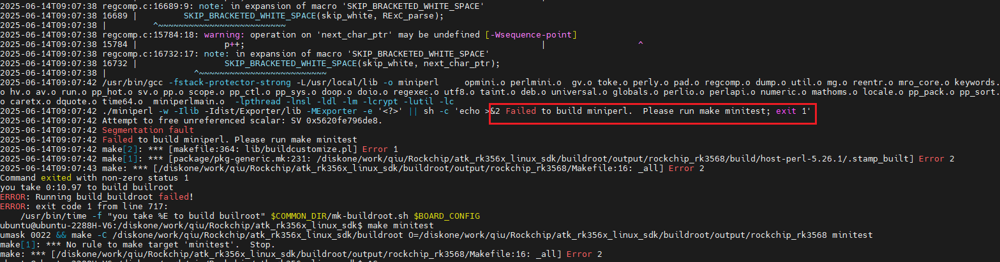
自带的版本通不过gcc10的编译，所以更换perl和perl-cross的版本就好了，注意这两个版本需要对应      
1. 下载最新的perl和perl-cross包，并放置`buildroot/dl`下面
https://github.com/Perl/perl5/tags
https://github.com/arsv/perl-cross/releases?page=1
2. 删除旧的perl编译项目，路径为`buildroot/output/rockchip_rk3568/build/perl-5.26.1`
3. 修改buildroot下的perl配置，路径为`buildroot/package/perl/perl.mk`
    ```mk
    PERL_VERSION_MAJOR = 40
    PERL_VERSION = 5.$(PERL_VERSION_MAJOR).2
    PERL_CROSS_VERSION = 1.6.2
    ```
4. 回到SDK根目录重新编译

### Buildroot系统编译squashfs报错问题
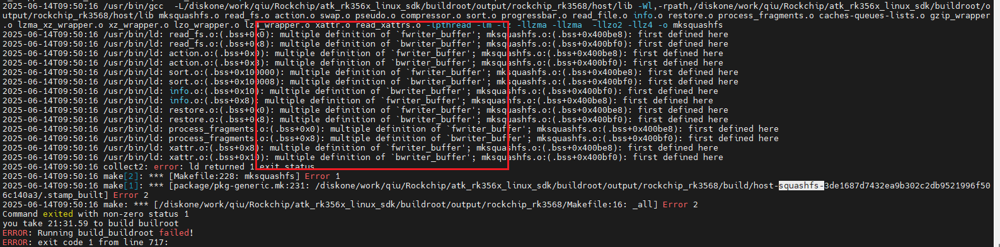
该问题由编译器版本和工具版本不兼容引发，在`buildroot/output/rockchip-rk3568`和`buildroot/output/rockchip-rk356x-recovery`中的`build/host-squashfs-3de1687d7432ea9b302c2db9521996f506c140a3/squashfs-tools`路径下的`bwriter_buffer`和`fwriter_buffer`修改为全局变量
1. 在对应目录的对应头文件处，修改变量为全局变量
    ```c
    extern struct cache *bwriter_buffer, *fwriter_buffer;
    ```
2. 删除`squashfs-tools`下的所有`.o`文件，然后重新编译即可
## 2025-06-17
### 系统缺少bzip2，导致无法执行bzcat命令
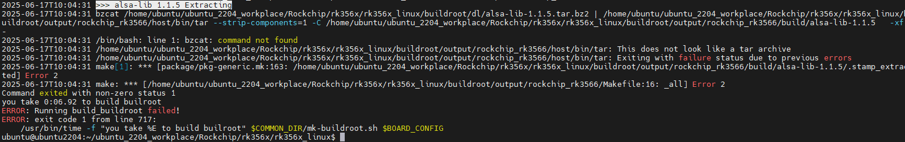 
把bzip2这个解压缩软件安装即可
```bash
sudo apt install bzip2
```
### Python映射或者安装问题
```bash
/usr/bin/python: not found
```
遇到此类问题大多是python没有安装，或者没有进行映射，可以执行安装指令或者进行软连接等方式进行解决
```bash
sudo ln -s /usr/bin/python3 /usr/bin/python
```
## 2025-06-18
### U-Boot 命令行中，环境变量无法保存
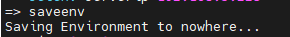
需要选择一个存储设备，在`u-boot\configs\rk3568_defconfig`中添加配置，选择存储设备
```bash
CONFIG_ENV_IS_IN_MMC=y
```
需要改后效果如下：

## 2025-06-21
### 解决buildroot系统没有`lib/modules`目录问题
之前由于编译生成的`buildroot/.config`配置文件中，没有打开linux内核，所以导致buxybox的配置没有生效，busybox的配置在`buildroot/packages/busybox/busybox.config`中
```bash
// .config
#
# Kernel
#
BR2_LINUX_KERNEL=y
# BR2_LINUX_KERNEL_LATEST_VERSION is not set
# BR2_LINUX_KERNEL_LATEST_CIP_VERSION is not set
# BR2_LINUX_KERNEL_LATEST_CIP_RT_VERSION is not set
# BR2_LINUX_KERNEL_CUSTOM_VERSION is not set
# BR2_LINUX_KERNEL_CUSTOM_TARBALL is not set
BR2_LINUX_KERNEL_CUSTOM_LOCAL=y
# BR2_LINUX_KERNEL_CUSTOM_GIT is not set
# BR2_LINUX_KERNEL_CUSTOM_HG is not set
# BR2_LINUX_KERNEL_CUSTOM_SVN is not set
BR2_LINUX_KERNEL_CUSTOM_LOCAL_LOCATION="$(TOPDIR)/../kernel"
BR2_LINUX_KERNEL_VERSION="custom"
BR2_LINUX_KERNEL_PATCH=""
BR2_LINUX_KERNEL_USE_DEFCONFIG=y
# BR2_LINUX_KERNEL_USE_ARCH_DEFAULT_CONFIG is not set
# BR2_LINUX_KERNEL_USE_CUSTOM_CONFIG is not set
BR2_LINUX_KERNEL_DEFCONFIG=""
BR2_LINUX_KERNEL_CONFIG_FRAGMENT_FILES=""
BR2_LINUX_KERNEL_CUSTOM_LOGO_PATH=""
BR2_LINUX_KERNEL_IMAGE=y
# BR2_LINUX_KERNEL_IMAGEGZ is not set
# BR2_LINUX_KERNEL_VMLINUX is not set
# BR2_LINUX_KERNEL_IMAGE_TARGET_CUSTOM is not set
BR2_LINUX_KERNEL_GZIP=y
# BR2_LINUX_KERNEL_LZ4 is not set
# BR2_LINUX_KERNEL_LZMA is not set
# BR2_LINUX_KERNEL_LZO is not set
# BR2_LINUX_KERNEL_XZ is not set
# BR2_LINUX_KERNEL_ZSTD is not set
# BR2_LINUX_KERNEL_DTS_SUPPORT is not set
# BR2_LINUX_KERNEL_INSTALL_TARGET is not set
# BR2_LINUX_KERNEL_NEEDS_HOST_OPENSSL is not set
# BR2_LINUX_KERNEL_NEEDS_HOST_LIBELF is not set

// busybox.config
#
# Linux Module Utilities
#
# CONFIG_MODPROBE_SMALL is not set
CONFIG_DEPMOD=y
CONFIG_INSMOD=y
CONFIG_LSMOD=y
CONFIG_FEATURE_LSMOD_PRETTY_2_6_OUTPUT=y
CONFIG_MODINFO=y
CONFIG_MODPROBE=y
# CONFIG_FEATURE_MODPROBE_BLACKLIST is not set
CONFIG_RMMOD=y
```
需要在板级配置文件处加入打开以下宏
```bash
BR2_LINUX_KERNEL=y
BR2_LINUX_KERNEL_MODULES=y
BR2_LINUX_KERNEL_USE_DEFCONFIG = y
BR2_LINUX_KERNEL_CUSTOM_LOCAL_LOCATION="$(TOPDIR)/../kernel"
BR2_LINUX_KERNEL_DEFCONFIG="rockchip_linux"     
BR2_LINUX_KERNEL_MODULES_INSTALL_TARGET=y
```
解决后效果如下
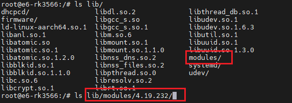
## 2025-06-27
### 解决RK Linux平台编译DTS生成DTB文件时出现的错误
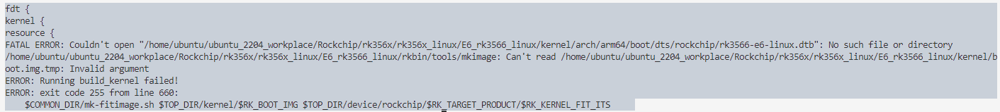
```bash
cd /path/to/kernel  # 进入内核源码目录
make ARCH=arm64 rockchip_defconfig  # 使用Rockchip默认配置
make ARCH=arm64 CROSS_COMPILE=aarch64-linux-gnu- dtbs  # 单独编译DTB文件
```
## 2025-07-02
### 解决新SDK 适配E6以太网口问题
**确定编译内核所对应的设备树，确定引脚复用配置问题**
- 参考文档
```
《Rockchip_Developer_Guide_Linux_GMAC_Mode_Configuration_CN.pdf》  
《C2685351_以太网收发器_YT8511C_规格书_WJ975060.PDF》
```
- 原理图
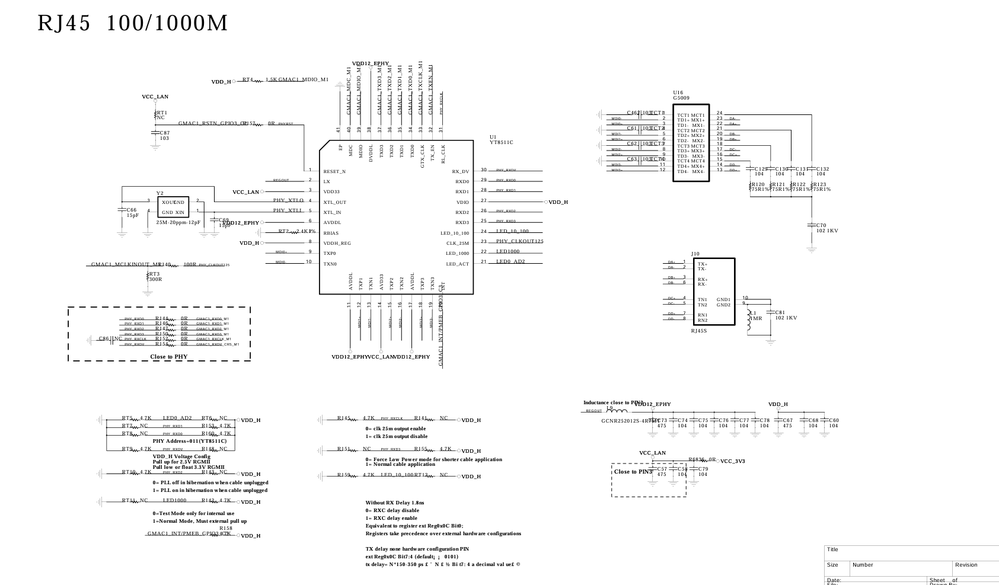
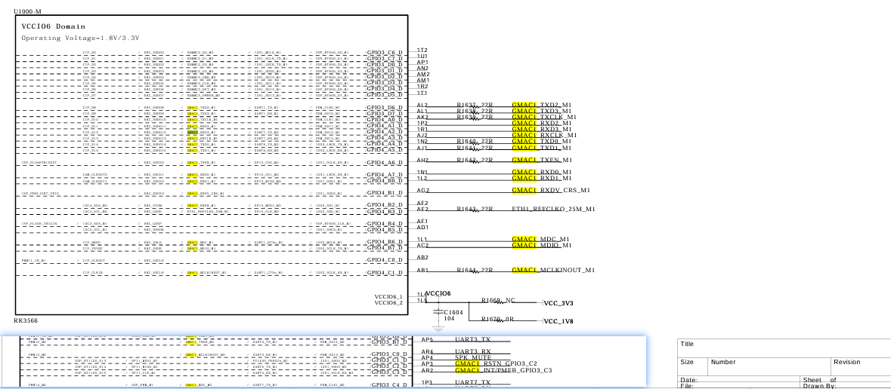
1. `dts`设备树配置部分
    ```dts
    &gmac1 {
        phy-mode = "rgmii";
        clock_in_out = "output";
        // 复位引脚控制
        snps,reset-gpio = <&gpio3 RK_PC2 GPIO_ACTIVE_LOW>;
        snps,reset-active-low;
        // 复位延时
        snps,reset-delays-us = <0 20000 100000>;

        assigned-clocks = <&cru SCLK_GMAC1_RX_TX>, <&cru SCLK_GMAC1>;
        assigned-clock-parents = <&cru SCLK_GMAC1_RGMII_SPEED>, <&cru CLK_MAC1_2TOP>;
        assigned-clock-rates = <0>, <125000000>;
        // pinctrl引脚复用
        pinctrl-names = "default";
        pinctrl-0 = <&gmac1m1_miim
                &gmac1m1_tx_bus2
                &gmac1m1_rx_bus2
                &gmac1m1_rgmii_clk
                &gmac1m1_rgmii_bus>;

        tx_delay = <0x2e>;
        rx_delay = <0x1b>;
        // phy芯片通道
        phy-handle = <&rgmii_phy0>;
        status = "okay";
    };

    &mdio1 {
        rgmii_phy0: phy@0 {
            compatible = "ethernet-phy-ieee802.3-c22";
            reg = <0x0>;
        };
    };
    ```
2. 终端调试部分
    - 检查引脚复用状态
        ```bash
        cat /sys/kernel/debug/pinctrl/pinctrl-pins | grep gmac
        ```
    - 检查确认GPIO状态，复位脚和中断脚
        ```bash
        cat /sys/kernel/debug/gpio
        ```
    - 验证时钟树是否匹配
        ```bash
        cat /sys/kernel/debug/clk/clk_summary | grep gmac
        ```
    - 内核日志分析，这里需要注意引脚复用是否正确，是否被占用
        ```bash
        dmesg | grep -E "gmac|phy|stmmac"
        dmesg | grep -i "gmac\|eth\|stmmac\|phy\|gpio"
        ```
    - 查看设备状态
        ```bash
        cat /proc/device-tree/ethernet@fe1c0000/status
        ```
    - 检查设备树节点，确保节点状态正常
        ```bash
        ls /proc/device-tree/ethernet@fe010000/status
        ```
    - 扫描MDIO总线，确认phy芯片地址是否正确
        ```bash
        ls /sys/bus/mdio_bus/devices/
        ``` 
    - 测试网络，是否链接成功，获取到IP
        ```bash
        ifconfig -a
        ifconfig <eth0> up
        udhcpc -i <eth0>
        ```
**以太网调试总结**
* 确认使用的设备树文件没有错误
* 确认引脚复用配置是否正确，是否被占用
* 确认GPIO状态，复位脚和中断脚
* 验证时钟树是否匹配
* 内核日志分析，确认引脚复用是否正确，是否被占用
* 查看设备状态
* 检查设备树节点，确保节点状态正常
* 扫描MDIO总线，确认phy芯片地址是否正确
* 测试网络，是否链接成功，获取到IP
    
## 2025-07-21
### RK3288 编译问题
- 手动编译
    - `uboot` 编译，具体可以查看该目录下的`UserManual`，里面有具体说明
        ```bash
        cd u-boot
        make rockchip_defconfig
        ./mkv7.sh
        ```
    - `kernel` 编译，具体设备树具体更改
        ```bash
        cd kernel 
        make ARCH=arm rockchip_defconfig
        make ARCH=arm rk3288-evb-android-rk808-edp.img -j12
        ```
    - `android` 编译
        ```bash
        source build/envsetup.sh
        lunch 14
        make -j12 
        ```
    - 打包
        ```bash 
        ./mkimage.sh
        ```
- 自动编译
    具体可以查看`build.sh`这个脚本

### RK3288 Android-7.1系统更换系统壁纸
安卓系统的默认壁纸放置在如下位置，只需要把这三个`default_wallpaper`更换就好
```
frameworks/base/core/res/res/drawable-sw720dp-nodpi/default_wallpaper.png
frameworks/base/core/res/res/drawable-nodpi/default_wallpaper.png
frameworks/base/core/res/res/drawable-sw600dp-nodpi/default_wallpaper.png
```
更换完之后需要清除缓存，否则桌面壁纸还是上一次的编译的
```bash
make clean 
rm -rf out/target/product/rk3288/obj/APPS/framework-res_intermediates/
rm -rf out/target/product/rk3288/obj/APPS/WallpaperPicker_intermediates/
rm -rf out/target/product/rk3288/system/framework/framework-res.apk
rm -rf out/target/product/rk3288/system/app/WallpaperPicker/
```
### 构建失败：缺少libstdc++.so.6
由于目标是32位的机器，虽然主机上有`libstdc++.so.6`这一个动态链接文件，但是主机是64位机器导致不兼容，安装32位的可以解决
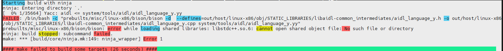
```bash
sudo apt install lib32stdc++.so.6
```
### 更换开机逐帧动画
开机动画需要在`device/rockchip/common/BoardConfig.mk`打开`BOOT_SHUTDOWN_ANIMATION_RINGING`这个宏，然后制作一个`bootanimation.zip`动画压缩包放置在`device/rockchip/rk3288/media/`中，该压缩包中包含`part`和`desc.txt`这两部分，假设`desc.txt`内容如下
```txt
1366 768 15
p 1 0 part0
p 0 10 part1
```
格式如下
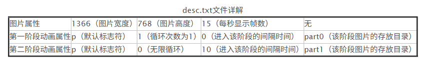
## 2025-07-30
### 编译`buildroot`出现就配置冲突问题   
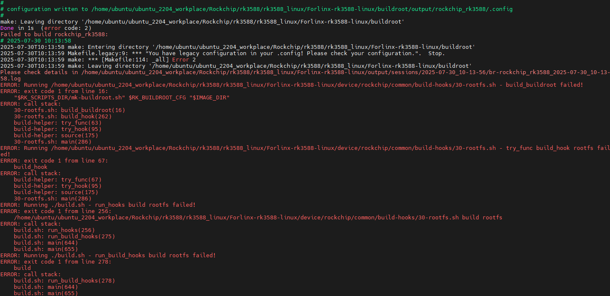
清理`buildroot`环境，重新编译即可
```bash
cd buildroot
make clean
make distclean
```
## 2025-08-01
调试RTC模块`PCF8563`
- RTC原理图
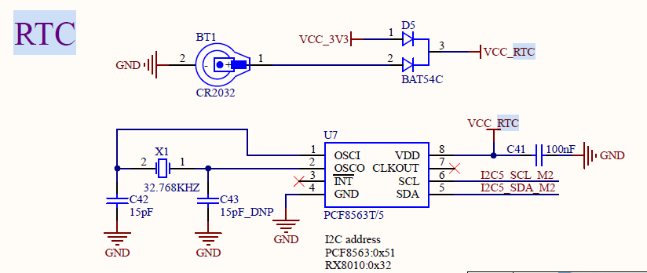
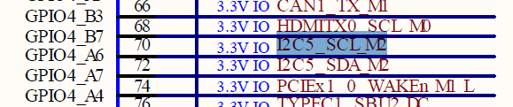
- 参考文档
```
《Rockchip_Developer_Guide_I2C_CN.pdf》
```
1. `dts` 设备树配置部分
    ```dts
    &i2c5 {
        status = "okay";

        pcf8563: pcf8563@51 {
            compatible = "nxp,pcf8563";
            reg = <0x51>;
            pinctrl-names = "default";
            pinctrl-0 = <&i2c5m2_xfer>;
            #clock-cells = <0>;
        };
    };
    ```
2. `Kernel`配置部分
    ```bash
    CONFIG_I2C=y
    CONFIG_RTC_PCF8563=y
    ```
    使用`make menuconfig`图形配置可以使用`/?`键查询配置
3. 终端调试部分
    - 检查总线是否存放`I2C`设备
        ```bash
        ls /sys/bus/i2c/devices/
        ```
    - 检查引脚复用状态
        ```bash
        cat /sys/kernel/debug/pinctrl/pinctrl-pins | grep i2c5
        ```
    - 检查确认GPIO状态，复位脚和中断脚
        ```bash
        cat /sys/kernel/debug/gpio
        ```
    - 验证时钟树是否匹配
        ```bash
        cat /sys/kernel/debug/clk/clk_summary | grep i2c5
        ```
    - 查看内核`RTC`是否启动成功
    ```bash
    dmesg | grep -i "pcf8563\|rtc"
    ```
    - 设置时间，将系统时间写入`RTC`，这里要注意时区问题，UTC和CST时间差8小时
        ```bash
        # 查看系统时间并输出24小时制
        date +%T
        # 将当前时间写入RTC
        hwclock -w -f /dev/rtc0
        # 查看RTC时间并输出24小时制
        hwclock -f /dev/rtc0 - show
        ```
## 2025-08-04
### HDMI_TX调试
- 参考文档
```
《Rockchip_Developer_Guide_HDMI_CN.pdf》    
《Rockchip_Developer_Guide_HDMI-CEC_CN.pdf》    
《Rockchip_Developer_Guide_HDMI-PHY-PLL_Config_CN.pdf》
```
- 原理图
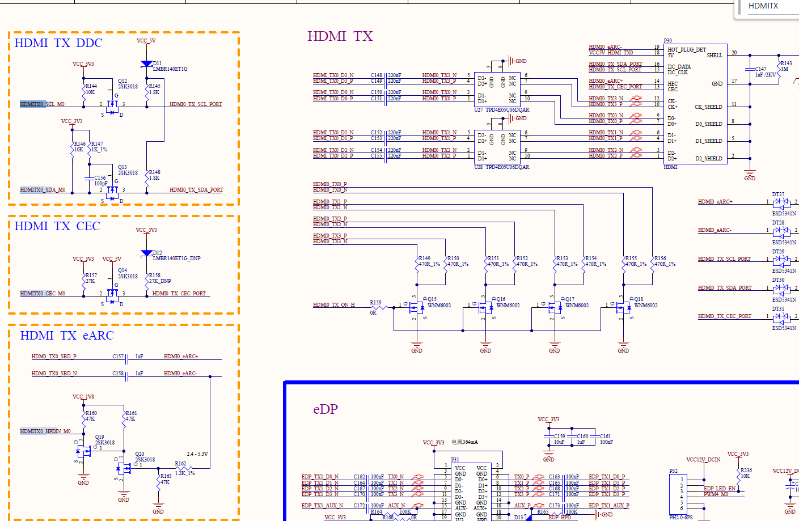       
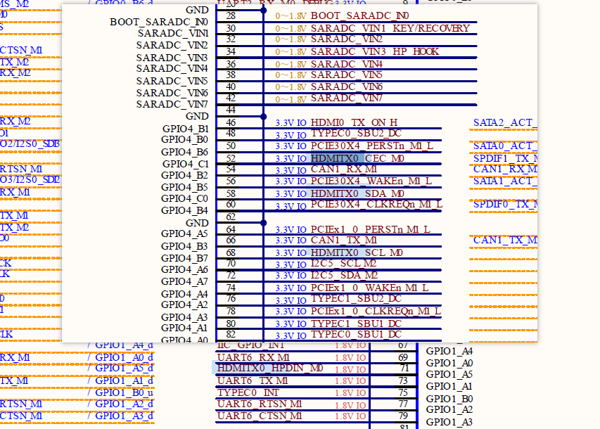 
1. `dts` 设备树配置部分 
    - rk3588-evb7-lp4.dtsi
    ```dts
    # 使能HDMI输出
    &hdmi0 {
        enable-gpios = <&gpio4 RK_PB1 GPIO_ACTIVE_HIGH>;
        status = "okay";
    };
    # 绑定VOP，在RK平台上，各种显示接口输出的图像数据来源都是VOP
    &hdmi0_in_vp0 {
        status = "okay";
    };
    # 使能hdmi物理通道
    &hdptxphy_hdmi0 {
        status = "okay";
    };
    # 打开U-Boot的logo支持
    &route_hdmi0 {
        status = "okay";
    };
    # 打开声卡
    &hdmi0_sound {
        status = "okay";
    };
    ```
2. `Kernel`配置部分
```bash
CONFIG_VIDEO_ROCKCHIP_HDMIRX=y
```
3. 终端调试部分
    - 检查总线是否存放`HDMI`设备
    ```bash
    ls /sys/bus/platform/devices/
    ```
    - 查看HDMI设备是否连接
    ```bash
    cat /sys/class/drm/card0-HDMI-A-1/status
    ```
    - 读取显示器EDID
    ```bash
    hexdump -C /sys/class/drm/card0-HDMI-A-1/edid
    ```
## 2025-08-05
### 基础3588移植ubuntu系统
- 先提前把`buildroot`和`kernel`编译好，生产镜像
```bash
./build.sh kernel
./build.sh buildroot
```
- 在另外的虚拟机建立`ubuntu-rootfs`文件夹，从官网获取最小`ubuntu`系统镜像，并解压到`ubuntu-rootfs`文件夹下
```bash
mkdir -p ubuntu-rootfs
wget http://cdimage.ubuntu.com/ubuntu-base/releases/22.04/release/ubuntu-base-22.04.1-base-arm64.tar.gz
tar -zxvf ubuntu-base-20.04.1-base-arm64.tar.gz -C ubuntu-rootfs
```
- 在服务器上安装qume-user-static，模拟运行最小`arm64`架构的文件系统
```bash 
sudo apt-get install qemu-user-static
sudo cp /usr/bin/qemu-aarch64-static ubuntu-rootfs/usr/bin/
```
- 拷贝`resolv.conf`文件以及配置国内的镜像源
```bash 
sudo cp -b /etc/resolv.conf ubuntu-rootfs/etc/resolv.conf
sudo vim ubuntu-rootfs/etc/apt/sources.list
```
- 编写一个`mount.sh`脚本，方便进入退出`arm64`文件系统
```bash
#!/bin/bash
function mnt() {
  echo "MOUNTING"
  sudo mount -t proc /proc ${2}proc
  sudo mount -t sysfs /sys ${2}sys
  sudo mount -o bind /dev ${2}dev
  #sudo mount -t devpts -o gid=5,mode=620 devpts ${2}dev/pts
  sudo mount -o bind /dev/pts ${2}dev/pts
  sudo chroot ${2}
}
function umnt() {
  echo "UNMOUNTING"
  sudo umount ${2}proc
  sudo umount ${2}sys
  sudo umount ${2}dev/pts
  sudo umount ${2}dev
}
if [ "$1" == "-m" ] && [ -n "$2" ] ;
then
  mnt $1 $2
elif [ "$1" == "-u" ] && [ -n "$2" ];
then
  umnt $1 $2
else
  echo ""
  echo "Either 1’st, 2’nd or both parameters were missing"
  echo ""
  echo "1’st parameter can be one of these: -m(mount) OR -u(umount)"
  echo "2’nd parameter is the full path of rootfs directory(with trailing ‘/’)"
  echo ""
  echo "For example: ch-mount -m /media/sdcard/"
  echo ""
  echo 1st parameter : ${1}
  echo 2nd parameter : ${2}
fi
```
- 进入`arm64`的根文件系统
```bash
./mount.sh -m /ubuntu-rootfs/
sudo chroot ubuntu-rootfs/
```
- 安装一些必要的软件
```bash
apt update
apt upgrade
apt install apt-utils dialog
apt install vim sudo
apt install bash-completion 
apt install net-tools iputils-ping ifupdown ethtool
apt install wireless-tools network-manager
apt install ssh rsync udev htop rsyslog
apt install bluetooth* bluez* blueman*
apt install locales tzdata 
apt install ubuntu-desktop
```
- 开机默认切换到图形界面
```bash
systemctl set-default graphical.target
```
- 设置主机名，增加用户，修改账户密码
```bash
echo "RK3588" > /etc/hostname
echo "127.0.0.1 localhost RK3588" > /etc/hosts
useradd -s '/bin/bash' -m -G adm,sudo user
passwd user
passwd root 
```
- Ubuntu默认不能用root登录界面，可以配置启用以root登录界面
```bash
vi /usr/share/lightdm/lightdm.conf.d/50-ubuntu.conf
# 添加下面的内容
greeter-show-manual-login=true
all-guest=false
 
vi /etc/pam.d/gdm-autologin
# 注释掉下面这行
#auth   required        pam_succeed_if.so user != root quiet_success
 
vi /etc/pam.d/gdm-password
# 注释掉下面这行
#auth   required        pam_succeed_if.so user != root quiet_success
 
vi /root/.profile
# 添加下面的内容，替换掉 mesg n || true 这一行
tty -s && mesg n || true
```
- 编写开机脚本服务，配置以太网口链接获取IP地址
    1. 创建网络配置脚本
    ```bash 
    vim /usr/local/bin/first-boot-network-setup.sh
    #!/bin/bash
    # 设置调试模式
    set -x
    # 等待网络接口就绪（最长30秒）
    for interface in eth0 eth1; do
        for i in {1..30}; do
            if [ -d /sys/class/net/$interface ]; then
                echo "$interface detected"
                break
            fi
            sleep 1
        done
    done
    # 激活所有以太网接口
    for interface in $(ls /sys/class/net | grep -E 'eth|en'); do
        ip link set $interface up
        echo "Activated $interface"
    done
    # 使用dhclient获取IP（兼容性强）
    for interface in eth0 eth1; do
        if [ -d /sys/class/net/$interface ]; then
            dhclient -4 -v $interface &
        fi
    done
    # 等待DHCP完成
    sleep 5
    # 验证网络连接
    if ping -c 3 -W 2 8.8.8.8; then
        echo "Network setup successful"
        touch /etc/.network-setup-complete
    else
        echo "Network setup failed"
        exit 1
    fi
    chmod +x /usr/local/bin/first-boot-network-setup.sh
    ```
    2. 创建`systemd`服务单元
    ```bash
    vim /etc/systemd/system/first-boot-network.service
    [Unit]
    Description=First Boot Network Setup
    After=systemd-udevd.service
    Before=network.target
    Wants=network.target

    [Service] 
    Type=oneshot
    ExecStart=/usr/local/bin/first-boot-network-setup.sh
    StandardOutput=journal+console
    StandardError=journal+console
    RemainAfterExit=yes
    TimeoutStartSec=90s

    [Install]
    WantedBy=multi-user.target
    ```
    3. 配置`systemd-networkd`
    ```bash
    [Match]
    Name=eth*

    [Network]
    DHCP=yes
    LinkLocalAddressing=ipv6
    LLMNR=no
    ```
- 设置串口登陆`root`
```bash ·
vi /lib/systemd/system/serial-getty\@.service
# 替换ExecStart这行
ExecStart=-/sbin/agetty --autologin root --noclear %I $TERM
```
- 退出`arm64`文件系统
```bash
exit
./mount.sh -u /ubuntu-rootfs/
```
- 制作镜像脚本，空间分配8G
```bash
#!/bin/bash
rootfs_dir=$1
rootfs_file=$2
rootfs_mnt="mnt"
if [ ! $rootfs_dir ] || [ ! $rootfs_file ];
then
  echo "Folder or target is empty."
  exit 0
fi
if [ -f "$rootfs_file" ]; then
  echo "-- Delete exist $rootfs_file ..."
  rm -f "$rootfs_file"
fi
echo "-- Create $rootfs_file ..."
dd if=/dev/zero of="$rootfs_file" bs=1M count=10240
sudo mkfs.ext4 -F -L linuxroot "$rootfs_file"
if [ ! -d "$rootfs_mnt" ]; then
  mkdir $rootfs_mnt
fi
echo "-- Copy data to $rootfs_file ..."
sudo mount $rootfs_file $rootfs_mnt
sudo cp -rfp $rootfs_dir/* $rootfs_mnt
sudo sync
sudo umount $rootfs_mnt
rm -r $rootfs_mnt
echo "-- Resize $rootfs_file ..."
# /sbin/e2fsck -p -f "$rootfs_file"
# /sbin/resize2fs -M "$rootfs_file"
echo "-- Done."
```

- 制作镜像，制作完成后即可进行烧录
```bash
./mkimage.sh ubuntu-rootfs rockdev/rootfs.img
```
## 2025-08-12
### CodeC 音频解码和耳机检测
- 参考文档
```
《Rockchip_Developer_Guide_CodeC_CN.pdf》
```
- 原理图
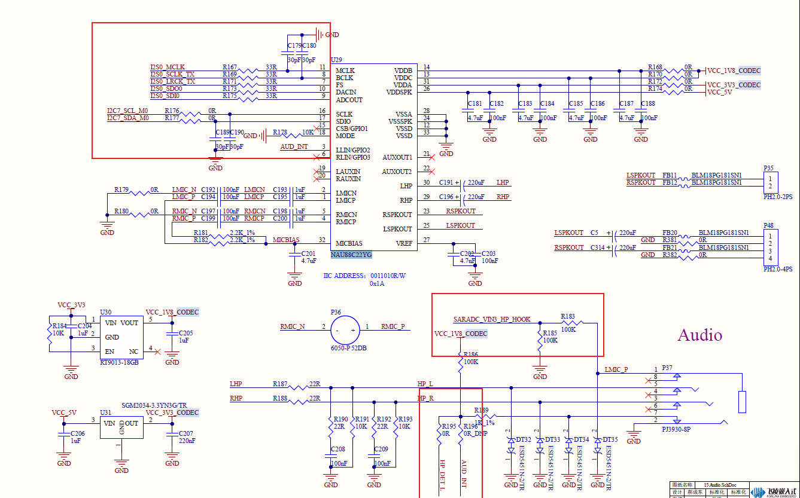
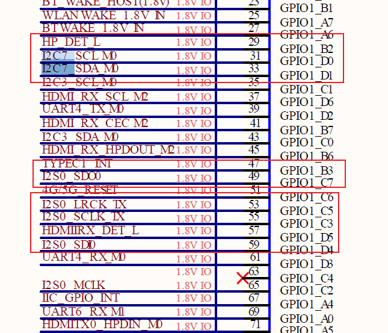  
1. `dts` 设备树配置部分 
    - rk3588-evb7-lp4.dtsi
    ```dts
	nau8822_sound: nau8822-sound {
		status = "okay";
		compatible = "rockchip,multicodecs-card";
		rockchip,card-name = "rockchip-nau8822";
		hp-det-gpio = <&gpio1 RK_PB2 GPIO_ACTIVE_HIGH>;
		io-channels = <&saradc 3>;
		io-channel-names = "adc-detect";
		keyup-threshold-microvolt = <1800000>;
		poll-interval = <100>;
		rockchip,format = "i2s";
		rockchip,mclk-fs = <256>;
		rockchip,cpu = <&i2s0_8ch>;
		rockchip,codec = <&nau8822>;
		rockchip,audio-routing =
			"Headphone", "RHP",
			"Headphone", "LHP",
			"Speaker", "LSPK",
			"Speaker", "RSPK",
			"RMICP", "Main Mic",
			"RMICN", "Main Mic",
			"RMICP", "Headset Mic",
			"RMICN", "Headset Mic",
			"LMICP", "Main Mic",
			"LMICN", "Main Mic",
			"LMICP", "Headset Mic",
			"LMICN", "Headset Mic";
		pinctrl-names = "default";
		pinctrl-0 = <&hp_det>;
		play-pause-key {
			label = "playpause";
			linux,code = <KEY_PLAYPAUSE>;
			press-threshold-microvolt = <2000>;
		};
	};

    &i2c7 {
        pinctrl-names = "default";
        pinctrl-0 = <&i2c7m0_xfer>;
        status = "okay";

        nau8822: nau8822@1a {
            status = "okay";
            #sound-dai-cells = <0>;
            compatible = "nuvoton,nau8822";
            reg = <0x1a>;
            clocks = <&mclkout_i2s0>;
            clock-names = "mclk";
            pinctrl-names = "default";
            pinctrl-0 = <&i2s0_mclk>;
        };
    };

    &pinctrl {
        headphone {
            hp_det: hp-det {
                rockchip,pins = <1 RK_PB2 RK_FUNC_GPIO &pcfg_pull_none>;
            };
        };	
    };
    ``` 
2. `Kernel`配置部分
    ```bash
    CONFIG_SND_SOC_NAU8822=y
    ```
3. 终端调试部分
    - 查看内核`nau8822`是否注册成功
    ```bash
    dmesg | grep -i nau8822
    ```
    - 查看设备节点
    ```bash
    ls /dev/snd/
    ```
    - 检查 `ALSA` 声卡列表
    ```bash
    cat /proc/asound/cards
    ```
    - 查看声卡信息
    ```bash
    amixer -c0 contents
    ```
    - 查看可用的录音设备
    ```bash
    arecord -l
    ```
    - 配置录音设备并录音，播放
    ```bash 
    arecord -D plughw:1,0 -f cd -d 10 test.wav
    aplay test.wav
    ```
4. 问题记录
    1. 看错耳机检测脚和`i2c7`对应的引脚
    2. 只描述了检测脚的`pinctrl`信息，并没有去显示调用该引脚
    3. 声卡`probe`驱动失败，驱动没有匹配上
## 2025-10-23
板子型号SS-RK3588-V2.0，调试驱动，制作ubuntu 20.04 LTS 镜像
- device使用`rockchip_defconfig`
- kernel使用`rockchip_linux_defconfg`
- dts使用`rk3588-evb7-v11.dtsi`
### rk3588网口 QSGMII 调试
- 参考文档
    ```
    《Rockchip Linux 软件开发指南.pdf》
    《Rockchip_Developer_Guide_PCIe_CN.pdf》
    《RTL8111H-CG.PDF》
    《RTL8211F-CG.PDF》
    ```
- 原理图
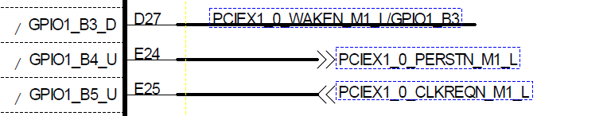 
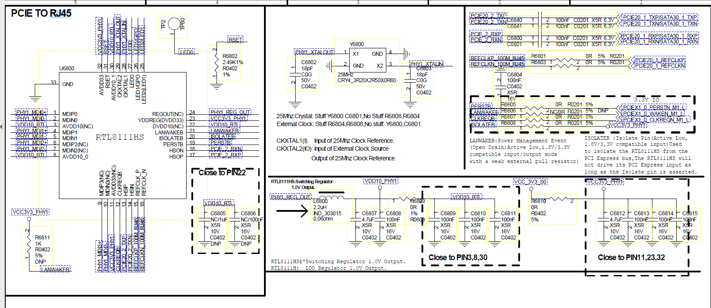
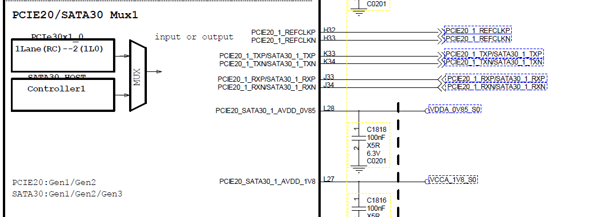
1. `dts` 设备树配置部分
    Pcie有五个控制节点，关联4个phy通道，根据原理图，使用的是pcie2通道mux1，需要配置pcie2x1l0，Gmac网口部分查看上述
    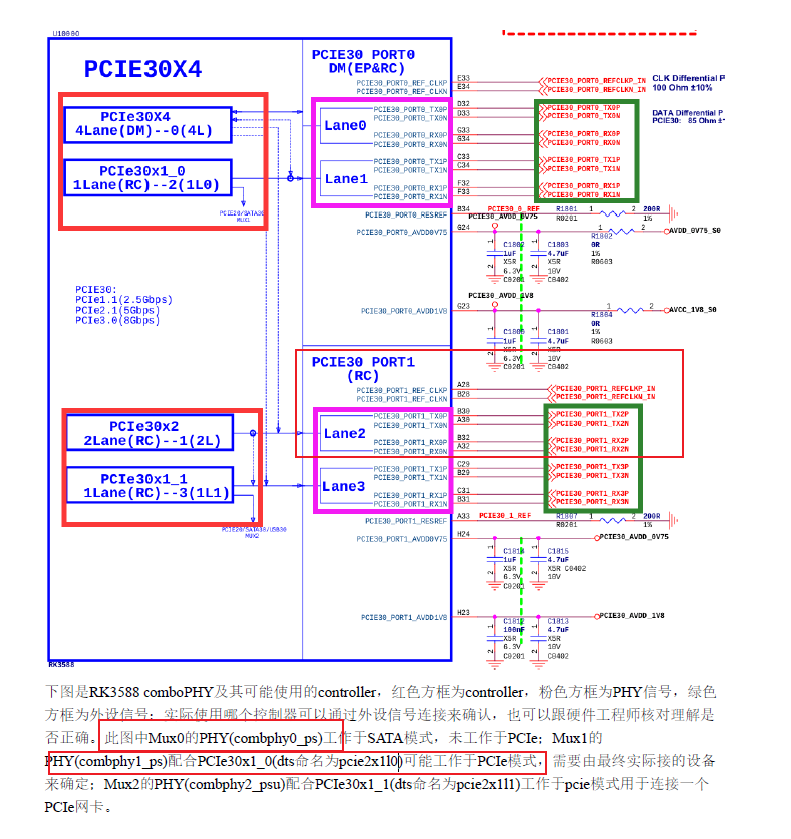
    ```dts
    &combphy1_ps {
        status = "okay";
    };
    &pcie2x1l0 {
        reset-gpios = <&gpio1 RK_PB2 GPIO_ACTIVE_HIGH>;
        status = "okay"; 
    };
    ```
2. `Menuoncfig`配置 
    ```bash
    # r8168网口驱动
    CONFIG_R8168=y
    # RTL8211网口驱动
    CONFIG_RTL8211F=y
    ```
3. 重新编译，烧录查看日志
    ```bash
    # 查看Pcie初始化
    dmesg | grep  fe170000.pcie
    # 查看驱动是否挂载
    dmesg | grep -i realtek
    dmesg | grep -i r8169
    # 查看设备树节点
    cat /proc/device-tree/ethernet@fe1c0000/phy-handle
    # 查看pcie设备
    lspci
    ```
4. 修改网口led灯状态，需要查阅以太网收发器的芯片手册中的LED等控制部分
    - rtl8211
    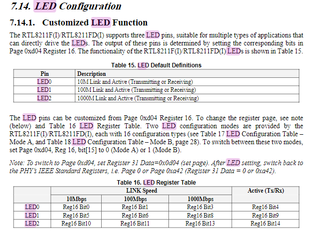
    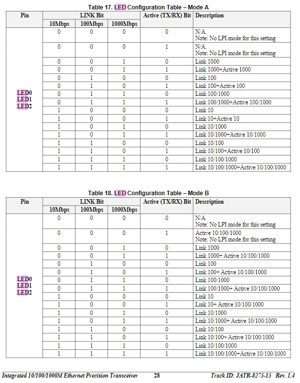
        - 修改，驱动源码在`kernel/drivers/net/phy/realtek.c`中
        ```bash
        static int rtl8211f_config_init(struct phy_device *phydev)
        {
        +   /* Custom LED Modified by QiuPeiqin at 2025-10-24 */
        +   phy_write(phydev, 0x1f, 0x0d04);
	    +   phy_write(phydev, 0x10, 0x2f71);
	    +   phy_write(phydev, 0x1f, 0x0a42);
        }
        ```
    - rtl8168
    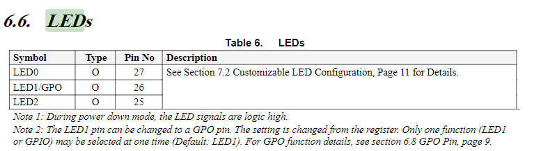
    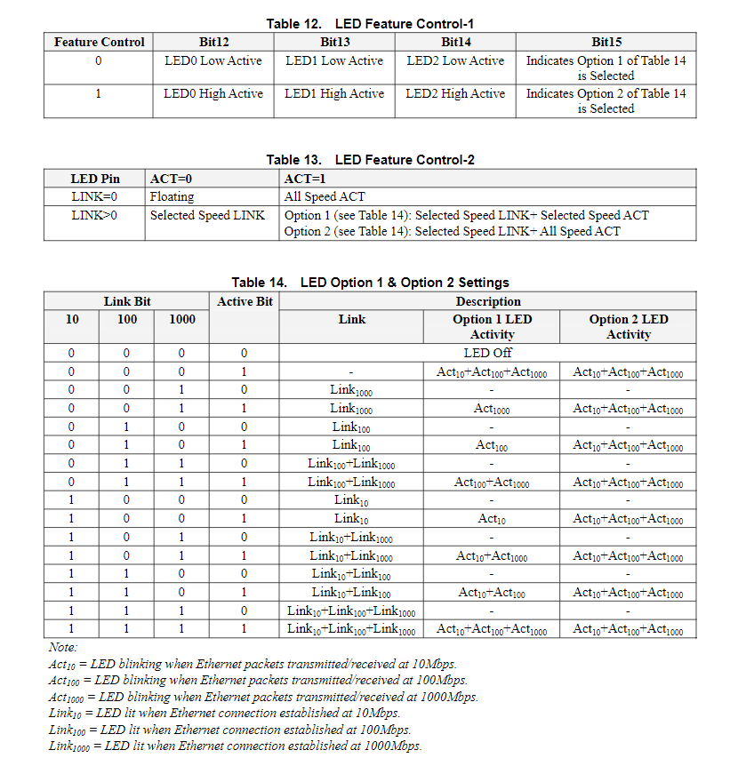
        - 修改，驱动源码在`kernel/drivers/net/ethernet/realtek/r8168/r8168_n.c`中
        ```bash
        static void
        rtl8168_init_software_variable(struct net_device *dev)
        {
            if (tp->HwIcVerUnknown) {
                tp->NotWrRamCodeToMicroP = TRUE;
                tp->NotWrMcuPatchCode = TRUE;
            }

        +   /* Custom LED Modified by QiuPeiqin at 2025-10-24 */
        +   RTL_W16(tp, CustomLED, 0x2780);

            tp->NicCustLedValue = RTL_R16(tp, CustomLED);
        }
        ```
## 2025-10-28
### rk3588 wifi/bt调试
- 参考文档
    ```
    《Rockchip_Developer_Guide_Linux_WIFI_BT_CN.pdf》
    ```
- 原理图
    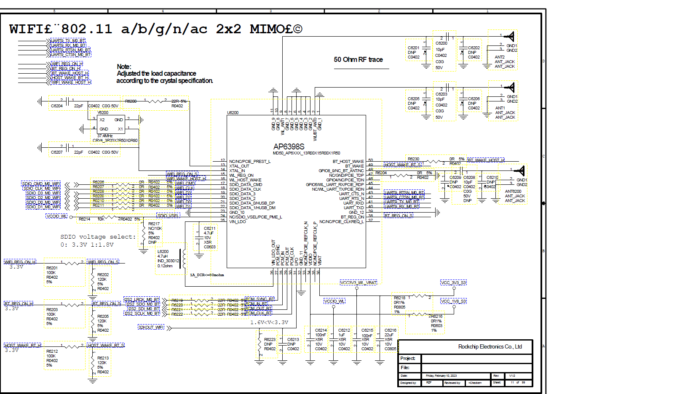
    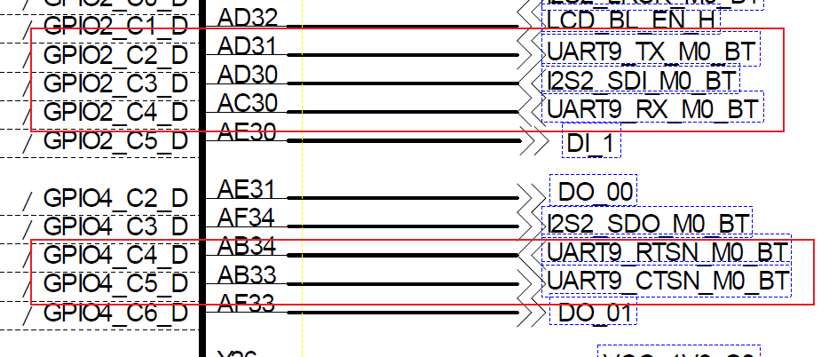
    
    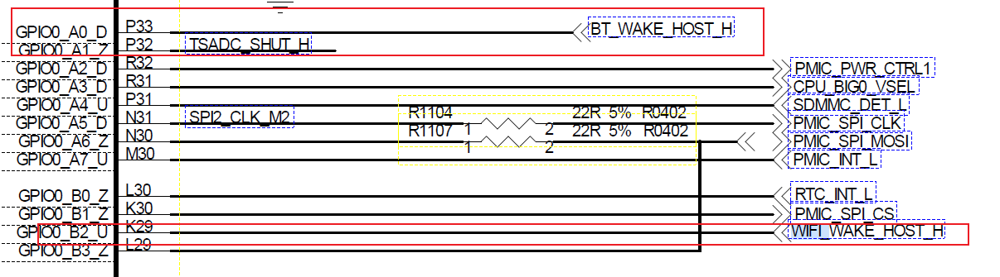
1. `dts` 设备树配置部分
    ```dts
    /{
        sdio_pwrseq: sdio-pwrseq {
            compatible = "mmc-pwrseq-simple";
            clocks = <&hym8563>;
            clock-names = "ext_clock";
            pinctrl-names = "default";
            pinctrl-0 = <&wifi_enable_h>;
            /*
            * On the module itself this is one of these (depending
            * on the actual card populated):
            * - SDIO_RESET_L_WL_REG_ON
            * - PDN (power down when low)
            */
            post-power-on-delay-ms = <200>;
            reset-gpios = <&gpio0 RK_PC4 GPIO_ACTIVE_LOW>;
        };
        wireless_bluetooth: wireless-bluetooth {
            compatible = "bluetooth-platdata";
            clocks = <&hym8563>;
            clock-names = "ext_clock";
            uart_rts_gpios = <&gpio4 RK_PC4 GPIO_ACTIVE_LOW>;
            pinctrl-names = "default", "rts_gpio";
            pinctrl-0 = <&uart9m0_rtsn>, <&bt_reset_gpio>, <&bt_wake_gpio>, <&bt_irq_gpio>;
            pinctrl-1 = <&uart9_gpios>;
            BT,reset_gpio    = <&gpio0 RK_PC6 GPIO_ACTIVE_HIGH>;
            BT,wake_gpio     = <&gpio0 RK_PC5 GPIO_ACTIVE_HIGH>;
            BT,wake_host_irq = <&gpio0 RK_PA0 GPIO_ACTIVE_HIGH>;
            status = "okay";
        };
        wireless_wlan: wireless-wlan {
            compatible = "wlan-platdata";
            wifi_chip_type = "ap6398s";
            pinctrl-names = "default";
            pinctrl-0 = <&wifi_host_wake_irq>;
            WIFI,host_wake_irq = <&gpio0 RK_PB2 GPIO_ACTIVE_HIGH>;
            WIFI,poweren_gpio = <&gpio0 RK_PC4 GPIO_ACTIVE_HIGH>;
            status = "okay";
        };

    };

    &pinctrl {
        sdio-pwrseq {
		    wifi_enable_h: wifi-enable-h {
			    rockchip,pins = <0 RK_PC4 RK_FUNC_GPIO &pcfg_pull_up>;
            };
        };

        wireless-bluetooth {
            uart9_gpios: uart9-gpios {
                rockchip,pins = <4 RK_PC4 RK_FUNC_GPIO &pcfg_pull_none>;
            };

            bt_reset_gpio: bt-reset-gpio {
                rockchip,pins = <0 RK_PC6 RK_FUNC_GPIO &pcfg_pull_none>;
            };

            bt_wake_gpio: bt-wake-gpio {
                rockchip,pins = <0 RK_PC5 RK_FUNC_GPIO &pcfg_pull_none>;
            };

            bt_irq_gpio: bt-irq-gpio {
                rockchip,pins = <0 RK_PA0 RK_FUNC_GPIO &pcfg_pull_none>;
            };
        };

        wireless-wlan {
            wifi_host_wake_irq: wifi-host-wake-irq {
                rockchip,pins = <0 RK_PB2 RK_FUNC_GPIO &pcfg_pull_down>;
            };
        };
    };

    &sdio {
        max-frequency = <150000000>;
        no-sd;
        no-mmc;
        bus-width = <4>;
        disable-wp;
        cap-sd-highspeed;
        cap-sdio-irq;
        keep-power-in-suspend;
        mmc-pwrseq = <&sdio_pwrseq>;
        non-removable;
        pinctrl-names = "default";
        pinctrl-0 = <&sdiom0_pins>;
        sd-uhs-sdr104;
        status = "okay";
    };

    &uart9 {
        status = "okay";
        pinctrl-names = "default";
        pinctrl-0 = <&uart9m0_xfer &uart9m0_ctsn>;
    };

    ```
2. `Menuoncfig`配置
    ```bash
    CONFIG_WIFI_BUILD_MODULE=y
    CONFIG_AP6XXX=m
    CONFIG_BCMDHD_SDIO=y
    ```
3. 重新编译，烧录查看日志
4. 功能验证，由于ubuntu-base生成的根文件系统独立于SDK，所以需要手动挂载安装设备
    - 创建目录`/lib/firmware`放置驱动固件，项目使用的是`ap6398S`，对应固件的位置位于`<SDK>/external/rkwifibt/firmware/broadcom/AP6398S`
        ```bash
        sudo mkdir -p /lib/firmware/brcm
        # BCM4359C0.hcd放入brcm，其他放在firware中就好了
        # 通过ftp把固件上传
        tree
        ├── bt
        │   └── BCM4359C0.hcd
        └── wifi
            ├── fw_bcm4359c0_ag.bin
            ├── fw_bcm4359c0_ag_mfg.bin
            └── nvram_ap6398s.txt
        ```
    - 创建模块目录加载内核模块，驱动位于`<SDK>/kernel/drivers/net/wireless/rockchip_wlan/rkwifi/bcmdhd`
        ```bash
        sudo mkdir -p /lib/modules/5.10.198/kernel/drivers/
        # 通过ftp把驱动上传，bcmdhd.ko  dhd_static_buf.ko
        ```
    - 挂载驱动
        ```bash
        # 挂载驱动
        cd /lib/modules/5.10.198/kernel/drivers/
        sudo insmod dhd_static_buf.ko
        sudo insmod bcmdhd.ko
        # 检测模块挂载
        lsmod | grep bcmdhd
        dmesg | tail -50
        ```
    - 查看wifi/bt的状况，`rfkill list`可以查看wifi/bt状况
        ```bash
        sudo apt install - y rfkill
        rfkill list all
        rfkill unblock all
        ```
    - 检测wifi
        - 查看是否有wlan接口
            ```bash
            # AP6398S带有双模wifi，wlan0是AP模式用于热点，wlan1是STA模式连接路由器
            ip link show 
            ```
        - 断开清空原有连接
            ```bash
            # 断开 wlan0
            nmcli device disconnect wlan0
            # 或手动清空 IP（防止残留 DHCP 租约）
            ip addr flush dev wlan0
            nmcli connection delete "name"
            ```
        - wlan0接入wifi
            ```bash
            # 配置热点
            nmcli connection add type wifi ifname wlan0 \
                        con-name "myhotspot" ssid "ssid" \
                        wifi-sec.key-mgmt wpa-psk \
                        wifi-sec.psk "password" \
                        802-11-wireless-security.pmf 0 \
                        autoconnect yes
            # 连接热点
            nmcli connection up "myhotspot"
            ```
        - 查看网络连接状态
            ```bash
            root@linaro-alip:/# nmcli device status
            DEVICE         TYPE      STATE         CONNECTION
            wlan0          wifi      connected     igotu
            wlan1          wifi      disconnected  --
            p2p-dev-wlan0  wifi-p2p  disconnected  --
            p2p-dev-wlan1  wifi-p2p  disconnected  --
            enP2p33s0      ethernet  unavailable   --
            eth0           ethernet  unavailable   --
            can0           can       unmanaged     --
            lo             loopback  unmanaged     --
            ```
    - 检测bt
        ```bash
        # 打开蓝牙终端，一般会内置，没有的话要安装
        bluetoothctl
        # 在蓝牙终端上进行操作
        [bluetooth]# power on
        [bluetooth]# discoverable on        # 允许被发现（默认持续 3 分钟）
        [bluetooth]# pairable on            # 允许被配对
        [bluetooth]# agent on               # 启用交互代理（处理 PIN/确认）
        [bluetooth]# default-agent          # 设为默认代理
        # 手机连接进行配对，终端记得输入`yes`
        # 查看连接设备信息
        [ble_dev_name]# FC:43:45:E6:C5:CC   # 设备的MAC
        ```
## 2025-10-30
### SD卡调试
- 参考文档
    ```
    《Rockchip_Developer_Guide_SDMMC_SDIO_eMMC_CN.pdf》
    《Rockchip_Developer_Guide_SD_Boot_CN.pdf》
    ```
- 原理图
    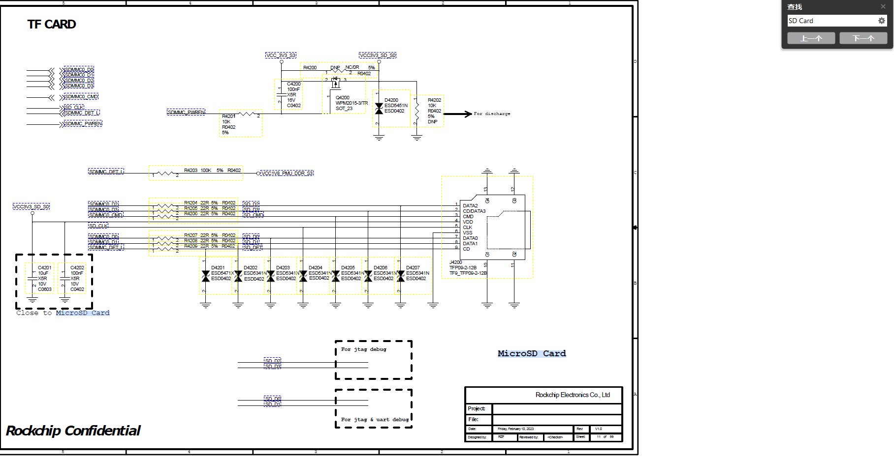
1. `dts` 设备树配置部分，设备树属性参考`kernel/Documentation/devicetree/bindings/mmc/mmc-controller.yaml`
    ```dts
    vcc_3v3_sd_s0: vcc-3v3-sd-s0-regulator {
		compatible = "regulator-fixed";
		gpio = <&gpio0 RK_PB7 GPIO_ACTIVE_HIGH>;
		pinctrl-names = "default";
		pinctrl-0 = <&sd_s0_pwr>;
		regulator-name = "vcc_3v3_sd_s0";
		enable-active-high;
	};
    &sdmmc {
        status = "okay";
        max-frequency = <150000000>;
        supports-sd;
        bus-width = <4>;
        disable-wp;
        sd-uhs-sdr104;
        cap-mmc-highspeed;
        cap-sd-highspeed;
        vmmc-supply = <&vcc_3v3_sd_s0>;
        vqmmc-supply = <&vccio_sd_s0>;
        pinctrl-names = "default";
        pinctrl-0 = <&sdmmc_bus4 &sdmmc_clk &sdmmc_cmd &sdmmc_det>;
    };
    ```
2. `Menuoncfig`配置
3. 重新编译，烧录查看日志
    ```bash
    dmesg | grep mmc
    lsblk
    ```
4. SD卡制作镜像烧录
    - 通过`SDDiskTool_v1.76`制作镜像，掉电插入已经做好的sdcard，等到烧录完成提示，拔卡重启
        ```bash
        Please remove SD CARD!!!, wait for reboot.
        ```
## 2025-10-31
### USB调试
- 参考文档
    ```
    《Rockchip_Developer_Guide_USB_CN.pdf》
    《Rockchip_RK3588_Developer_Guide_USB_CN.pdf》
    ```
- 原理图
    板卡上使用两个usb3.0，一个是usb3.0only，一个是usb3.0+dp，板子上硬件都是Type A的座子，即使有一个座子是带有usb2.0otg的一队数据线，但是因为座子id引脚，所以只能是usb3.0
    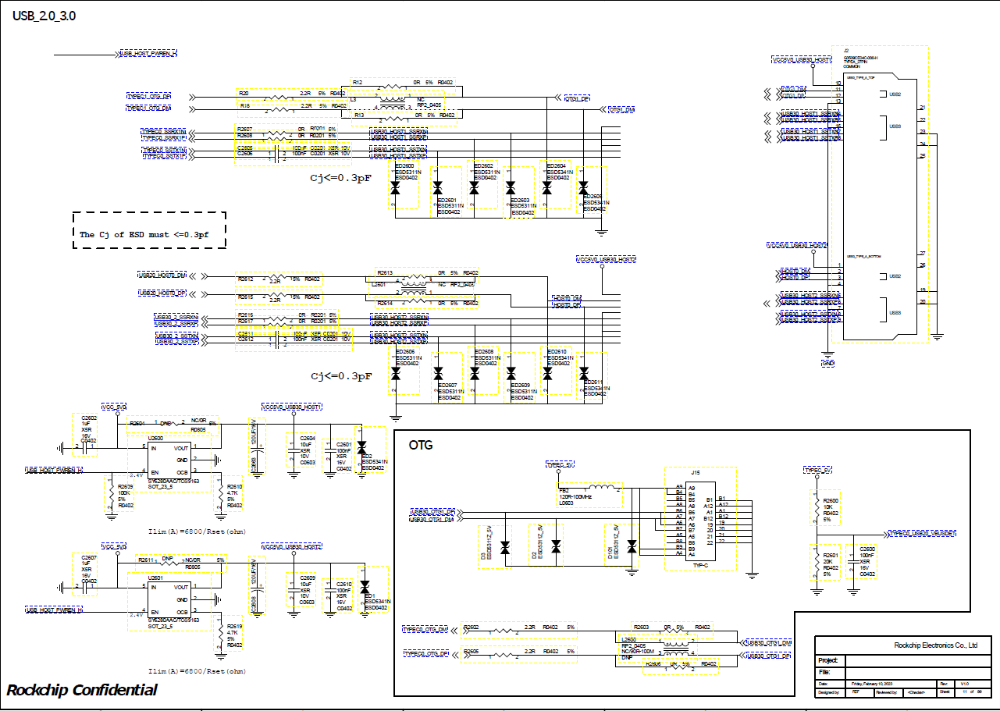
1. `dts` 设备树配置部分
    ```dts
    &u2phy0_otg {
        rockchip,typec-vbus-det;
        phy-supply = <&vcc5v0_host>;
        status = "okay";
    };

    &u2phy2_host {
        phy-supply = <&vcc5v0_host>;
        status = "okay";
    };

    &u2phy3_host {
        phy-supply = <&vcc5v0_host>;
        status = "okay";
    };

    &usbdp_phy0_dp {
        status = "okay";
    };

    &usbdp_phy0_u3 {
        rockchip,dp-lane-mux = <2 3>;
        status = "okay";
    };

    &usbdrd_dwc3_0 {
        dr_mode = "host";
        status = "okay";
    };

    &usbhost3_0 {
        status = "okay";
    };

    &usbhost_dwc3_0 {
        status = "okay";
    };
    ```
2. `Menuoncfig`配置
3. 重新编译，烧录查看日志
    ```bash
    dmesg | grep usb 
    ```
4. 功能验证，可以将硬盘等存储设备插入usb口，然后查看是否有设备挂载
## 2025-11-06
### HDMI-RX调试
- 参考文档
    ```
    《Rockchip_Developer_Guide_HDMI_RX_CN.pdf》
    ```
- 原理图
    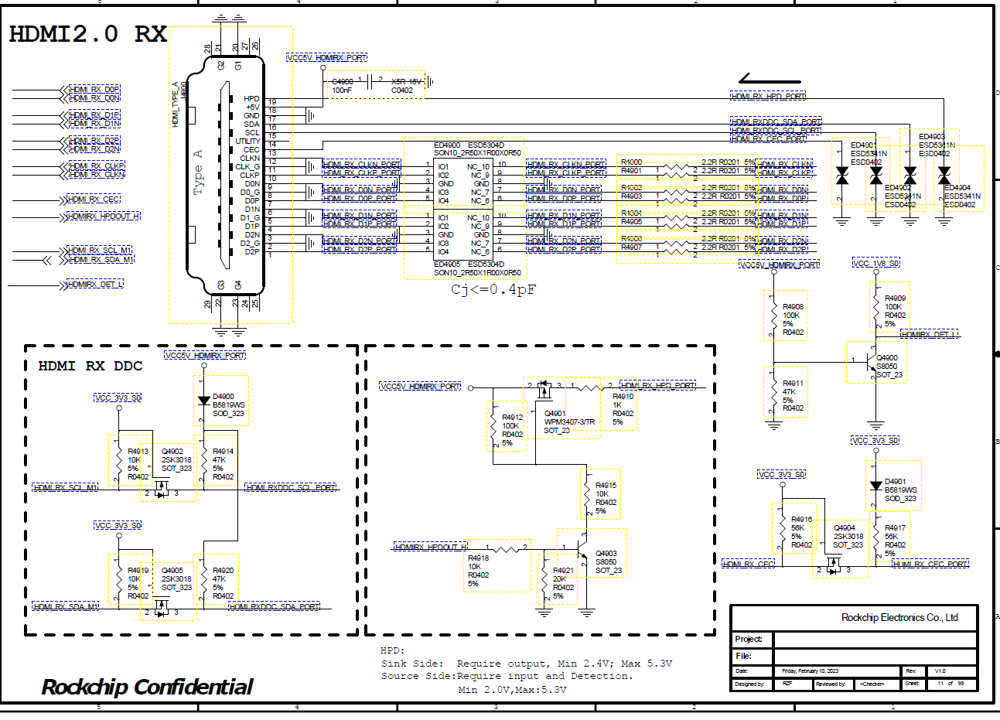
1. `dts` 设备树配置部分
    ```dts
    /* Should work with at least 128MB cma reserved above. */
    &hdmirx_ctrler {
        status = "okay";

        #sound-dai-cells = <1>;
        /* Effective level used to trigger HPD: 0-low, 1-high */
        hpd-trigger-level = <1>;
        hdmirx-det-gpios = <&gpio1 RK_PD5 GPIO_ACTIVE_LOW>;
        pinctrl-names = "default";
        pinctrl-0 = <&hdmim1_rx &hdmirx_det>;
    };
    &pinctrl {
        hdmi {
            hdmirx_det: hdmirx-det {
                rockchip,pins = <1 RK_PD5 RK_FUNC_GPIO &pcfg_pull_up>;
            };
	    };
    };
    ```
2. `Menuoncfig`配置
    ```bash 
    CONFIG_VIDEO_ROCKCHIP_HDMIRX=y
    ```
3. 驱动调试
    - 查看HDMI-RX的video节点
        ```bash
        linaro@linaro-alip:/$ grep -H hdmirx /sys/class/video4linux/video*/name
        /sys/class/video4linux/video20/name:stream_hdmirx
        ```
    - 查找HDMI-RX设备
        ```bash
        linaro@linaro-alip:/$ v4l2-ctl -d /dev/video20 -D
        Driver Info:
                Driver name      : rk_hdmirx
                Card type        : rk_hdmirx
                Bus info         : fdee0000.hdmirx-controller
                Driver version   : 5.10.198
                Capabilities     : 0x84201000
                        Video Capture Multiplanar
                        Streaming
                        Extended Pix Format
                        Device Capabilities
                Device Caps      : 0x04201000
                        Video Capture Multiplanar
                        Streaming
                        Extended Pix Format
        ```
    - 获取驱动timing信息
        ```bash
        linaro@linaro-alip:/$ v4l2-ctl -d /dev/video20 --get-dv-timings
        DV timings:
                Active width: 1920
                Active height: 1080
                Total width: 2200
                Total height: 1125
                Frame format: progressive
                Polarities: -vsync -hsync
                Pixelclock: 148508000 Hz (60.00 frames per second)
                Horizontal frontporch: 88
                Horizontal sync: 44
                Horizontal backporch: 148
                Vertical frontporch: 4
                Vertical sync: 5
                Vertical backporch: 36
                Standards:
                Flags:
        ```
    - 实时查询timing信息
        ```bash
        inaro@linaro-alip:/$ v4l2-ctl -d /dev/video20 --query-dv-timings
            Active width: 1920
            Active height: 1080
            Total width: 2200
            Total height: 1125
            Frame format: progressive
            Polarities: -vsync -hsync
            Pixelclock: 148508000 Hz (60.00 frames per second)
            Horizontal frontporch: 88
            Horizontal sync: 44
            Horizontal backporch: 148
            Vertical frontporch: 4
            Vertical sync: 5
            Vertical backporch: 36
            Standards:
            Flags:
        ```
    - 查询分辨率和图像格式
        ```bash
        linaro@linaro-alip:/$ v4l2-ctl -d /dev/video20 --get-fmt-video
        Format Video Capture Multiplanar:
                Width/Height      : 1920/1080
                Pixel Format      : 'BGR3' (24-bit BGR 8-8-8)
                Field             : None
                Number of planes  : 1
                Flags             : premultiplied-alpha, 0x000000fe
                Colorspace        : sRGB
                Transfer Function : Unknown (0x000000b8)
                YCbCr/HSV Encoding: Unknown (0x000000ff)
                Quantization      : Limited Range
                Plane 0           :
                Bytes per Line : 5760
                Size Image     : 6220800
        ```
    - 开启图像数据流
        ```bash
        linaro@linaro-alip:/$ v4l2-ctl --verbose -d /dev/video20 \
        --set-fmt-video=width=1920,height=1080,pixelformat='BGR3' \
        --stream-mmap=4
        VIDIOC_QUERYCAP: ok
        VIDIOC_G_FMT: ok
        VIDIOC_S_FMT: ok
        Format Video Capture Multiplanar:
                Width/Height      : 1920/1080
                Pixel Format      : 'BGR3' (24-bit BGR 8-8-8)
                Field             : None
                Number of planes  : 1
                Flags             : premultiplied-alpha, 0x000000fe
                Colorspace        : sRGB
                Transfer Function : Unknown (0x000000b8)
                YCbCr/HSV Encoding: Unknown (0x000000ff)
                Quantization      : Limited Range
                Plane 0           :
                Bytes per Line : 5760
                Size Image     : 6220800
                        VIDIOC_REQBUFS returned 0 (Success)
                        VIDIOC_QUERYBUF returned 0 (Success)
        [ 7068.771566] fdee0000.hdmirx-controller: hdmirx_start_streaming: delay_line:720
                        VIDIOC_QUERYBUF returned 0 (Success)
                        VIDIOC_QUERYBUF returned 0 (Success)
                        VIDIOC_QUERYBUF returned 0 (Success)
                        VIDIOC_QBUF returned 0 (Success)
                        VIDIOC_QBUF returned 0 (Success)
                        VIDIOC_QBUF returned 0 (Success)
                        VIDIOC_QBUF returned 0 (Success)
                        VIDIOC_STREAMON returned 0 (Success)
        cap dqbuf: 0 seq:      0 bytesused: 6220800 ts: 7067.147079 delta: 7067147.079 ms (ts-monotonic, ts-src-eof)
        cap dqbuf: 1 seq:      1 bytesused: 6220800 ts: 7067.163745 (ts-monotonic, ts-src-eof)
        cap dqbuf: 2 seq:      2 bytesused: 6220800 ts: 7067.180411 (ts-monotonic, ts-src-eof)
        cap dqbuf: 3 seq:      3 bytesused: 6220800 ts: 7067.197077 (ts-monotonic, ts-src-eof)
        cap dqbuf: 0 seq:      4 bytesused: 6220800 ts: 7067.213740 fps: 60.01 (ts-monotonic, ts-src-eof)
        cap dqbuf: 1 seq:      5 bytesused: 6220800 ts: 7067.230409 fps: 60.00 (ts-monotonic, ts-src-eof)
        cap dqbuf: 2 seq:      6 bytesused: 6220800 ts: 7067.247076 fps: 60.00 (ts-monotonic, ts-src-eof)
        cap dqbuf: 3 seq:      7 bytesused: 6220800 ts: 7067.263741 fps: 60.00 (ts-monotonic, ts-src-eof)

        ```
    - 抓取图像文件
        ```bash 
        linaro@linaro-alip:~/Desktop$ v4l2-ctl --verbose -d /dev/video20 \
            --set-fmt-video=width=1920,height=1080,pixelformat='BGR3' \
            --stream-mmap=4 --stream-skip=3 \
            --stream-to=/home/linaro/Desktop/1920_1080_brg3.yuv \
            --stream-count=5 --stream-poll
        VIDIOC_QUERYCAP: ok
        VIDIOC_G_FMT: ok
        VIDIOC_S_FMT: ok
        Format Video Capture Multiplanar:
                Width/Height      : 1920/1080
                Pixel Format      : 'BGR3' (24-bit BGR 8-8-8)
                Field             : None
                Number of planes  : 1
                Flags             : premultiplied-alpha, 0x000000fe
                Colorspace        : sRGB
                Transfer Function : Unknown (0x000000b8)
                YCbCr/HSV Encoding: Unknown (0x000000ff)
                Quantization      : Limited Range
                Plane 0           :
                Bytes per Line : 5760
                Size Image     : 6220800
                        VIDIOC_REQBUFS returned 0 (Success)
                        VIDIOC_QUERYBUF returned 0 (Success)
        [ 7785.719017] fdee0000.hdmirx-controller: hdmirx_start_streaming: delay_line:720
                        VIDIOC_QUERYBUF returned 0 (Success)
                        VIDIOC_QUERYBUF returned 0 (Success)
                        VIDIOC_QUERYBUF returned 0 (Success)
                        VIDIOC_QBUF returned 0 (Success)
                        VIDIOC_QBUF returned 0 (Success)
                        VIDIOC_QBUF returned 0 (Success)
                        VIDIOC_QBUF returned 0 (Success)
                        VIDIOC_STREAMON returned 0 (Success)
        cap dqbuf: 0 seq:      0 bytesused: 6220800 ts: 7784.106089 delta: 7784106.089 ms (ts-monotonic, ts-src-eof)
        cap dqbuf: 1 seq:      1 bytesused: 6220800 ts: 7784.122755 (ts-monotonic, ts-src-eof)
        cap dqbuf: 2 seq:      2 bytesused: 6220800 ts: 7784.139421 (ts-monotonic, ts-src-eof)
        cap dqbuf: 3 seq:      3 bytesused: 6220800 ts: 7784.156087 (ts-monotonic, ts-src-eof)
        cap dqbuf: 0 seq:      4 bytesused: 6220800 ts: 7784.172747 fps: 60.01 (ts-monotonic, ts-src-eof)
        cap dqbuf: 1 seq:      5 bytesused: 6220800 ts: 7784.189410 fps: 60.01 (ts-monotonic, ts-src-eof)
        cap dqbuf: 2 seq:      6 bytesused: 6220800 ts: 7784.206076 fps: 60.01 (ts-monotonic, ts-src-eof)
        cap dqbuf: 3 seq:      7 bytesused: 6220800 ts: 7784.222745 fps: 60.01 (ts-monotonic, ts-src-eof)
        [ 7785.971011] fdee0000.hdmirx-controller: stream start stopping
        [ 7785.974998] fdee0000.hdmirx-controller: stream stopping finished
        ```
    - ffplay播放抓取的图像文件
        ```bash
        linaro@linaro-alip:~/Desktop$ ffplay -f rawvideo \
                -pixel_format bgr24 \
                -video_size 1920x1080 \
                -framerate 60 \
                1920_1080_brg3.yuv
        ffplay version 4.3.9-0+deb11u1 Copyright (c) 2003-2025 the FFmpeg developers
        built with gcc 10 (Debian 10.2.1-6)
        configuration: --prefix=/usr --extra-version=0+deb11u1 --toolchain=hardened --libdir=/usr/lib/aarch64-linux-gnu --incdir=/usr/include/aarch64-linux-gnu --arch=arm64 --enable-gpl --disable-stripping --enable-avresample --disable-filter=resample --enable-gnutls --enable-ladspa --enable-libaom --enable-libass --enable-libbluray --enable-libbs2b --enable-libcaca --enable-libcdio --enable-libcodec2 --enable-libdav1d --enable-libflite --enable-libfontconfig --enable-libfreetype --enable-libfribidi --enable-libgme --enable-libgsm --enable-libjack --enable-libmp3lame --enable-libmysofa --enable-libopenjpeg --enable-libopenmpt --enable-libopus --enable-libpulse --enable-librabbitmq --enable-librsvg --enable-librubberband --enable-libshine --enable-libsnappy --enable-libsoxr --enable-libspeex --enable-libsrt --enable-libssh --enable-libtheora --enable-libtwolame --enable-libvidstab --enable-libvorbis --enable-libvpx --enable-libwavpack --enable-libwebp --enable-libx265 --enable-libxml2 --enable-libxvid --enable-libzmq --enable-libzvbi --enable-lv2 --enable-omx --enable-openal --enable-opencl --enable-opengl --enable-sdl2 --enable-pocketsphinx --enable-libdc1394 --enable-libdrm --enable-libiec61883 --enable-chromaprint --enable-frei0r --enable-libx264 --enable-shared
        libavutil      56. 51.100 / 56. 51.100
        libavcodec     58. 91.100 / 58. 91.100
        libavformat    58. 45.100 / 58. 45.100
        libavdevice    58. 10.100 / 58. 10.100
        libavfilter     7. 85.100 /  7. 85.100
        libavresample   4.  0.  0 /  4.  0.  0
        libswscale      5.  7.100 /  5.  7.100
        libswresample   3.  7.100 /  3.  7.100
        libpostproc    55.  7.100 / 55.  7.100
        libGL error: failed to create dri screen
        libGL error: failed to load driver: rockchip
        libGL error: failed to create dri screen
        libGL error: failed to load driver: rockchip
        [  568.040825] dwhdmi-rockchip fde80000.hdmi: use tmds mode
        [  568.082177] dwhdmi-rockchip fde80000.hdmi: use tmds mode
        [rawvideo @ 0x7f1c000ba0] Estimating duration from bitrate, this may be inaccurate
        Input #0, rawvideo, from '1920_1080_brg3.yuv':
        Duration: 00:00:00.08, start: 0.000000, bitrate: 2985995 kb/s
            Stream #0:0: Video: rawvideo (BGR[24] / 0x18524742), bgr24, 1920x1080, 2985984 kb/s, 60 tbr, 60 tbn, 60 tbc
        6.40 M-V:  0.231 fd=   2 aq=    0KB vq=    0KB sq=    0B f=0/0
        ```
## 2025-11-07   
### CAN 调试
- 参考文档
    ```
    《Rockchip_Developer_Guide_Can_CN.pdf》
    《USBCAN-II产品说明书V1.2.pdf》
    ```
- 原理图
    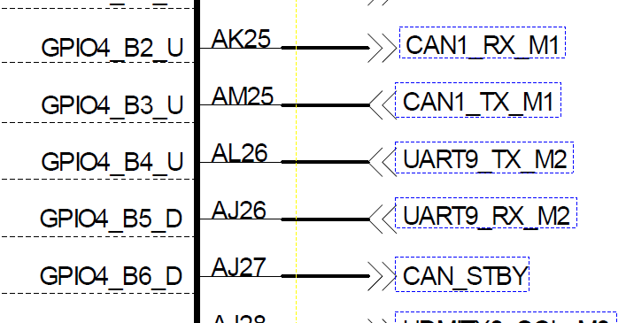
1. `dts` 设备树配置部分
    ```dts
    &can1 {
        status = "okay";
        pinctrl-names = "default";
        pinctrl-0 = <&can1m1_pins>;
    };
    ```
2. `Menuoncfig`配置
    ```bash
    CONFIG_CAN=y
    CONFIG_CAN_ROCKCHIP=y
    CONFIG_CANFD_ROCKCHIP=y
    ```
3. 驱动调试，建议验证
    **下位机部分**
    - 查看内核是否开启CAN总线，CAN设备是否存在
        ```bash
        root@linaro-alip:/# dmesg | grep can:
        [    2.869271] can: controller area network core
        [    2.869309] can: raw protocol
        [    2.869317] can: broadcast manager protocol
        [    2.869327] can: netlink gateway - max_hops=1
        root@linaro-alip:/# ip a | grep can
        2: can0: <NOARP,UP,LOWER_UP,ECHO> mtu 16 qdisc pfifo_fast state UP group default qlen 10
        link/can
        ```
    - 启动 CAN 接口（标准 CAN 模式）
        ```bash
        root@linaro-alip:/# ip link set can0 down
        root@linaro-alip:/# ip link set can0 up type can bitrate 500000
        [ 7086.993986] IPv6: ADDRCONF(NETDEV_CHANGE): can0: link becomes ready
        ```  
    - 下位编辑发送数据，可以在上位机显示接收到的数据，下位机的发送指令
        ```bash
        # 发送标准帧：ID=0x100，数据=4字节
        root@linaro-alip:/# cansend can0 100#11223344
        ```
        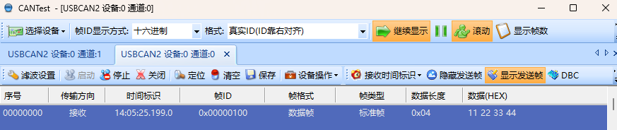
    **上位机部分**
    - 在PC上安装上位机软件CANtest和CAN驱动
    - 在CANtest上，对应的CAN接口选择can0，波特率选择500Kbps，点击Connect按钮连接设备
    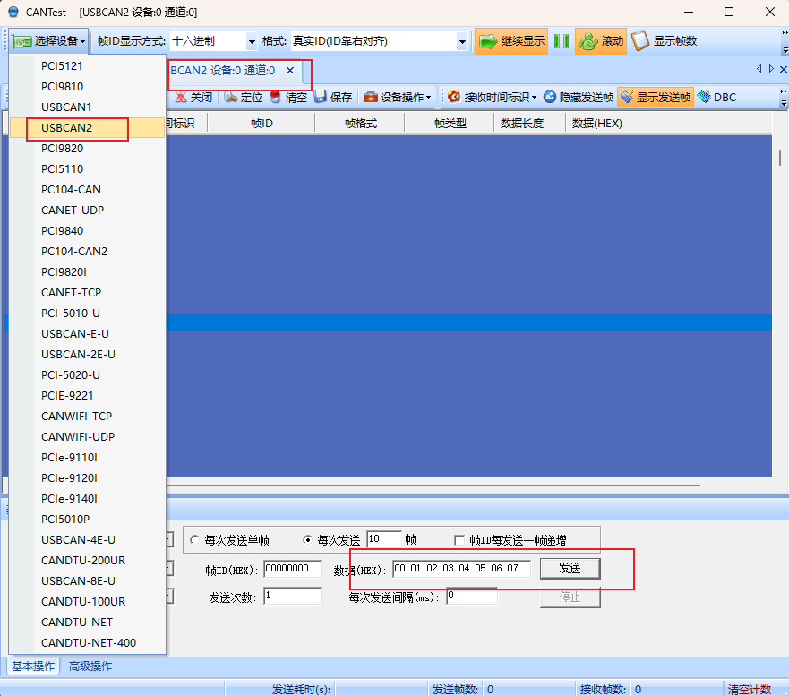
    - 上位编辑发送数据，可以在下位输出`candump can0`查看上位机发送的数据
    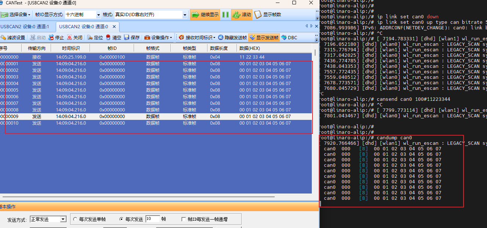   
## 2025-11-10
### 串口通信485-232
- 参考文档
    ```
    《Rockchip_Developer_Guide_UART_CN.pdf》
    ```
1. `dts` 设备树配置部分
    ```dts
    # 232
    &uart3 {
        status = "okay";
        pinctrl-names = "default";
        pinctrl-0 = <&uart3m2_xfer>;
    };
    # 485
    &uart0 {
        status = "okay";
        pinctrl-names = "default";
        pinctrl-0 = <&uart0m2_xfer>;
    };

    ```
2. `Menuoncfig`配置
    ```bash
    CONFIG_USB_SERIAL=y
    CONFIG_USB_SERIAL_CH341=y
    CONFIG_USB_SERIAL_GENERIC=y
    CONFIG_USB_SERIAL_CP210X=y
    CONFIG_USB_SERIAL_PL2303=y
    ```
3. 功能验证
    - 232回环测试
        ```bash
        # 1. 设置串口参数（115200, 8N1）
        stty -F /dev/ttyS3 115200 cs8 -cstopb -parenb raw -echo

        # 2. 启动监听（后台）
        cat /dev/ttyS3 

        # 3. 开始另外一个终端，发送测试数据
        echo "RS232 OK" > /dev/ttyS3
        while true; do echo "RS232 OK" > /dev/ttyS3; sleep 1; done
        ```
    - 485测试，注意线不要接反
        ```bash
        # 1. 设置串口参数（115200, 8N1）
        stty -F /dev/ttyS0 115200 cs8 -cstopb -parenb -echo
        stty -F /dev/ttyUSB0 115200 cs8 -cstopb -parenb -echo
        # 2. 开启两个终端，分别发送串口数据，监听数据
        # 其中一个终端监听
        cat /dev/tttUSB0
        # 另一个终端发送数据
        echo "RS485 OK" > /dev/ttyS0
        ```
### 使用sysfs控制gpio一般流程
1. 确定gpio编号，查看原理图
2. 导出gpio，让内核将gpio暴露给用户空间，
    ```bash
    echo <gpio_num> > /sys/class/gpio/export
    ```
    导出成功之后会生成目录`/sys/class/gpio/gpio<gpio_num>`，如果失败请查看权限和占用问题
3. 设置方向
    ```bash
    # 输入
    echo in > /sys/class/gpio/gpio<gpio_num>/direction
    # 输出
    echo out > /sys/class/gpio/gpio<gpio_num>/direction
    ```
4. 读取电平
    - 写输出
    ```bash
    echo 1 > /sys/class/gpio/gpio<gpio_num>/value   # 高电平
    echo 0 > /sys/class/gpio/gpio<gpio_num>/value   # 低电平
    ```
    - 读输入
    ```bash
    cat /sys/class/gpio/gpio<gpio_num>/value 
    ```
5. 取消导出
    ```bash
    echo <gpio_num> > /sys/class/gpio/unexport
    ```
## 2025-11-17
### 一些系统参数相关操作
对于RK3588的CPU、GPU、DDR、NPU有以下六种运行策略
- `interactive` 根据CPU负载动态调频调压
- `performance` 性能有限，将频率设置为最高
- `ondemand` 根据CPU负载动态调频调压，比`interactive`更省电，但是策略反应慢
- `conservative` 保守策略，逐级调整频率和电压
- `powersave` 省电策略，频率和电压都降低
- `userspace` 用户自定义策略，用户自己定义调频调压策略

可以通过以下命令查看他们的频率电压表
```bash
cat /sys/kernel/debug/opp/opp_summary
```
#### CPU
RK3588的CPU为4个A55和4个A76，分三组节点进行控制
```bash
/sys/devices/system/cpu/cpufreq/policy0:(4 A55：CPU0-3)
/sys/devices/system/cpu/cpufreq/policy4:(2 A76：CPU4-5)
/sys/devices/system/cpu/cpufreq/policy6:(2 A76：CPU6-7)
```
- 获取CPU支持频率
    ```bash
    cat /sys/devices/system/cpu/cpufreq/policy0/scaling_available_frequencies
    ```
- 获取CPU支持运行模式
    ```bash
    cat /sys/devices/system/cpu/cpufreq/policy0/scaling_available_governors
    ```
- 获取CPU当前频率
    ```bash
    cat /sys/devices/system/cpu/cpufreq/policy0/scaling_cur_freq
    ```
- 设置CPU运行模式
    ```bash
    echo performance > /sys/devices/system/cpu/cpufreq/policy0/scaling_governor
    ```
- 设置CPU频率
    ```bash
    echo userspace > /sys/devices/system/cpu/cpufreq/policy6/scaling_governor
    echo 2352000 > /sys/devices/system/cpu/cpufreq/policy6/scaling_setspeed
    ```
#### GPU
GPU节点为`/sys/class/devfreq/fb000000.gpu/`
- 获取GPU支持频率
    ```bash
    cat /sys/class/devfreq/fb000000.gpu/available_frequencies
    ```
- 获取GPU当前频率
    ```
    cat /sys/class/devfreq/fb000000.gpu/cur_freq
    ```
- 设置GPU频率
    ```bash
    echo userspace > /sys/class/devfreq/fb000000.gpu/governor
    echo 10000000000 > /sys/class/devfreq/fb000000.gpu/max_freq
    ```
- 获取GPU运行的模式
    ```bash
    cat /sys/class/devfreq/fb000000.gpu/governor
    ```
- 获取GPU支持运行模式
    ```bash
    cat /sys/class/devfreq/fb000000.gpu/available_governors
    ```
- 查看GPU负载
    ```bash
    cat /sys/class/devfreq/fb000000.gpu/load
    ```
#### NPU
NPU节点为`/sys/class/devfreq/fdab0000.npu/`
- 获取NPU支持频率
    ```bash
    cat /sys/class/devfreq/fdab0000.npu/available_frequencies
    ```
- 获取NPU支持运行模式
    ```bash
    cat /sys/class/devfreq/fdab0000.npu/available_governors
    ```
- 获取NPU当前频率
    ```bash
    cat /sys/class/devfreq/fdab0000.npu/cur_freq
    ```
- 查看NPU负载
    ```bash
    cat /sys/class/devfreq/fdab0000.npu/load
    ```
#### DDR 
DDR节点为`/sys/class/devfreq/dmc/`
- 获取 DDR 支持的频率
    ```bash
    cat /sys/class/devfreq/dmc/available_frequencies
    ```     
- 获取DDR支持运行模式
    ```bash
    cat /sys/class/devfreq/dmc/available_governors
    ```
- 获取DDR当前频率
    ```bash
    cat /sys/class/devfreq/dmc/cur_freq
    ```
- 设置DDR频率
    ```bash
    echo userspace > /sys/class/devfreq/dmc/governor
    echo 2112000000 > /sys/class/devfreq/dmc/userspace/set_freq
    ```
- 查看DDR负载
    ```bash
    cat /sys/class/devfreq/dmc/load
    ```
#### 温度
RK3588的芯片有7路TS-ADC分别对应：芯片中心位置、A76_0/1、A76_2/3、A55_0/1/2/3、PD_CENTER、 NPU、GPU，单位为0.001摄氏度
```bash
# 芯片中心位置
cat /sys/class/thermal/thermal_zone0/temp
# A76_0/1
cat /sys/class/thermal/thermal_zone1/temp
# A76_2/3
cat /sys/class/thermal/thermal_zone2/temp
# A55_0/1/2/3
cat /sys/class/thermal/thermal_zone3/temp
# PD_CENTER
cat /sys/class/thermal/thermal_zone4/temp
# NPU
cat /sys/class/thermal/thermal_zone5/temp
# GPU
cat /sys/class/thermal/thermal_zone6/temp
```
### 2025-12-04
###  RK3588 USB 控制器和 PHY 简介
RK3588的USB控制器包括2个`USB2.0HOST`控制、2个`USB3.1OTG`控制、1个`USB3.1`控制器，支持7个独立的USBPHY包括4个人`USB2.0PHY`、`2个USB3.1/DP ComboPHY`、1个`USB3.1/SATA/PCIe ComboPHY`，RK3588 USB 控制器和PHY的连接关系列表如下
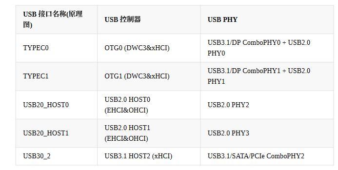
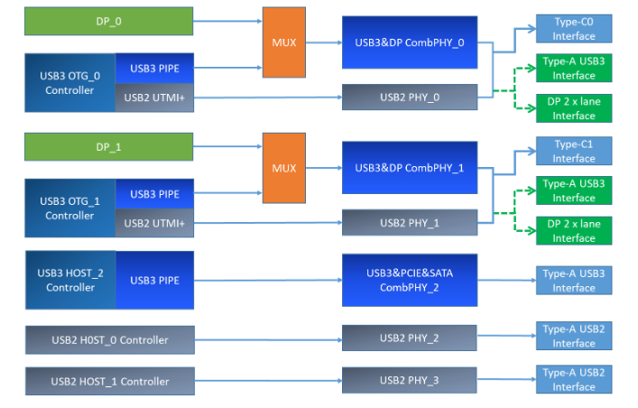
控制器和pin脚的对应关系
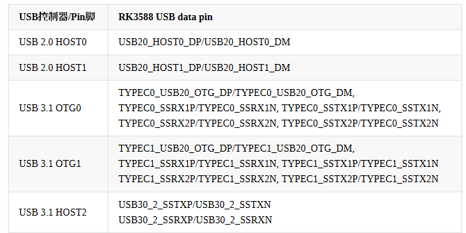
### USB调试
- 参考文档
    [Rockchip_RK3588_Developer_Guide_USB_CN.pdf](20251204\Rockchip_Developer_Guide_USB_CN.pdf)
- 原理图    
    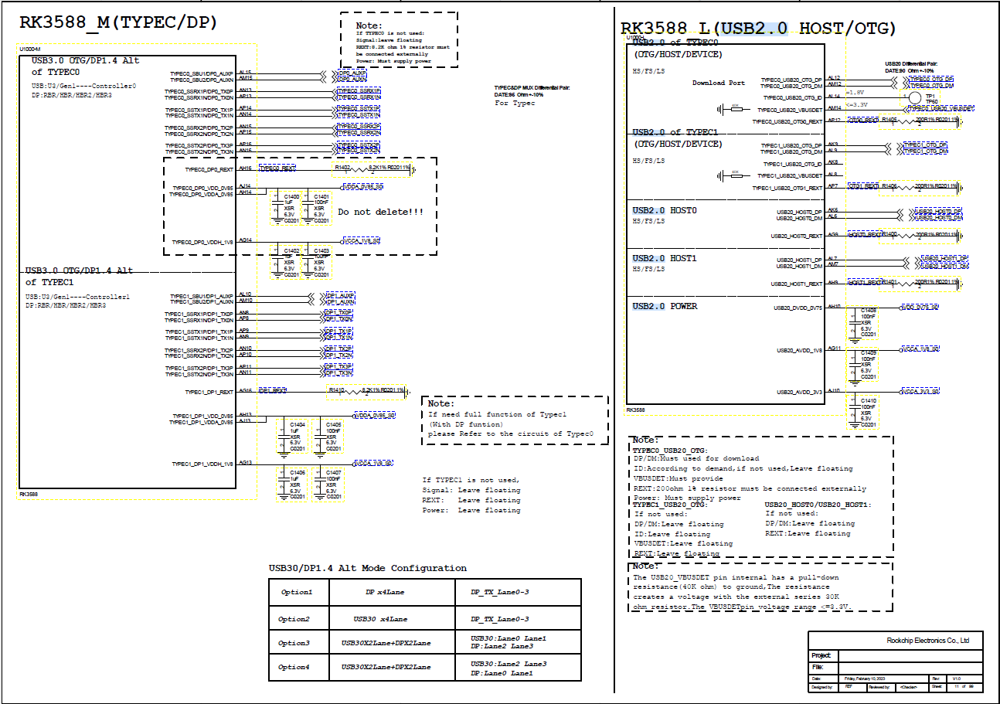
    ```
    物理端口1 (Type-C) → 
    USB2.0: u2phy0 + u2phy0_otg
    USB3.0: usbdp_phy0 + usbdrd_dwc3_0
    
    物理端口2 (Type-C) →         
    USB2.0: u2phy1 + u2phy1_otg  
    USB3.0: usbdp_phy1 + usbdrd_dwc3_1
    
    物理端口3 (Type-A) →
    USB2.0: u2phy2 + u2phy2_host
    
    物理端口4 (Type-A) →
    USB2.0: u2phy3 + u2phy3_host

    物理接口5（Type-A）→
    USB3.0: usbhost3_0 + usbhost_dwc3_0
    ```
1. `dts` 设备树配置部分
    ```dts
    &u2phy0_otg {
        phy-supply = <&vcc5v0_host>;
        status = "okay";
    };

    &u2phy1_otg {
        phy-supply = <&vcc5v0_host>;
        status = "okay";
    };

    &u2phy2_host {
        phy-supply = <&vcc5v0_host>;
    };

    &u2phy3_host {
        phy-supply = <&vcc5v0_host>;
    };

    &usbdp_phy0 {
        rockchip,dp-lane-mux = <2 3>;
        status = "okay";
    };

    &usbdp_phy0_dp {
        status = "okay";
    };

    &usbdp_phy0_u3 {
        status = "okay";
    };

    &usbdp_phy1 {
        rockchip,dp-lane-mux = <2 3>; 
        status = "okay";
    };

    &usbdp_phy1_dp {
        status = "okay";
    };

    &usbdp_phy1_u3 {
        status = "okay";
    };

    &usbdrd_dwc3_0 {
        dr_mode = "host";
        extcon = <&u2phy0>;
        status = "okay";
    };

    &usbdrd_dwc3_1 {
        dr_mode = "host";
        status = "okay";
    };

    ```
2. 功能验证
    - 查看usb总线拓扑和详细信息
        ```bash 
        lsusb -vt
        root@linaro-alip:/# lsusb -vt
        # USB3.0 控制器组（xHCI），每个USB3.0控制器会创建两个总线
        # 一个低速480M总线处理USB2.0设备，一个高速5000M总线处理USB3.0设备
        /:  Bus 08.Port 1: Dev 1, Class=root_hub, Driver=xhci-hcd/1p, 5000M
            ID 1d6b:0003 Linux Foundation 3.0 root hub
        /:  Bus 07.Port 1: Dev 1, Class=root_hub, Driver=xhci-hcd/1p, 480M
            ID 1d6b:0002 Linux Foundation 2.0 root hub
        /:  Bus 06.Port 1: Dev 1, Class=root_hub, Driver=xhci-hcd/1p, 5000M
            ID 1d6b:0003 Linux Foundation 3.0 root hub
        /:  Bus 05.Port 1: Dev 1, Class=root_hub, Driver=xhci-hcd/1p, 480M
            ID 1d6b:0002 Linux Foundation 2.0 root hub
        # USB1.1控制器组（OHCI）
        /:  Bus 04.Port 1: Dev 1, Class=root_hub, Driver=ohci-platform/1p, 12M
            ID 1d6b:0001 Linux Foundation 1.1 root hub
        /:  Bus 03.Port 1: Dev 1, Class=root_hub, Driver=ohci-platform/1p, 12M
            ID 1d6b:0001 Linux Foundation 1.1 root hub
        # USB2.0 控制器组（EHCI）
        /:  Bus 02.Port 1: Dev 1, Class=root_hub, Driver=ehci-platform/1p, 480M
            ID 1d6b:0002 Linux Foundation 2.0 root hub
            |__ Port 1: Dev 2, If 0, Class=Hub, Driver=hub/4p, 480M
                ID 1a86:8091 QinHeng Electronics
                |__ Port 3: Dev 3, If 0, Class=Communications, Driver=, 480M
                    ID 2c7c:0900 Quectel Wireless Solutions Co., Ltd.
                |__ Port 3: Dev 3, If 1, Class=CDC Data, Driver=, 480M
                    ID 2c7c:0900 Quectel Wireless Solutions Co., Ltd.
                |__ Port 3: Dev 3, If 2, Class=Vendor Specific Class, Driver=option, 480M
                    ID 2c7c:0900 Quectel Wireless Solutions Co., Ltd.
                |__ Port 3: Dev 3, If 3, Class=Vendor Specific Class, Driver=option, 480M
                    ID 2c7c:0900 Quectel Wireless Solutions Co., Ltd.
                |__ Port 3: Dev 3, If 4, Class=Vendor Specific Class, Driver=option, 480M
                    ID 2c7c:0900 Quectel Wireless Solutions Co., Ltd.
                |__ Port 3: Dev 3, If 5, Class=Vendor Specific Class, Driver=option, 480M
                    ID 2c7c:0900 Quectel Wireless Solutions Co., Ltd.
                |__ Port 3: Dev 3, If 6, Class=Vendor Specific Class, Driver=option, 480M
                    ID 2c7c:0900 Quectel Wireless Solutions Co., Ltd.
        /:  Bus 01.Port 1: Dev 1, Class=root_hub, Driver=ehci-platform/1p, 480M
            ID 1d6b:0002 Linux Foundation 2.0 root hub
            |__ Port 1: Dev 2, If 0, Class=Video, Driver=uvcvideo, 480M
                ID 0bda:3035 Realtek Semiconductor Corp.
            |__ Port 1: Dev 2, If 1, Class=Video, Driver=uvcvideo, 480M
                ID 0bda:3035 Realtek Semiconductor Corp.
        ```
    - 查看`/sys/bus/usb/devices`是否存在usb驱动
        ```bash
        ls /sys/bus/usb/devices
        ```
    - 查看usb接口工作模式
        ```bash
        cat /sys/kernel/debug/usb/*devicename*/mode
        ```
    - 对于otg接口，可以设置其工作模式为`host`或者`device`
        ```bash
        echo host > /sys/kernel/debug/usb/*devicename*/mode 
        echo device > /sys/kernel/debug/usb/*devicename*/mode
        ```
## 2025-12-05
### sata 接口
- 参考文档
    [Rockchip_Developer_Guide_PCIe_CN.pdf](20251205\Rockchip_Developer_Guide_PCIe_CN.pdf)
- 原理图
    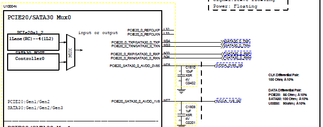
    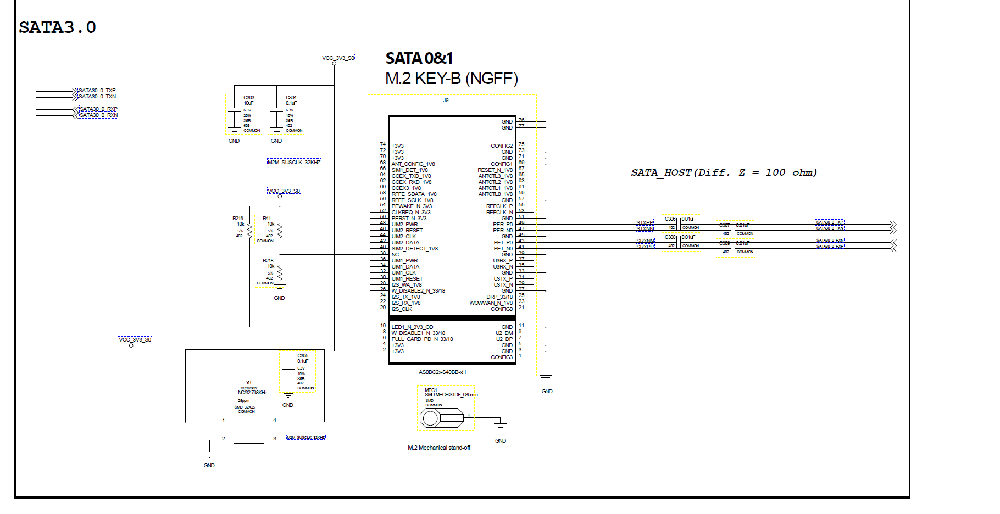
1. `dts` 设备树配置部分
    ```dts
    &combphy0_ps {
        status = "okay";
    };

    &sata0 {
        status = "okay";
    };
    ```
2. 功能验证
    - 确认分区状况
        ```bash
        lsblk
        ```
### 4G/5G模块
- 参考文档
    [Quectel_QConnectManager_Linux_用户指导_V1.0.pdf](20251205/Quectel_QConnectManager_Linux_用户指导_V1.0.pdf)
    [Quectel_UMTS_LTE_5G_Linux_USB_Driver_用户指导_V1.2.pdf](20251205/Quectel_UMTS_LTE_5G_Linux_USB_Driver_用户指导_V1.2.pdf)
- 原理图
    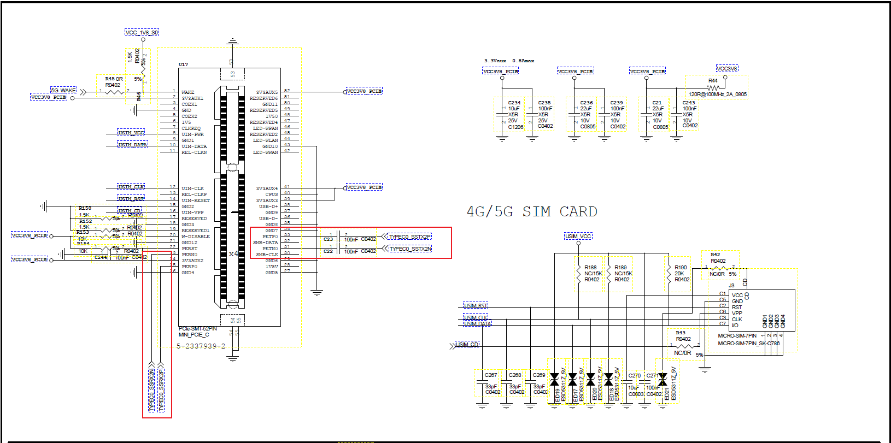
1. `dts` 设备树配置部分
    参考上述usb的配置
2. `Menuconfig` 配置部分
    ```bash
    CONFIG_USB_NET_DRIVERS=y
    CONFIG_USB_USBNET=y
    CONFIG_USB_NET_QMI_WWAN=y
    CONFIG_USB_WDN=y
    CONFIG_USB_ACM=y
    ```
3. 功能验证
    - 根据`《Quectel_QConnectManager_Linux_用户指导_V1.0.pdf》`交叉编译`Quectel_Linux_Android_QMI_WWAN_Driver_V1.2.9`生成`quectel-CM`，放入系统
    - 使用`busybox mircocom`配置模块
        ```bash
        busybox microcom /dev/ttyUSB2 -s 115200 
        AT+CFUN=0
        AT+CFUN=1
        AT+CPIN?
        AT+CSQ
        AT+COPS?
        ```
    - 执行`./quectel-CM`配置模组
    - 查看ip
4. 将 Quectel 模块支持集成到根文件系统（基于 `<SDK>/debian`）：
   - `quectel-CM` → `<SDK>/debian/overlay-firmware/usr/share/quectel/quectel-CM`
   - 启动配置脚本 `quectel` → `<SDK>/debian/overlay/usr/bin/quectel`
   - systemd 服务文件 → `<SDK>/debian/overlay/lib/systemd/system/quectel.service`
## 2026-05-22
### RK 反汇编设备树
1. 查看当前内核使用的设备树目录，查看设备树根节点
```bash
ls /proc/device-tree 
cat /proc/device-tree/model
```
2. 导出当前正在使用的DTB
```bash 
sudo -s
apt update 
apt install device-tree-compiler
dtc -I fs -O dts /proc/device-tree > /tmp/running.dts
```
## 2026-05-25
### PCIE 接口调试
- 原理图
    [RK3588+BM1684X-V1.0_20260305](20260525\RK3588+BM1684X-V1.0_20260305.pdf)
    这个板子中 PCIe 资源分配如下：
    1. PCIe3.0 PHY 共 4 条 lane，配置为 2 + 1 + 1 模式。
        PORT0 使用 lane0 + lane1，共 2 条 lane，通过 `pcie3x4` 控制器配置为 PCIe Gen3 x2，用于 M.2 接口。
        PORT1 的两条 lane 拆分为两个独立的 x1 使用：
        lane2 通过 `pcie3x2` 控制器配置为 PCIe x1；
        lane3 通过 `pcie2x1l1` 控制器配置为 PCIe x1。
    2. PCIe2.0 部分共有 3 路 x1 资源：
        一路用于板载网口；
        一路用于外部 PCIe 设备接口，即 J4 / PCIE200，对应 `pcie2x1l2`；
        剩余一路由于与其它功能复用冲突，在当前硬件设计中无法使用。
        控制器的对应关系需要去看手册，并不是顺序对应
        其中 J4 / PCIE200 使用 `combphy0_ps`，需要关闭与其复用的 SATA0，因此 DTS 中启用 `combphy0_ps` 和 `pcie2x1l2` ，同时禁用`sata0`。
    3. 有一个时钟使能脚，是公用资源需要常高，不要配置成专属资源
- 注意事项
    拿到板子先跟硬件对 **电源时钟复位** 等相关资源，避免硬件问题阻碍软件调试

1. `dts` 设备树配置部分
    ```dts
    /* J4 - PCIE200 */
    &combphy0_ps {
        status = "okay";
    };

    &pcie2x1l2 {
        status = "okay";
        num-lanes = <1>;
        rockchip,perst-inactive-ms = <3000>;
        max-link-speed = <1>;
        rockchip,skip-scan-in-resume;
        reset-gpios = <&gpio1 RK_PA3 GPIO_ACTIVE_HIGH>;
    };

    &sata0 {
        status = "disabled";
    };

    /* PCIe3.0 PHY: 2 + 1 + 1 */
    &pcie30phy {
        rockchip,pcie30-phymode = <PHY_MODE_PCIE_NABINB>; /* 2 + 1 + 1 */
        status = "okay";
    };

    /*
    * PORT0: lane0 + lane1
    */
    &pcie3x4 {
        status = "okay";
        num-lanes = <2>;
        max-link-speed = <1>;
        vpcie3v3-supply = <&vcc3v3_pcie30>;
        rockchip,skip-scan-in-resume;
        reset-gpios = <&gpio4 RK_PB6 GPIO_ACTIVE_HIGH>; 
    };

    /*
    * PORT1 Lane0：PCIE30_PORT1_TX2/RX2
    */
    &pcie3x2 {
        status = "okay";
        num-lanes = <1>;
        max-link-speed = <1>;
        vpcie3v3-supply = <&vcc3v3_pcie30>;
        rockchip,skip-scan-in-resume;
        rockchip,perst-inactive-ms = <3000>;
        reset-gpios = <&gpio4 RK_PA1 GPIO_ACTIVE_HIGH>;
    };

    /*
    * PORT1 Lane1：PCIE30_PORT1_TX3/RX3
    */
    &pcie2x1l1 {
        status = "okay";
        num-lanes = <1>;
        max-link-speed = <1>;
        rockchip,perst-inactive-ms = <3000>;
        phys = <&pcie30phy>;
        phy-names = "pcie-phy";
        vpcie3v3-supply = <&vcc3v3_pcie30>;
        reset-gpios = <&gpio4 RK_PA0 GPIO_ACTIVE_HIGH>;
    };

    /* 
    * J10 - PCIE201
    */
    &combphy1_ps {
        status = "okay";
    };

    &pcie2x1l0 {
        status = "okay";
        num-lanes = <1>;
        rockchip,skip-scan-in-resume;
        rockchip,perst-inactive-ms = <3000>;
        max-link-speed = <1>;
        reset-gpios = <&gpio1 RK_PA2 GPIO_ACTIVE_HIGH>;
    };
    ```
### 1684X 驱动安装    
这里调试的时候遇到三个问题
1. `lib/modules/5.10.198` 运行时模块目录不完整
2. `Linux Header` 编译环境不完整
3. 1684X 驱动 `deb` 包需要能被正确安装并触发 `depmod / modprobe`

这三部分的两个补丁里分工是：
- [integrate-linux-header-in-sdk-combined.patch](20260525/integrate-linux-header-in-sdk-combined.patch) 主要修改通用构建流程，解决 `linux-headers` 标准化打包和输出目录问题，也顺带调整了模块放置路径
- [integrate-linux-header-in-sdk-debian-combined.patch](20260525/integrate-linux-header-in-sdk-debian-combined.patch) 主要修改 `Debian rootfs` 流程

#### `lib\modules\5.10.198` 目录补全
由于原厂的SDK中，`./build.sh all` 或者 `./build.sh debian` 流程里，`mk-kernel.sh` 默认只负责内核镜像、`modules` 和 `linux-header`，但没有完全安装或者内容不完整，标准的 Linux 流程里，这个目录应该来自：
1. 内核开启 `CONFIG_MODULES`
2. 内核构建阶段正确生成`linux-image-5.10.198*.deb`
3. 在 `rootfs` 构建阶段，将`linux-image` 包拷贝到`binary/packages/kernel`里面
4. 在 chroot rootfs 内安装 `linux-image`，由包安装标准生成 `/lib/modules/5.10.198`

关键地方可以查阅[mk-rootfs-bullseye.sh](20260525/mk-rootfs-bullseye.sh)的`line:47`和`line:128`

#### `Linux Header` 补全 
原本的SDK是把 `header` 打成一个 `linux-header.tar`，这对标准 `deb` 驱动安装、DKMS、外部模块构建不支持，所以 patch 补齐模块构建所需文件及目录结构
修改方式：
1. `mk-kernel.sh` 在生成 headers 前执行 `modules_prepare`
2. 将 `include/`、`scripts/`、`tools/objtool`、`Module.symvers`、`System.map`、`.config`、`module.lds`等文件打入 header 包
3. 从目标架构 `linux-kbuild-*` 目录覆盖`scripts/`和`tools/`，避免 `host/target` 架构不匹配
4. 建立 `/lib/modules/<kernel-release>/build` 和 `source` 到` /usr/src/linux-headers-<kernel-release>` 的软链接

关键的地方可以查阅[mk-kernel.sh](20260525/mk-kernel.sh)的`line:263` 和 [mk-all.sh](20260525/mk-all.sh)的`line:30`

#### `deb` 包编译安装
这里涉及到一个 [DKMS](https://www.cnblogs.com/wanglouxiaozi/p/18934802) 的概念，他是一个框架，旨在在内核更新时自动重新构建和安装内核模块，确保这些模块始终与当前运行的内核版本兼容，下面是安装`1684x driver deb`遇到的问题
1. 原厂提供的[sophon-driver_0.5.1-LTS_arm64.deb](20260525/sophon-driver_0.5.1-LTS_arm64.deb)和[sophon-libsophon_0.5.1-LTS_arm64.deb](20260525/sophon-libsophon_0.5.1-LTS_arm64.deb)放进板子里面
2. `dpkg -i sophon*`的时候遇到了`__aarch64_cas4_acq_rel undefined`的问题，在 `DKMS` 编译增加 `KCFLAGS=-mno-outline-atomics`
    ```bash
    python3 - <<'PY'
    from pathlib import Path

    p = Path("/usr/src/bmsophon-0.5.1/dkms.conf")
    s = p.read_text()

    if "KCFLAGS=-mno-outline-atomics" not in s:
        s = s.replace(
            'MAKE[0]="make ',
            'MAKE[0]="make KCFLAGS=-mno-outline-atomics ',
            1
        )

    p.write_text(s)
    PY
    ```
3. 还要注意内核目录这些是否正常，修复后重新执行
    ```bash
    dkms remove bmsophon/0.5.1 --all || true
    rm -rf /var/lib/dkms/bmsophon/0.5.1

    dkms add -m bmsophon -v 0.5.1
    dkms build -m bmsophon -v 0.5.1 -k $(uname -r)
    dkms install -m bmsophon -v 0.5.1 -k $(uname -r)
    ```
4. 编译安装完成后模块位于`/lib/modules/5.10.198/updates/dkms/bmsophon.ko`，安装完之后需要重启一下
5. 挂载模块
    ```bash 
    depmod -a $(uname -r)
    modprobe bmsophon
    ```

集成进入rootfs，可以具体查阅 [mk-rootfs-bullseye.sh](20260525/mk-rootfs-bullseye.sh)的`line:47`和[rockchip.sh](20260525/rockchip.sh)
#### 功能验证
1. 输入 `bm-smi` 查看设备运行情况
    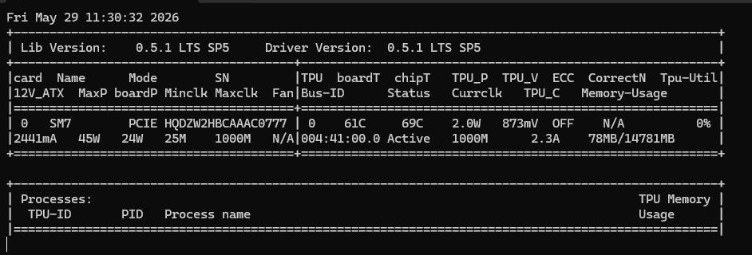
2. 查看pcie设备`lspci`
    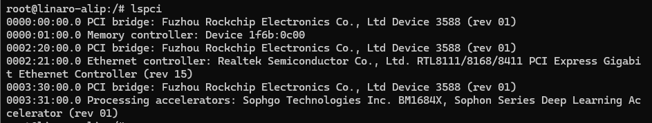
3. `lspci -s pcie_devid -vvv`
    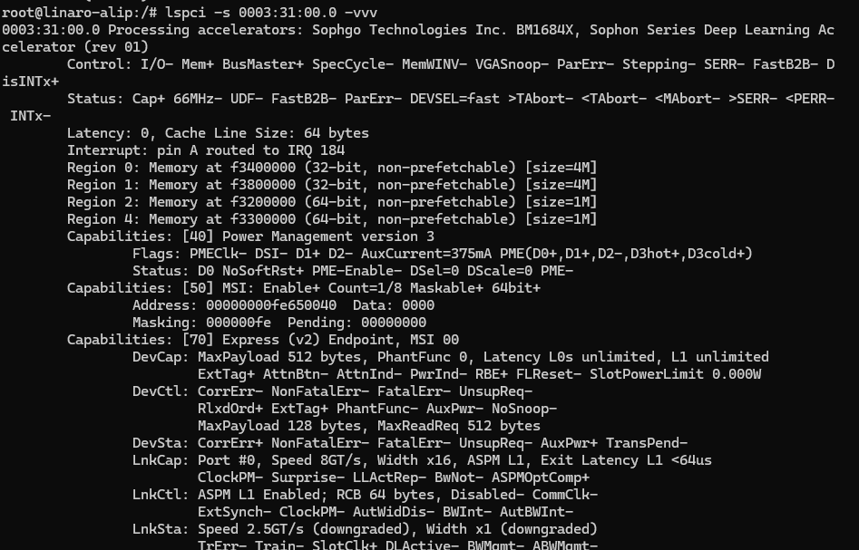
## 2026-05-26
### USB 接口解析

## 2026-05-28
### chroot 执行错误
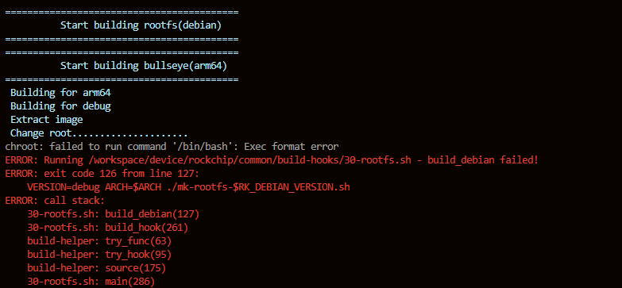
进入`chroot`出现语法错误，大概是宿主机进入 `arm rootfs` 后，没法执行 `/bin/bash`，常见原因是`qemu-user-static` 和 `binfmt_misc` 没有满足，解决如下
```bash 
sudo apt-get update
sudo apt-get install -y qemu-user-static binfmt-support
sudo update-binfmts --enable qemu-aarch64
update-binfmts --display qemu-aarch64
```
## 2026-07-03
### RK3588 + BM1684X PCIE 接口复调 
[kernel/drivers/pci/controller/dwc/pcie-dw-rockchip.c](20260703\pcie-dw-rockchip.c)
- 现象问题描述
    RK3588 作为 PCIe RC，接口已打开，主控侧 PERST#、REFCLK 及相关供电均正常，但 BM1684X 侧未正常进入 EP 模式，导致 PCIe 链路未按预期建立
- 解决方案
    排查发现，PERST# 上电初期第一段高电平由模组侧 3.3V 上拉引起；去除上拉后，又发现 RK3588 不同 IO 上电默认电平存在差异。最终将 PERST# 切换到默认低电平的 IO，使其在 U-Boot 阶段持续保持低电平，待 kernel PCIe 初始化时再释放，BM1684X 即可正常进入 EP 模式。
- `uboot-dts` 设备树配置部分
    ```dts
    &gpio1 {
        pcie2x1l2-perst-hog {
            gpio-hog;
            gpios = <RK_PA3 GPIO_ACTIVE_LOW>;
            output-high;
            line-name = "pcie2x1l2-perst";
            u-boot,dm-pre-reloc;
        };
        
        pcie2x1l0-perst-hog {
            gpio-hog;
            gpios = <RK_PA2 GPIO_ACTIVE_LOW>;
            output-high;
            line-name = "pcie2x1l0-perst";
            u-boot,dm-pre-reloc;
        };
    };

    &gpio4 {
        pcie3x2-perst-hog {
            gpio-hog;
            gpios = <RK_PA1 GPIO_ACTIVE_LOW>;
            output-high;
            line-name = "pcie3x2-perst";
            u-boot,dm-pre-reloc;
        };

        pcie2x1l1-perst-hog {
            gpio-hog;
            gpios = <RK_PA0 GPIO_ACTIVE_LOW>;
            output-high;
            line-name = "pcie2x1l1-perst";
            u-boot,dm-pre-reloc;
        };
    };
    ```
### RK3588 + BM1684X 用户态 + 驱动层修改