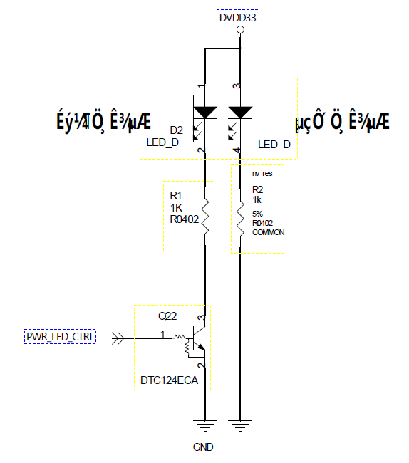

# BM1684X 开发问题记录
## 2026-01-07
### 编译 BSP
- 编译 `kernel`，然后更换 `/boot/emmcboot.itb` 文件，然后重启
    ```bash
    build_kernel 
    build_ramdisk uclibc emmc 
    ```
    内核的编译结果在`linux-arm64/build/bm1684/normal`
    编译出的`ko`在`linux-arm64/build/bm1684/normal/lib/modules/5.4.202-bm1684/kernel`中可以找到
- 编译`ubuntu`
    

### 编译 LIBSOPHON
- 参考资料
    [算能libsophon](https://github.com/sophgo/libsophon)
- `libsophon`库框图
    ```bash
     workspace
        ├── build_soc_libsophon.sh      # 编译脚本
        ├── gcc-linaro-6.3.1-2017.05-x86_64_aarch64-linux-gnu   # 工具链
        ├── libsophon                   # libsophon，github拉取
        ├── linux-headers-*.deb         # 内核头文件，从BSP编译后获取
        └── soc_kernel                  # 解压内核头文件
    ```
    1. 从BSP部分拷贝工具链
    2. 从BSP部分拷贝内核头文件
    3. 解压内核头文件到`soc_kernel`目录下
        ```bash
        dpkg -x linux-headers-*.deb soc_kernel
        ```
    4. 构建编译脚本[build_soc_libsophon.sh](20260107/build_soc_libsophon.sh)，具体使用脚本的时候要注意一下内核头文件的版本
- 编译遇到的问题
    1. 编译器检测失败
        ```bash
        # 现象
        CMAKE_C_COMPILER not set
        CMAKE_MAKE_PROGRAM is not set
        # 解决方法
        apt install -y build-essential cmake ninja-build git
        ```
    2. `git` 安全策略问题
        ```bash
        # 现象
        fatal: detected dubious ownership in repository at '/workspace/libsophon'
        # 解决方法
        git config --global --add safe.directory /workspace/libsophon
        git config --global --add safe.directory /workspace/libsophon/bmvid
        ```
    3. `hexdump` 缺失
        ```bash
        # 现象
        /bin/sh: hexdump: not found
        # 解决方法
        apt install -y bsdmainutils
        ```
    4. `jpu.ko` 编译失败
        ```bash
        # 现象 
        ERROR: "my_rwlock" [jpu.ko] undefined!
        # 解决方法，将jpu.c中的声明由
        extern struct rw_semaphore my_rwlock;
        # 改为
        #include <linux/rwsem.h>
        DECLARE_RWSEM(my_rwlock);
        ```
### 反编译
- 安装设备树工具
    ```bash
    sudo apt update
    sudo apt install device-tree-compiler
    dtc --version
    ```
- 反编译板卡的设备树
    ```bash
    # 设备树节点都会放置在 /proc/device-tree/ 下面
    ll /proc/device-tree 

    # 反编译内核设备树
    dtc -I fs -O dts /proc/device-tree -o /tmp/running.dts
    ```
- 查看板卡内核配置
    ```bash
    # 查看是否有你想要的配置
    zcat /proc/config.gz | grep CONFIG_XXX
    ```
- 反编译内核 ko 模块，转换为 伪 C 文件
    - 板卡内核模块信息采集
        ```bash
        KO = "xxx.ko"
        file "$KO"
        modinfo "$KO"
        strings "$KO" | head -n 200
        nm -n "$KO" | head -n 100
        nm -u "$KO" | head -n 100
        ```
    - 使用 `Ghidra` 将 ko 模块进行反汇编，并生成伪 C 文件，解读驱动代码逻辑，重写驱动代码
## 2026-01-08
### RTC-DS1307 
- 参考资料
    [rtc-ds1307](20260108/rtc-ds1307.txt)
- 原理图
    
    这里使用了一个电平转换芯片，把i2c2转换为i2c0，但对应主控实际也应该是i2c2
1. `dts` 设备树配置部分，设备树配置位于`arch/arm64/boot/dts/bitmain/bm1684x_evb.dtsi`
    ```dts
    &i2c2 {
        pinctrl-names = "default";
        pinctrl-0 = <&i2c2_acquire>;
        status = "okay";
        // rtc
        rtc@68 {
            compatible = "dallas,ds1307";
            reg = <0x68>;
            status = "okay";
        };
    };
    // 这里需要注意一点就是算能的RTC默认挂载在
    ```
2. 驱动源码位置`drivers/rtc/rtc-ds1307.c`
3. `Menuoncfig`配置，使用驱动需要在内核开启相应的配置`arch/arm64/configs/bitmain_bm1684_normal_defconfig`
    ```bash
    CONFIG_RTC_CLASS=y
    CONFIG_RTC_DRV_DS1307=y
    ```
4. 功能验证
    - `i2cdetect`扫描总线使用说明
        ```bash
        # 查看有那些I2C总线
        i2cdetect -l
        # 扫描某条总线
        i2cdetect -r -y 2
        ```
        扫描结果说明
        - `68` 有设备响应，但是未被内核驱动占用
        - `UU` 有设备响应，已被内核占用
        - `--` 无设备响应
    - `i2cget` 读寄存器
        ```bash
        i2cget -y -f 2 0x68 0x00
        ```
        - `-f` 强制访问
    - `i2cset` 写寄存器
        ```bash
        i2cset -y -f 2 0x68 0x00 
        ```
    - `i2cdump`一次性看一大片寄存器
        ```bash
        i2cdump -f -y 2 0x68 b 
        ```
    - 查看系统里的设备
        ```bash
        ls -l /sys/bus/i2c/devices/
        readlink -f /sys/bus/i2c/devices/*-0068
        ```
## 2026-01-09
### HDMI-USB 显示（FL2000 + IT66121）
- 说明
    主控1684X并没有HDMI的接口，而是通过下面的框图链路转出来的显示
- 框图
    ```
    BM1684X
        └─ PCIe
            └─ USB3 Host (ASM3142)
                └─ USB Hub (FE2.1 / Realtek)
                    └─ FL2000 (USB 显示)
                        └─ RGB/LVDS
                            └─ IT66121FN (HDMI TX)
                                └─ HDMI 接口
    ```
- 原理图 
1. `dts` 设备树配置部分，设备树中必须保证PCIe和USB Host 设备是`okay`状态
    ```dts
    &pcie0 {
    status = "okay";
    };

    &usb_xhci {
    status = "okay";
    };
    ```
2. 驱动源码位置`drivers/video/fl2000`，对于一般USB设备，只要将USB控制器正确启动，USB驱动会自动枚举加载USB设备
3. `Menuoncfig`配置，使用驱动需要在内核开启相应的配置
    ```bash 
    # USB 基础
    CONFIG_USB_SUPPORT=y
    CONFIG_USB_XHCI_HCD=y
    CONFIG_USB_XHCI_PCI=y
    CONFIG_USB_HUB=y
    # FL2000 显示驱动
    CONFIG_USB_FL2000=y
    # Framebuffer 显示驱动
    CONFIG_FB=y
    CONFIG_FRAMEBUFFER_CONSOLE=y
    ```
4. 功能验证
    - 内核驱动确认
        ```bash
        zcat /proc/config.gz | grep FL2000
        ```
    - usb 枚举确认
        ```bash
        lsusb | grep 1d5c:2000
        ```
## 2026-01-23
### PWM-风扇调速应用
- 参考资料
    
- 原理图
    
1. `dts` 设备树配置部分，设备树配置位于`arch/arm64/boot/dts/bitmain/bm1684x_evb.dtsi`
    ```dts
    &thermal_zones {
	soc {
		trips {
			soc_pwmfan_trip1: soc_pwmfan_trip@1 {
				temperature = <53000>; /* millicelsius */
				hysteresis = <8000>; /* millicelsius */
				type = "active";
			};

			soc_pwmfan_trip2: soc_pwmfan_trip@2 {
				temperature = <65000>; /* millicelsius */
				hysteresis = <12000>; /* millicelsius */
				type = "active";
			};

			soc_pwmfan_trip3: soc_pwmfan_trip@3 {
				temperature = <75000>; /* millicelsius */
				hysteresis = <10000>; /* millicelsius */
				type = "active";
			};

			soc_pwmfan_trip4: soc_pwmfan_trip@4 {
				temperature = <80000>; /* millicelsius */
				hysteresis = <5000>; /* millicelsius */
				type = "active";
			};
		};f

		cooling-maps {
			map3 {
				trip = <&soc_pwmfan_trip1>;
				cooling-device = <&pwmfan 0 1>;
			};

			map4 {
				trip = <&soc_pwmfan_trip2>;
				cooling-device = <&pwmfan 1 2>;
			};

			map5 {
				trip = <&soc_pwmfan_trip3>;
				cooling-device = <&pwmfan 2 3>;
			};

			map6 {
				trip = <&soc_pwmfan_trip4>;
				cooling-device = <&pwmfan 3 4>;
                };
            };
        };
    };

    / {
        pwmfan: pwm-fan {
            compatible = "pwm-fan";
            pwms = <&pwm 0 40000>, <&pwm 1 40000>; // period_ns
            pwm-names = "pwm0","pwm1";
            pwm_inuse = "pwm0";
            #cooling-cells = <2>;
            // cooling-levels = <153 128 77 26 1>;  //total 255
            cooling-levels = <0 160 192 224 255>;
        };
    };

    ```
2. 驱动源码位置`drivers/pwm/pwm-bitmain.c`
3. `Menuoncfig`配置，使用驱动需要在内核开启相应的配置
    ```bash
    CONFIG_PWM=y
    CONFIG_PWM_SYSFS=y
    CONFIG_ARCH_BITMAIN=m
    CONFIG_ARCH_SOPHGO=m
    ```
4. 功能验证
    - 查看系统设备
        ```bash
        # PWM 硬件本体
        ls -l /sys/class/pwm/
        # 硬件监控抽象层
        ls -l /sys/class/hwmon/
        # 温控决策层
        ls -l /sys/class/thermal/
        ```
    - 查看温度
        ```bash
        cat /sys/class/thermal/thermal_zone0/temp   # SoC 温度（主控）
        cat /sys/class/thermal/thermal_zone1/temp   # 板级温度
        ```
    - 查看风扇 `cooling device` 状态
        ```bash
        cat /sys/class/thermal/cooling_device0/type
        cat /sys/class/thermal/cooling_device0/cur_state
        cat /sys/class/thermal/cooling_device0/max_state
        ```
    - 查看降频 `cooling device` 状态
        ```bash
        cat /sys/class/thermal/cooling_device1/type
        cat /sys/class/thermal/cooling_device1/cur_state
        cat /sys/class/thermal/cooling_device1/max_state
        ```
    - 手动设置风扇挡位
        ```bash
        echo 0 > /sys/class/thermal/cooling_device0/cur_state   # 最慢
        echo 4 > /sys/class/thermal/cooling_device0/cur_state   # 最快
        ```
## 2026-01-24
### Soc - Mcu 拓展 GPIO 控制问题
这个1684X板卡，先前是委托外包进行开发完成的，由于板卡上有单片机程序和主板与单片机通讯的功能，尝试对单片机程序和主板通讯的功能程序，使用 Ghidra 进行逆向解析
- 参考资料
    [Ghidra](https://github.com/NationalSecurityAgency/ghidra?tab=readme-ov-file) 
    [ch341_driver](https://github.com/WCHSoftGroup/ch341ser_linux)
    [ch343_driver](https://github.com/WCHSoftGroup/ch343ser_linux)
- 原理图，具体见[SS-SE7-V4](Sophgo\BM1684X_Develop_Recorder\20250507\SS-SE7-V4-原理图分析.md)分析，通过一系列的 usb 转换最后到单片机的 io 控制

1. `dts` 设备树配置部分，通过 dtb 反编译 dts 得到[running.dts](20260124/running.dts)模块的节点挂载 pcie 下面 
2. 重新推理驱动源码[aios_gpio.md](20260124\aios_gpio.md)，应该放置在`drivers/usb/serial/`
3. `Makefile` 修改
    ```bash
    obj-$(CONFIG_USB_SERIAL_AIOSGPIO)              += aios_gpio.o
    obj-$(CONFIG_USB_SERIAL_CH343)                 += ch343.o 
    ```
4. `Kconfig` 修改
    ```bash
    config USB_SERIAL_AIOSGPIO
           tristate "USB Serial GPIO Driver"
           help
               Say Y here if you want to use USB Serial GPIO.
    
               To compile this driver as a module, choose M here: the module
               will be called aircable.
    
    config USB_SERIAL_CH343
           tristate "USB Winchiphead CH343 Single Port Serial Driver"
           help
             Say Y here if you want to use a Winchiphead CH343 single port
             USB to serial adapter.
    
             To compile this driver as a module, choose M here: the
             module will be called ch343.
    
    ``` 
5. `Menuoncfig`配置，使用驱动需要在内核开启相应的配置
    ```bash
    CONFIG_SERIAL_DEV_BUS=y
    CONFIG_SERIAL_DEV_CTRL_TTYPORT=y
    CONFIG_USB_SERIAL_AIOSGPIO=m
    ```
6. 重新编译内核，挂载模块
    ```bash
    make ARCH=arm64 \
    CROSS_COMPILE=/workspace/gcc-linaro-6.3.1-2017.05-x86_64_aarch64-linux-gnu/bin/aarch64-linux-gnu- \
    O=/workspace/linux-arm64/build/bm1684/normal \
    M=drivers/usb/serial \
    aios_gpio.ko -j$(nproc)

    modprobe aios_gpio 
    ```
7. 验证功能
    - 查看模块是否挂载
        ```bash
        lsmod | grep aios_gpio
        ```
    - 查看驱动是否有拓展 io 
        ```bash
        cat /sys/kernel/debug/gpio
        ```
    - 测试功能使用 [bm1684x_zx_gpio.sh](20260124/bm1684x_zx_gpio.sh)
## 2026-03-02
### 关闭原生算能服务端口
- 在板卡的操作
    ```bash
    sudo ss -lntp | grep 8080
    sudo systemctl stop sophliteos
    sudo systemctl disable sophliteos
    ```
Removed /etc/systemd/system/multi-user.target.wants/sophliteos.service.
- 在`rootfs`中关闭，需要修改两个文件
    - `bsp_code/bootloader-arm64/distro/sophgo-fs/usr/sbin/user-auto-start.sh` 将 `load_sophliteos` 注释
        ```bash
        function load_web_server(){
        + # 打开注释打开网页服务 
        + # load_sophliteos
        + # sleep 1
        ...
        }
        ```
    - `bsp_code/bootloader-arm64/distro/sophgo-fs/usr/sbin/bmrt_setup.sh` 中 将启动`sophliteos`服务注释
        ```bash
            if [ -f /etc/systemd/system/multi-user.target.wants/bmSE6Monitor.service ]; then
                systemctl stop bmSE6Monitor.service
                systemctl disable bmSE6Monitor.service
                systemctl stop airboxFanMonitor.service
                systemctl disable airboxFanMonitor.service
                systemctl enable bmSysMonitor.service
                systemctl start bmSysMonitor.service
            fi
            systemctl enable bmssm.service
            systemctl start bmssm.service
        +    # systemctl enable sophliteos.service
        +    # systemctl start sophliteos.service

        ```
## 2026-03-13
### 算能HDMI-UI修改更换
[算能hdmi-UI](https://github.com/sophgo/sophon-tools/tree/main/source/pSophUI)
- 源码获取，直接下载[sophon-tools](https://github.com/sophgo/sophon-tools.git)，拉出里面的源码
    ```bash
    git clone https://github.com/sophgo/sophon-tools.git
    cd sophon-tools
    cp -r source/pSophUI ../
    ```
- 源码工具链下载编译脚本，编译生成`SophonUI`，然后打包生成deb文件
    [build_qSophui.sh](20260313/build_qSophui.sh)
    1. 找到qt交叉编译工具链使用 qmake . && make 编译出 SophUI 可执行文件
    2. 将 SophUI 可执行文件拷贝到 deb/bm_services/SophonHDMI/ 下
    3. 执行 dpkg-deb -b deb sophgo-hdmi_x.x.x_arm64.deb 打包deb安装包

- 更换`SophUI/resource`下的`bp.png`
- 隐藏控件，在`SophUI/mainwindow.cpp`中修改
    ```cpp
    auto hide = [&](QWidget *w){ if (w) w->hide(); };
    // 右侧 WAN/LAN 文本标签
    ui->label->hide();
    ui->label_2->hide();
    ui->label_4->hide();
    ui->label_5->hide();

    ui->MAC_LABEL_2->hide();
    ui->MAC_LABEL_3->hide();
    ui->MAC_LABEL_4->hide();
    ui->MAC_LABEL_5->hide();
    ui->MAC_LABEL_6->hide();
    ui->MAC_LABEL_7->hide();
    ui->MAC_LABEL_8->hide();
    ui->MAC_LABEL_9->hide();

    ui->MAC_LABEL_14->hide();
    ui->MAC_LABEL_15->hide();
    ui->MAC_LABEL_16->hide();
    ui->MAC_LABEL_17->hide();
    ui->MAC_LABEL_18->hide();
    ui->MAC_LABEL_19->hide();
    ui->MAC_LABEL_20->hide();
    ui->MAC_LABEL_21->hide();

    // WAN/LAN 输入框
    hide(ui->wan_ip); hide(ui->wan_net); hide(ui->wan_gate); hide(ui->wan_dns);
    hide(ui->wan_ip6); hide(ui->wan_net6); hide(ui->wan_gate6); hide(ui->wan_dns6);
    hide(ui->lan_ip); hide(ui->lan_net); hide(ui->lan_gate); hide(ui->lan_dns);
    hide(ui->lan_ip6); hide(ui->lan_net6); hide(ui->lan_gate6); hide(ui->lan_dns6);

    // 相关按钮（按你要去掉的程度）
    hide(ui->wan_button);      // 修改eth0
    hide(ui->lan_button);      // 修改eth1
    hide(ui->lan_button_2);    // 重置网络配置
    hide(ui->show_net_button); // 进入内嵌终端
    hide(ui->pushButtonRunDemo); // 运行demo（如果也不要）

    // 分割线/标题可一起隐藏，避免空白难看
    hide(ui->line_5); hide(ui->line_6); hide(ui->line_7);
    hide(ui->INFO_3); hide(ui->comboBoxSelectDemo);

    ui->line_4->hide();                    // 中间竖线也隐藏
    ui->horizontalLayout_5->setStretch(0, 1);
    ui->horizontalLayout_5->setStretch(1, 0);
    ui->horizontalLayout_5->setStretch(2, 0);

    ```
- 将编译生成的 `deb` 更新进入更文件系统，相关位置 `bootloader-arm64/distro/sophgo-fs/home/linaro/bsp-debs/sophgo-hdmi*.deb`
- 图片格式修改，因为 `bm1684x` 的显示驱动时 fl2000，默认走 `bgr888`，QT 默认走`rgb888`，所以图片格式需要转换
    [patch](20260313/0001-Add-judgment-for-the-main-control-model-and-modify-t.patch)
### 源码解读
## 2026-03-20
### 开机灯的状态修改
1684X 的硬件IO大部分可以在启动的设备树中去获取，因为硬件配置基本和原厂固定
- 原理图
    
1. `kernel dts` 设备树配置部分，开机是电源按键灯亮，正常拉高就好
    [patch](20260320/0001-Fix-the-indicator-light_kernel.patch)
2. `uboot dts` 设备树配置部分，开机是电源按键灯亮，正常拉高就好
3. 升级脚本修改，uboot在启动时，先会检查sdcard是否又插入然后在检测里面是否有升级程序，开始升级的时候没刷一个分区闪烁一次，全部完成后直接拉高
    [uboot-update](20260320/0001-Fix-the-indicator-light_uboot_update.patch)
## 2026-03-27
### OPENSSH 客制化
客户需要最新版的 openssh ，并需要把默认端口22修改为其他，这里选着官网的新发行的LTS版本
[patch]()
- 拉取源码包
    [openssl-3.5.5](https://openssl-library.org/source/)
    [openssh-V_10_2_P1](https://codeload.github.com/openssh/openssh-portable/tar.gz/refs/tags/V_10_2_P1)
#### 板子上先测试
- 旧 ssh 服务卸载停止删除
    1. 切换身份
        ```bash
        sudo -s
        ```
    2. 卸载旧 ssh 服务
        ```bash
        apt-get purge -y openssh-server openssh-sftp-server
        apt-get autoremove -y 
        ```
    3. 停止禁用屏蔽 ssh 服务相关服务单元
        ```bash
        systemctl stop ssh.service ssh.socket sshd.service
        systemctl disable ssh.service ssh.socket sshd.service
        systemctl mask ssh.service ssh.socket sshd.service 
        ```
    4. 删除 systemd 相关链接/文件
        ```bash 
        rm -f /etc/systemd/system/multi-user.target.wants/ssh.service
        rm -f /etc/systemd/system/sockets.target.wants/ssh.socket
        rm -f /etc/systemd/system/sshd.service
        ```
- 为 ssh 服务准备运行环境和专用用户
    ```
    mkdir -p /var/lib
    mkdir -p /run/sshd
    chown root:root /run/sshd
    chmod 0755 /run/sshd
    ls -ld /run/sshd
    useradd -r -M -s /usr/sbin/nologin -d /run/sshd sshd 
    ```
- openssl 源码编译安装
    1. 解压源码包，进入源码目录
        ```bash
        tar -xfv openssl-3.5.5.tar.gz
        cd openssl-3.5.5
        ```
    2. 配置编译安装
        ```bash
        ./Configure linux-aarch64 \
            --prefix=/usr/local/openssl-3.5.5 \
            --openssldir=/usr/local/openssl-3.5.5/ssl
        # 编译
        make -j8
        # 安装
        sudo make install_sw
        ```
    3. 验证，需要指明源码提供的库路径
        ```
        file /usr/local/openssl-3.5.5/bin/openssl
        export LD_LIBRARY_PATH=/usr/local/openssl-3.5.5/lib64:/usr/local/openssl-3.5.5/lib 
        /usr/local/openssl-3.5.5/bin/openssl version
        ```
- openssh 源码编译安装
    1. 解压源码包，进入源码目录
        ```bash
        tar xf openssh-portable-V_10_2_P1.tar.gz
        cd openssh-portable-V_10_2_P1
        ```
    2. 声明 openssl 库路径
        ```bash
        export CPPFLAGS="-I/usr/local/openssl-3.5.5/include"
        export LDFLAGS="-L/usr/local/openssl-3.5.5/lib -Wl,-rpath,/usr/local/openssl-3.5.5/lib"
        export LD_LIBRARY_PATH="/usr/local/openssl-3.5.5/lib"
        ```
    3. 配置编译安装
        ```bash 
        ./configure \
        --prefix=/usr/local/openssh-10.2p1 \
        --sysconfdir=/usr/local/openssh-10.2p1/etc \
        --with-ssl-dir=/usr/local/openssl-3.5.5 \
        --without-pam

        make -j8
        
        sudo make install 
        ```
- 初始化并配置 OpenSSH 服务及其客户端工具
    ```bash
    export OPENSSH_ROOT=/usr/local/openssh-10.2p1 
    ```
    1. 删除旧的主机密钥文件
        ```bash
        sudo rm -f $OPENSSH_ROOT/etc/ssh_host_*_key*
        ```
    2. 生成新的主机密钥
        ```bash
        "$OPENSSH_ROOT"/bin/ssh-keygen -t rsa -f "$OPENSSH_ROOT"/etc/ssh_host_rsa_key -N ""
        "$OPENSSH_ROOT"/bin/ssh-keygen -t ecdsa -f "$OPENSSH_ROOT"/etc/ssh_host_ecdsa_key -N ""
        "$OPENSSH_ROOT"/bin/ssh-keygen -t ed25519 -f "$OPENSSH_ROOT"/etc/ssh_host_ed25519_key -N ""
        ```
    3. 创建符号链接到系统路径
        ```bash
        ln -sf "$OPENSSH_ROOT"/bin/ssh /usr/local/bin/ssh
        ln -sf "$OPENSSH_ROOT"/bin/scp /usr/local/bin/scp
        ln -sf "$OPENSSH_ROOT"/bin/sftp /usr/local/bin/sftp
        ln -sf "$OPENSSH_ROOT"/bin/ssh-add /usr/local/bin/ssh-add
        ln -sf "$OPENSSH_ROOT"/bin/ssh-agent /usr/local/bin/ssh-agent
        ln -sf "$OPENSSH_ROOT"/bin/ssh-keygen /usr/local/bin/ssh-keygen
        ln -sf "$OPENSSH_ROOT"/bin/ssh-keyscan /usr/local/bin/ssh-keyscan
        ```
- 修改 ssh 服务端口，修改`/usr/local/openssh-10.2p1/etc/sshd_config`    
    ```bash 
    Port 2222
    ```
- 验证 ssh 功能
    1. 查看动态库是否还有问题
        ```bash 
        ldd $OPENSSH_ROOT/sbin/sshd
        ```
    2. 查看配置语法是否有问题
        ```bash 
        $OPENSSH_ROOT/sbin/sshd -t -f $OPENSSH_ROOT/etc/sshd_config
        ```
    3. 前台启动，测试连接，正式集成的时候需要写入 systemd 服务单元
        ```bash
        $OPENSSH_ROOT/sbin/sshd -D -e -f $OPENSSH_ROOT/etc/sshd_config -ddd
        ```
- 集成后测试
    ```bash
    # 旧ssh应该被关闭
    systemctl status ssh.service
    systemctl status ssh.socket
    # 新ssh的配置服务
    systemctl status firstboot-openssh.service
    systemctl status openssh-prebuilt.service
    ls -l /var/lib/firstboot-openssh.done
    ls -l /usr/local/openssh-10.2p1/sbin/sshd
    ls -l /usr/local/bin/ssh

    which ssh
    ssh -V
    /usr/local/openssh-10.2p1/bin/ssh -V 
    ```
## 2026-06-16
### 集成 4/5G 模块
当前两套脚本可以按模块类型才分理解
- 5G 模块走 NCM 拨号流程
- 4G 模块走 QMI 拨号流程

整体启动流程：
1. 主控启动后，先让模块复位
2. 等待 USB 枚举完成
3. 识别当前插入的模块
4. 根据模块类型选择拨号流程
#### 4G 模块 QMI 拨号流程
- 主要文件：    
    [quectel-4g-autoconnect.sh](20260616/4G/quectel-4g-autoconnect.sh)
    [quectel-4g-autoconnect.service](20260616/4G/quectel-4g-autoconnect.service)
    [quectel-4g-autoconnect](20260616/4G/quectel-4g-autoconnect)
    [quectel-CM](20260616/4G/quectel-CM)
    [quectel-qmi-proxy](20260616/4G/quectel-qmi-proxy)
- 脚本流程：    
    ```text
    systemd 启动 quectel-4g-autoconnect.service
        -> 加载 /etc/default/quectel-4g-autoconnect
        -> 执行 quectel-4g-autoconnect.sh monitor
        -> 检测 USB VID/PID，判断 4G 模块是否存在
        -> 等待 wwan0 和 /dev/cdc-wdm0
        -> 自动查找 AT 串口
        -> 发送 AT 命令检查 SIM、信号、注册状态
        -> 判断 wwan0 驱动是否为 qmi_wwan
        -> 设置 raw_ip
        -> 优先使用 quectel-CM 拨号
        -> quectel-CM 不可用时尝试 qmicli
        -> DHCP 获取 IP
        -> 配置默认路由和 DNS
        -> 常驻监控，断线后自动重拨
    ```
- 关键点：
    - 通过 USB VIP/PID 判断模块是否存在
    - 默认网卡是 `wwan0`
    - 默认控制设备是 `/dev/cdc-wdm0`
    - 驱动为 `qmi_wwan` 时进入 QMI 拨号流程
#### 5G 模块 NCM 拨号流程
- 主要文件：
    [quectel-autoconnect.sh](20260616/5G/quectel-autoconnect.sh)
    [quectel-autoconnect.service](20260616/5G/quectel-autoconnect.service)
    [default.script](20260616/5G/default.script)
- 脚本流程：
    ```text
    systemd 启动 quectel-autoconnect.service
    -> 延时 10s 等待 USB 枚举
    -> 执行 quectel-autoconnect.sh start
    -> 等待 /dev/ttyUSB2
    -> 查找 cdc_ncm 驱动对应的网卡
    -> 启动 quectel-CM
    -> 拉起 NCM 网卡
    -> 等待 carrier
    -> 执行 DHCP
    -> 配置 IP、默认路由、DNS
    ```
- 关键点
    - 通过 `find_ncm_ifaces()` 查找驱动为 `cdc_ndm` 的网卡
    - 使用 `quectel-CM` 拉起模块数据链路
    - 使用 `dhclient` 或 `udhcpc` 获取 IP
    - 服务采用 `Type=oneshot`，开机执行一次的服务
设备reboot之后模块需要重启复位

## 2026-06-30
### 优化 AIOS-GPIO
