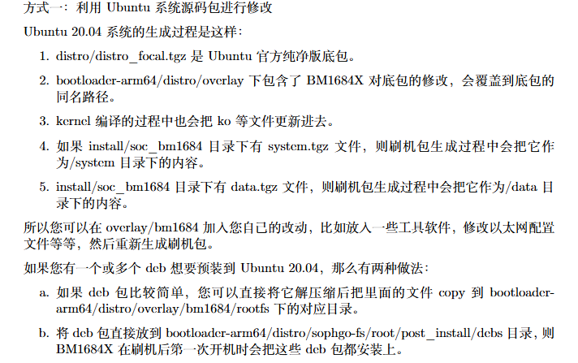
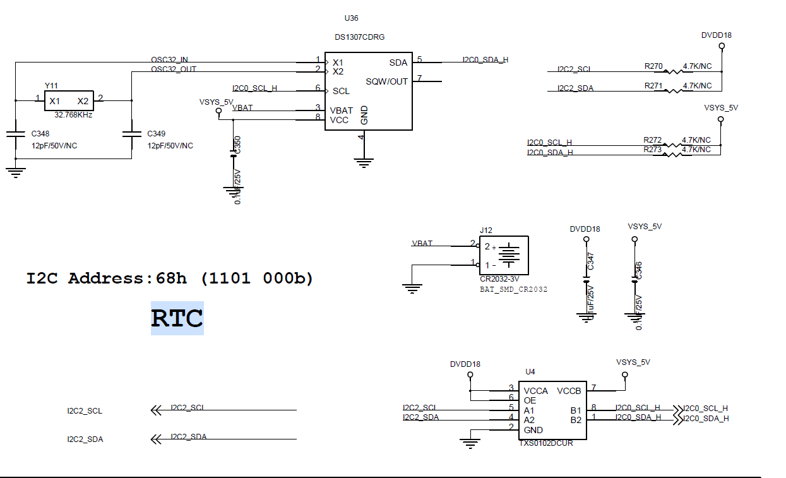
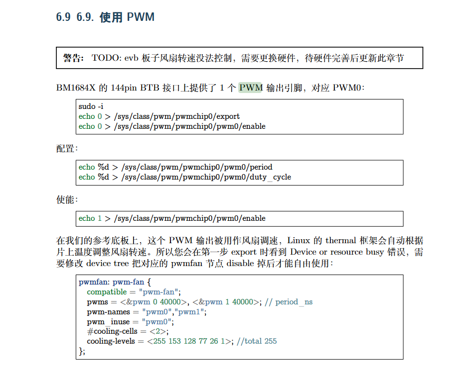
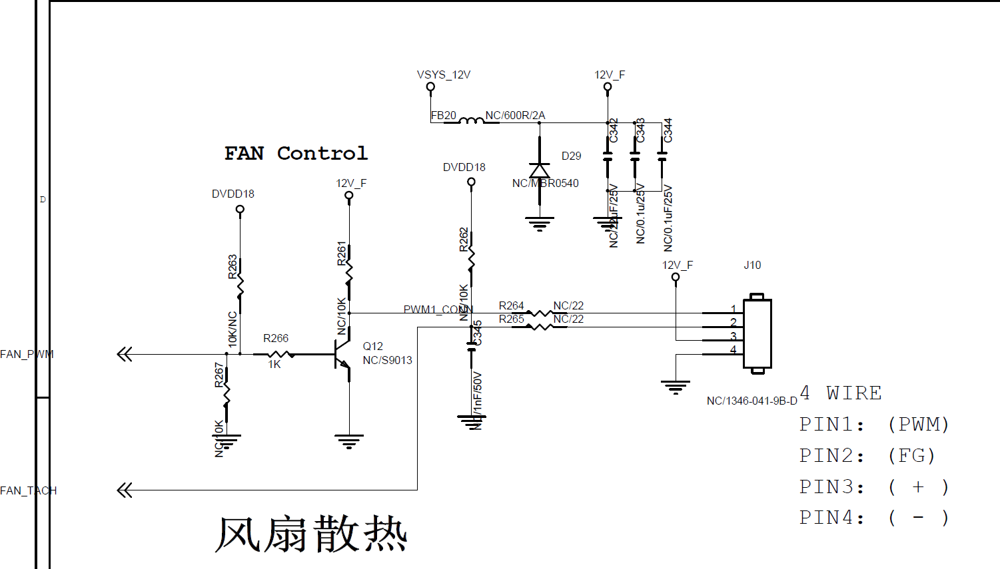

# BM1684X 开发问题记录
## 2026-01-07
### 编译 BSP
- 编译 `kernel`，然后更换 `/boot/emmcboot.itb` 文件，然后重启
    ```bash
    build_kernel 
    build_ramdisk uclibc emmc 
    ```
    内核的编译结果在`linux-arm64/build/bm1684/normal`
    编译出的`ko`在`linux-arm64/build/bm1684/normal/lib/modules/5.4.202-bm1684/kernel`中可以找到
- 编译`ubuntu`
    
- 反编译板卡的设备树
    ```bash
    sudo apt update
    sudo apt install device-tree-compiler
    dtc --version
    ls -lh /tmp/running.dtb
    dtc -I dtb -O dts -@ -o /tmp/running.dts /tmp/running.dtb
    # 查看板卡运行的真正配置
    zcat /proc/config.gz
    ```
### 编译 LIBSOPHON
- 参考资料
    [算能libsophon](https://github.com/sophgo/libsophon)
- `libsophon`库框图
    ```bash
     workspace
        ├── build_soc_libsophon.sh      # 编译脚本
        ├── gcc-linaro-6.3.1-2017.05-x86_64_aarch64-linux-gnu   # 工具链
        ├── libsophon                   # libsophon，github拉取
        ├── linux-headers-*.deb         # 内核头文件，从BSP编译后获取
        └── soc_kernel                  # 解压内核头文件
    ```
    1. 从BSP部分拷贝工具链
    2. 从BSP部分拷贝内核头文件
    3. 解压内核头文件到`soc_kernel`目录下
        ```bash
        dpkg -x linux-headers-*.deb -C soc_kernel
        ```
    4. 构建编译脚本[build_soc_libsophon.sh](20260107/build_soc_libsophon.sh)，具体使用脚本的时候要注意一下内核头文件的版本
- 编译遇到的问题
    1. 编译器检测失败
        ```bash
        # 现象
        CMAKE_C_COMPILER not set
        CMAKE_MAKE_PROGRAM is not set
        # 解决方法
        apt install -y build-essential cmake ninja-build git
        ```
    2. `git` 安全策略问题
        ```bash
        # 现象
        fatal: detected dubious ownership in repository at '/workspace/libsophon'
        # 解决方法
        git config --global --add safe.directory /workspace/libsophon
        git config --global --add safe.directory /workspace/libsophon/bmvid
        ```
    3. `hexdump` 缺失
        ```bash
        # 现象
        /bin/sh: hexdump: not found
        # 解决方法
        apt install -y bsdmainutils
        ```
    4. `jpu.ko` 编译失败
        ```bash
        # 现象 
        ERROR: "my_rwlock" [jpu.ko] undefined!
        # 解决方法，将jpu.c中的声明由
        extern struct rw_semaphore my_rwlock;
        # 改为
        #include <linux/rwsem.h>
        DECLARE_RWSEM(my_rwlock);
        ```
## 2026-01-08
### RTC-DS1307 
- 参考资料
    [rtc-ds1307](20260108/rtc-ds1307.txt)
- 原理图
    
    这里使用了一个电平转换芯片，把i2c2转换为i2c0，但对应主控实际也应该是i2c2
1. `dts` 设备树配置部分，设备树配置位于`arch/arm64/boot/dts/bitmain/bm1684x_evb.dtsi`
    ```dts
    &i2c2 {
        pinctrl-names = "default";
        pinctrl-0 = <&i2c2_acquire>;
        status = "okay";
        // rtc
        rtc@68 {
            compatible = "dallas,ds1307";
            reg = <0x68>;
            status = "okay";
        };
    };
    // 这里需要注意一点就是算能的RTC默认挂载在
    ```
2. 驱动源码位置`drivers/rtc/rtc-ds1307.c`
3. `Menuoncfig`配置，使用驱动需要在内核开启相应的配置`arch/arm64/configs/bitmain_bm1684_normal_defconfig`
    ```bash
    CONFIG_RTC_CLASS=y
    CONFIG_RTC_DRV_DS1307=y
    ```
4. 功能验证
    - `i2cdetect`扫描总线使用说明
        ```bash
        # 查看有那些I2C总线
        i2cdetect -l
        # 扫描某条总线
        i2cdetect -r -y 2
        ```
        扫描结果说明
        - `68` 有设备响应，但是未被内核驱动占用
        - `UU` 有设备响应，已被内核占用
        - `--` 无设备响应
    - `i2cget` 读寄存器
        ```bash
        i2cget -y -f 2 0x68 0x00
        ```
        - `-f` 强制访问
    - `i2cset` 写寄存器
        ```bash
        i2cset -y -f 2 0x68 0x00 
        ```
    - `i2cdump`一次性看一大片寄存器
        ```bash
        i2cdump -f -y 2 0x68 b 
        ```
    - 查看系统里的设备
        ```bash
        ls -l /sys/bus/i2c/devices/
        readlink -f /sys/bus/i2c/devices/*-0068
        ```
## 2026-01-09
### HDMI-USB 显示（FL2000 + IT66121）
- 说明
    主控1684X并没有HDMI的接口，而是通过下面的框图链路转出来的显示
- 框图
    ```
    BM1684X
        └─ PCIe
            └─ USB3 Host (ASM3142)
                └─ USB Hub (FE2.1 / Realtek)
                    └─ FL2000 (USB 显示)
                        └─ RGB/LVDS
                            └─ IT66121FN (HDMI TX)
                                └─ HDMI 接口
    ```
- 原理图 
1. `dts` 设备树配置部分，设备树中必须保证PCIe和USB Host 设备是`okay`状态
    ```dts
    &pcie0 {
    status = "okay";
    };

    &usb_xhci {
    status = "okay";
    };
    ```
2. 驱动源码位置`drivers/video/fl2000`，对于一般USB设备，只要将USB控制器正确启动，USB驱动会自动枚举加载USB设备
3. `Menuoncfig`配置，使用驱动需要在内核开启相应的配置
    ```bash 
    # USB 基础
    CONFIG_USB_SUPPORT=y
    CONFIG_USB_XHCI_HCD=y
    CONFIG_USB_XHCI_PCI=y
    CONFIG_USB_HUB=y
    # FL2000 显示驱动
    CONFIG_USB_FL2000=y
    # Framebuffer 显示驱动
    CONFIG_FB=y
    CONFIG_FRAMEBUFFER_CONSOLE=y
    ```
4. 功能验证
    - 内核驱动确认
        ```bash
        zcat /proc/config.gz | grep FL2000
        ```
    - usb 枚举确认
        ```bash
        lsusb | grep 1d5c:2000
        ```
## 2026-01-23
### PWM-风扇调速应用
- 参考资料
    
- 原理图
    
1. `dts` 设备树配置部分，设备树配置位于`arch/arm64/boot/dts/bitmain/bm1684x_evb.dtsi`
    ```dts
    &thermal_zones {
	soc {
		trips {
			soc_pwmfan_trip1: soc_pwmfan_trip@1 {
				temperature = <53000>; /* millicelsius */
				hysteresis = <8000>; /* millicelsius */
				type = "active";
			};

			soc_pwmfan_trip2: soc_pwmfan_trip@2 {
				temperature = <65000>; /* millicelsius */
				hysteresis = <12000>; /* millicelsius */
				type = "active";
			};

			soc_pwmfan_trip3: soc_pwmfan_trip@3 {
				temperature = <75000>; /* millicelsius */
				hysteresis = <10000>; /* millicelsius */
				type = "active";
			};

			soc_pwmfan_trip4: soc_pwmfan_trip@4 {
				temperature = <80000>; /* millicelsius */
				hysteresis = <5000>; /* millicelsius */
				type = "active";
			};
		};f

		cooling-maps {
			map3 {
				trip = <&soc_pwmfan_trip1>;
				cooling-device = <&pwmfan 0 1>;
			};

			map4 {
				trip = <&soc_pwmfan_trip2>;
				cooling-device = <&pwmfan 1 2>;
			};

			map5 {
				trip = <&soc_pwmfan_trip3>;
				cooling-device = <&pwmfan 2 3>;
			};

			map6 {
				trip = <&soc_pwmfan_trip4>;
				cooling-device = <&pwmfan 3 4>;
                };
            };
        };
    };

    / {
        pwmfan: pwm-fan {
            compatible = "pwm-fan";
            pwms = <&pwm 0 40000>, <&pwm 1 40000>; // period_ns
            pwm-names = "pwm0","pwm1";
            pwm_inuse = "pwm0";
            #cooling-cells = <2>;
            // cooling-levels = <153 128 77 26 1>;  //total 255
            cooling-levels = <0 160 192 224 255>;
        };
    };

    ```
2. 驱动源码位置`drivers/pwm/pwm-bitmain.c`
3. `Menuoncfig`配置，使用驱动需要在内核开启相应的配置
    ```bash
    CONFIG_PWM=y
    CONFIG_PWM_SYSFS=y
    CONFIG_ARCH_BITMAIN=m
    CONFIG_ARCH_SOPHGO=m
    ```
4. 功能验证
    - 查看系统设备
        ```bash
        # PWM 硬件本体
        ls -l /sys/class/pwm/
        # 硬件监控抽象层
        ls -l /sys/class/hwmon/
        # 温控决策层
        ls -l /sys/class/thermal/
        ```
    - 查看温度
        ```bash
        cat /sys/class/thermal/thermal_zone0/temp   # SoC 温度（主控）
        cat /sys/class/thermal/thermal_zone1/temp   # 板级温度
        ```
    - 查看风扇 `cooling device` 状态
        ```bash
        cat /sys/class/thermal/cooling_device0/type
        cat /sys/class/thermal/cooling_device0/cur_state
        cat /sys/class/thermal/cooling_device0/max_state
        ```
    - 查看降频 `cooling device` 状态
        ```bash
        cat /sys/class/thermal/cooling_device1/type
        cat /sys/class/thermal/cooling_device1/cur_state
        cat /sys/class/thermal/cooling_device1/max_state
        ```
    - 手动设置风扇挡位
        ```bash
        echo 0 > /sys/class/thermal/cooling_device0/cur_state   # 最慢
        echo 4 > /sys/class/thermal/cooling_device0/cur_state   # 最快
        ```
## 2026-01-24
### Soc - Mcu GPIO 控制问题
## 2026-03-02
### 关闭原生算能服务端口
- 在板卡的操作
    ```bash
    sudo ss -lntp | grep 8080
    sudo systemctl stop sophliteos
    sudo systemctl disable sophliteos
    ```
Removed /etc/systemd/system/multi-user.target.wants/sophliteos.service.
- 在`rootfs`中关闭，需要修改两个文件
    - `bsp_code/bootloader-arm64/distro/sophgo-fs/usr/sbin/user-auto-start.sh` 将 `load_sophliteos` 注释
        ```bash
        function load_web_server(){
        + # 打开注释打开网页服务 
        + # load_sophliteos
        + # sleep 1
        ...
        }
        ```
    - `bsp_code/bootloader-arm64/distro/sophgo-fs/usr/sbin/bmrt_setup.sh` 中 将启动`sophliteos`服务注释
        ```bash
            if [ -f /etc/systemd/system/multi-user.target.wants/bmSE6Monitor.service ]; then
                systemctl stop bmSE6Monitor.service
                systemctl disable bmSE6Monitor.service
                systemctl stop airboxFanMonitor.service
                systemctl disable airboxFanMonitor.service
                systemctl enable bmSysMonitor.service
                systemctl start bmSysMonitor.service
            fi
            systemctl enable bmssm.service
            systemctl start bmssm.service
        +    # systemctl enable sophliteos.service
        +    # systemctl start sophliteos.service

        ```
