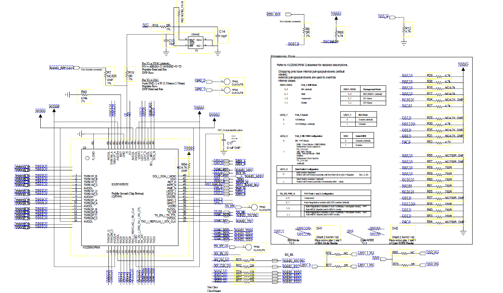
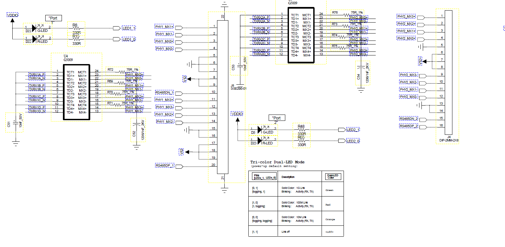
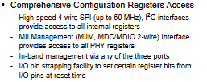
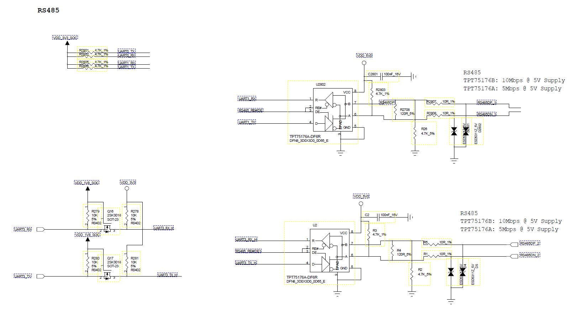
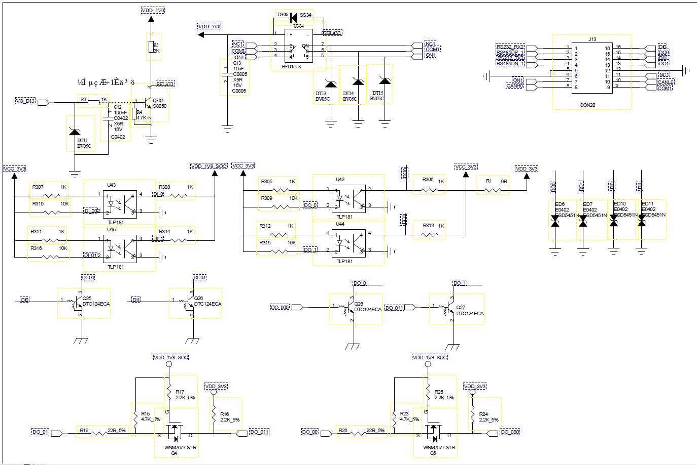
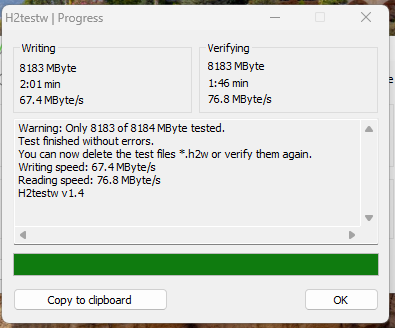
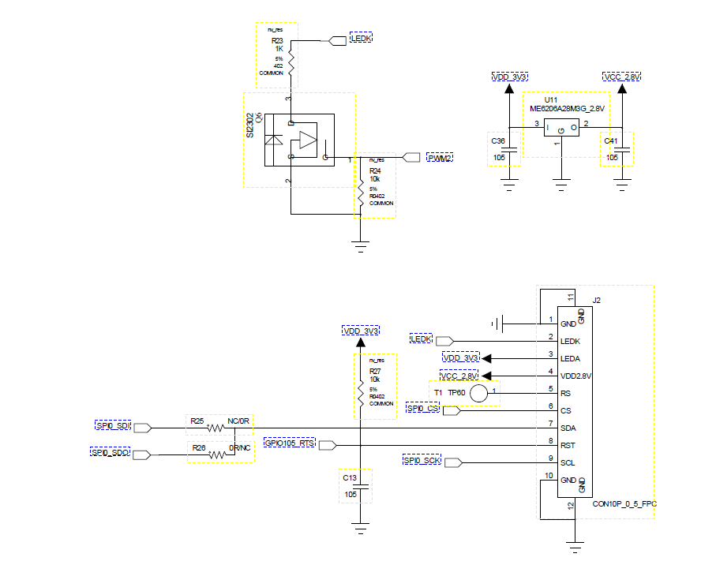

# BM1688 & CBV186AH 开发问题记录
## 2025-12-19
### 环境搭建
- 配置编译环境
- 源码拉取
- docker搭建
    使用docker环境，一般在docker环境内进行代码编译，在环境之外进行代码修改
### SDK文件结构
```
    top
    ├── build               ## 编译脚本集合
    ├── fsbl                ## ATF
    ├── host-tools ## 编译工具链
    ├── isp_tuning ## isp tuning工具
    ├── libsophon ## 多媒体 及tpu库
    ├── linux_5.10 ## linux内核
    ├── middleware ## isp库
    ├── osdrv ## 驱动
    ├── oss ## 开源代码库
    ├── ramdisk ## ram disk
    ├── sophon_media ## ffmpeg 与opencv库
    ├── u-boot-2021.10 ## uboot
    ├── libsophon ## tpu及tpu驱动
    ├── libsophon/libsophav ## 多媒体hal层
    └── ubuntu/bootloader-arm64 ##边侧文件系统依赖
```
### 编译
- 全部编译
    ```bash
    # 加载编译环境
    source build/envsetup.sh
    # 选择编译配置
    defconfig edge_wevb_defconfig
    # 清除所有旧编译生成
    clean_edge_all
    # 边侧全编
    ```
- 部分编译，可以在`source build/envsetup.sh`之后，查看源码
### 引脚复用换算
- 参考资料
    ```
    《BM1688 PINMUX切换指南_V1.1.pdf》
    《BM1688_PINOUT_CN_V1.4.xlsx》
    ```
1. 在Sophgo中，提供了`cvi_pinmux`的工具查看引脚复用
    ```bash
    cvi_pinmux for bm1688
    ./cvi_pinmux -p <== List all pins
    ./cvi_pinmux -l <== List all pins and its func
    ./cvi_pinmux -r pin <== Get func from pin
    ./cvi_pinmux -w pin/func <== Set func to pin
    ./cvi_pinmux -c <pin name>,<0 or 1 or 2> <== Set pin pull up/down (0:pull down; 1:pull up；2:pull off)
    ./cvi_pinmux -d <pin name>,<0 ~ 15> <== Set pin driving
    ```
2. 确认GPIO的组号和偏移位，32个GPIO为一组，有如下的换算公式
    ```bash
    # 公式
    gpio_num % 32 = base
    # 组号
    组号0 对应 Linux 组号值为480
    组号1 对应 Linux 组号值为448
    组号2 对应 Linux 组号值为416
    组号3 对应 Linux 组号值为384
    组号4 对应 Linux 组号值为352
    组号5 对应 Linux 组号值为320
    pwr_gpio 对应 Linux 组号值为288
    ```
3. 复用需要在`build/boards/default/u-boot/cv186x_bga_cvi_board_init.c`中声明
    ```c
	PINMUX_CONFIG(PIN_NAME, FUNC_NAME, GROUP):
    ```
    - PIN_NAME: 引脚名称，对应pinlist文档中第一列的Signal Name
    - FUNC_NAME: 引脚功能名称，对应pinlist文档中需要切换的功能
    - GROUP: 引脚组号，对应pinlist文档中的Group列
4. DTS中声明配置
    ```c
    # 106号脚，32 * 3 + 10 
    reset-gpios = <&portd 10 GPIO_ACTIVE_LOW>;
    ```
## 2025-12-29
### 网络交换机`KSZ9563`
- 参考资料
    ```
    《KSZ9563R-Data-Sheet-DS00002419.pdf》
    《EVB-KSZ9563-Schematic.pdf》
    ```
    [官方驱动](https://github.com/Microchip-Ethernet/EVB-KSZ9477/tree/master)
- 原理图
    
    
    在数据手册中，feture 中有明确有一段话
    
    I2C 和 SPI 可以访问所有内部寄存器，MDIO 可以访问所有PHY寄存器，要实现交换机功能，需要对寄存器全访问，所以硬件改成I2C，此外硬件必须确认RGMII时钟，TX/RX是否复合，从哪里输出输出，复位，中断
- 网络框架
    ```
        Linux
            |
        eth1  ← CPU port（RGMII）
            |
        KSZ9563
        |       |
    lan1      lan2   
    ```
    
1. `dts` 设备树配置部分
    ```c
	i2c_gpio_ksz: i2c_gpio_ksz9563 {
		compatible = "i2c-gpio";
		#address-cells = <1>;
        #size-cells = <0>;
		status = "okay";

		sda-gpios = <&portb 7 (GPIO_ACTIVE_HIGH | GPIO_OPEN_DRAIN)>;
		scl-gpios = <&portb 6 (GPIO_ACTIVE_HIGH | GPIO_OPEN_DRAIN)>;

		i2c-gpio,delay-us = <20>;

		ksz9563: ethernet-switch@5f {
			compatible = "microchip,ksz9563";
			reg = <0x5f>;
			status = "okay";
			dsa,member = <0 0>;
            # 指定复位脚和时序
			reset-gpios = <&portd 10 GPIO_ACTIVE_LOW>;
			reset-assert-us = <1000>;
            reset-deassert-us = <20000>;
            # 指定中断源
			interrupt-parent = <&portb>;
			interrupts = <5 IRQ_TYPE_LEVEL_LOW>;
			ports {
				#address-cells = <1>;
				#size-cells = <0>;
                # 外部PHY/网口
				port@0 {
					reg = <0>;
					label = "lan1";
				};
				port@1 {
					reg = <1>;
					label = "lan2";
				};
                # 内部CPU口
				port@2 {
					reg = <2>;
					label = "cpu";
					ethernet = <&ethernet1>;
					phy-mode = "rgmii-id";
					fixed-link {
						speed = <1000>;
						full-duplex;
						pause;
					};
				};
			};
		};
	};
    # 覆盖/补充MAC节点的接口模式和固定链路配置
    &ethernet1 {
        phy-mode = "rgmii-id";
        fixed-link {
            speed = <1000>;
            full-duplex;
            pause;
        };
    };
    ```
    - 由于硬件缺陷，所以这里需要用到软件模拟I2C，软件模拟I2C的配置可以参考`linux_5.10/Documentation/devicetree/bindings/i2c/i2c-gpio.yaml`，驱动为在`linux_5.10/include/linux/platform_data/i2c-gpio.h`、`linux_5.10/drivers/i2c/busses/i2c-gpio.c`
    - ksz9563的设备树配置需要参考`linux_5.10/net/dsa/dsa2.c`和`linux_5.10/drivers/net/dsa/microchip/ksz_common.c`
2. 引脚复用，在`build/boards/default/u-boot/cv186x_bga_cvi_board_init.c`需要指明引脚复用
    ```c
    // dsa-ksz9563
	PINMUX_CONFIG(CAN0_RX, GPIO106, G11);		// reset
	PINMUX_CONFIG(RGMII1_MDIO, GPIO39, G1);   	// sda
	PINMUX_CONFIG(RGMII1_MDC, GPIO38, G1);   	// scl
	PINMUX_CONFIG(RGMII1_IRQ, GPIO37, G1);		// irq
    ```
3. `Menuoncfig`配置，使用驱动需要在内核开启相应的配置
    ```bash
    # 
    # DSA
    #
    CONFIG_NET_DSA=y
    CONFIG_NET_DSA_MICROCHIP_KSZ_COMMON=y
    CONFIG_NET_DSA_MICROCHIP_KSZ9477=y
    CONFIG_NET_DSA_MICROCHIP_KSZ9477_I2C=y
    ```
    
4. 特殊修改，由于原厂默认使用1.8V对网口PHY供电，这个交换机IC需要3.3V，除了硬件需要修改，还需要在`fsbl/plat/cvitek/cv186x/common/cv_bl2_setup.c`修改电源配置
    ```c
    void config_rgmii_power(void)
    {
        mmio_write_32(0x281051e0, mmio_read_32(0x281051e0) & ~(0x300)); //RGMII 3.3V
        // mmio_write_32(0x281051e0, mmio_read_32(0x281051e0) | 0x300); //RGMII 1.8V
        mmio_write_32(0x281001cc, mmio_read_32(0x281001cc) | 0x101); //rx delay 2ns
    }
    ```
5. 功能验证
    1. 驱动检查
        - 查看内核
            ```bash
            dmesg | grep ksz
            ```
        - 查看看卡是否生成
            ```bash
            ip link show
            ```
    2. 修改系统的网络配置，让eth1不自动获取ip
        ```bash
        sudo vim /etc/netplan//01-netcfg.yaml

        network:
        version: 2
        renderer: networkd
        ethernets:
                eth1:
                        dhcp4: no
                        addresses: []
                        optional: yes
        ```
    2. 端口上网功能验证
        - DHCP 配置
            ```bash
            # 清除DHCP client进程
            pkill dhclient
            # 删除DHCP 租约文件
            sudo rm -f /var/lib/dhcp/dhclient*
            # 重启网络
            systemctl restart systemd-networkd
            ```
        - 清除网口配置
            ```bash
            sudo ip addr flush dev eth1
            sudo ip addr flush dev lan1
            sudo ip addr flush dev lan2
            sudo ip link set lan1 down
            sudo ip link set lan2 down
            sudo ip route flush table main
            sudo ip neigh flush all
            ```
        - 确认物理链路
            ```bash
            # 将lan2拉起
            sudo ip link set lan2 up
            # 查看 carrier / speed
            cat /sys/class/net/lan2/{operstate,carrier,speed,duplex}
            ```
        - 直接在 lan2 上做 DHCP
            ```bash
            sudo dhclient -v \
            -cf /dev/null \
            -lf /tmp/dhclient-lan2.leases \
            lan2
            ```
        - 抓包确认
            ```bash
            sudo tcpdump -i lan2 -n -e port 67 or port 68
            ```
    - 端口转发功能验证，框图如下
        ```
        上级交换机 / 路由器
                │
                │  网线
                ▼
        板 A ：J4（lan2）
                │  KSZ9563 内部交换
        板 A ：J8（lan1）
                ▼
        板 B ：J4（lan2）
                │
        板 B ：J8（lan1）→ 暂时不接
        ```
        - 不使用DHCP
            - 把板子的lan口都拉起起来
                ```bash
                sudo ip link set lan1 up
                sudo ip link set lan2 up
                sudo ip addr flush dev lan1
                sudo ip addr flush dev lan2
                ```
            - 确认板子的物理链路
                ```bash
                cat /sys/class/net/lan1/{carrier,speed}
                cat /sys/class/net/lan2/{carrier,speed}
                ```
            - 给板B的lan2配置一个静态ip
                ```bash
                sudo ip addr add 192.168.100.2/24 dev lan2
                sudo ip link set lan2 up
                ```
            - 给板A的lan2配置一个静态ip
                ```bash
                sudo ip addr add 192.168.100.1/24 dev lan2
                sudo ip link set lan2 up
                ```
            - 从板A ping 板B
        - 使用DHCP，在DSA架构下，DHCP一定要在DSA的slave口或者br-lan口上，不能再DSA的master口上
            - 建桥
                ```bash
                ip link add br-lan type bridge
                ip link set br-lan up
                ```
            - 加端口，获取ip
                ```bash
                ip link set lan1 up
                ip link set lan2 up
                ip link set lan1 master br-lan
                ip link set lan2 master br-lan
                dhclient br-lan
                ```
    - 排查命令
        ```
        # DSA 状态
        dmesg | grep -E "ksz|dsa|Link is"

        # 物理层
        cat /sys/class/net/lan2/carrier
        cat /sys/class/net/lan2/speed

        # 数据方向
        ethtool -S lan2 | egrep "rx_packets|tx_packets"

        # 二层
        bridge link
        bridge fdb show br br-lan

        # DHCP 抓包
        tcpdump -i br-lan -e -n

        ```
## 2026-01-07
### rs485调试
- 参考资料

- 原理图
    
- 通信框架
1. `dts` 设备树配置部分
2. 引脚复用，在`build/boards/default/u-boot/cv186x_bga_cvi_board_init.c`需要指明引脚复用
3. `Menuoncfig`配置，使用驱动需要在内核开启相应的配置
4. 功能验证
    - 手动操作IO
        ```bash
        echo 457 > /sys/class/gpio/export
        echo 460 > /sys/class/gpio/export
        echo out > /sys/class/gpio/gpio457/direction
        echo out > /sys/class/gpio/gpio460/direction
        echo 0 > /sys/class/gpio/gpio457/value
        echo 1 > /sys/class/gpio/gpio460/value
        # 高发
        echo "485 test" > /dev/ttyS3
        # 低收
        cat /dev/ttyS1
        ```
## 2026-01-09
### 一些名词
1. `NPU，Neural Processing Unit`
    神经网络推理加速器，跑 CNN / Transformer / YOLO / 分类 / 检测等模型
2. `TPU，Tensor Processing Unit`
    在 CVI / Sophgo 体系里，TPU 是对 NPU 的逻辑/软件层命名
3. `VPP，Video Post-Processing`
    视频后处理硬件模块
4. `ION，`
    ION 是 Linux 中专门为“硬件加速器 / 多设备共享”设计的一套内存分配与共享机制，
    用来解决 NPU / VPP / ISP / GPU / Codec 之间 零拷贝、安全、可控地共享大块内存 的问题

### 运行内存
- 参考资料
[算能官网内存资料](https://doc.sophgo.com/bm1688_sdk-docs/v2.1/docs_latest_release/docs/athena2-img/5_system_interface_usage.html#id2)
### 内存相关
- 查看系统内存
    ```bash
    $ free -h
    total        used        free      shared  buff/cache   available
    Mem:         2.0Gi       317Mi     1.4Gi   3.0Mi        339Mi        1.5Gi
    Swap:        0B          0B          0B
    ```
    - used: 正在使用的物理内存
    - free: 空闲的物理内存
    - shared: 正在使用的共享内存
    - buff/cache: 缓存和缓存
    - available: 可用的物理内存
- 查看ION内存
    ```bash
    $ cat /sys/kernel/debug/ion/cvi_npu_heap_dump/summary  | head -2
    [0] npu heap size:1610612736 bytes, used:0 bytes
    $ cat /sys/kernel/debug/ion/cvi_vpp_heap_dump/summary  | head -2
    [1] vpp heap size:4290772992 bytes, used:0 bytes
    ```
    如上，通常会有2个ION heap（即两块预留的内存区域），如名字所示，分别供TPU、VPP使用。以上示例中只打印了每个heap使用信息的开头，如果完整地`cat summary`文件，可以看到其中分配的每块buffer的地址和大小信息
- 内存配置，在1688中，DDR为4G的一般使用[`soph_default_memmap_4G.dtsi`](20260109/soph_default_memmap_4G.dtsi)，[`soph_default_memmap.dtsi`](20260109/soph_default_memmap.dtsi)一般给DDR大于4G的使用，具体解释可以查看相应的dtsi
- 查看内核kernel内存占用
    ```bash
    cat /proc/device-tree/memory@100000000/reg | hexdump -Cv 
    dmesg | grep -i "Memory:"
    ```
### 设备树切换
在算能的BM1688中，会配有不同规格的内存对应也有不同的设备树文件
```bash 
    BM1688_EDGEs_v2_1/build/boards/sophon/edge_wevb_emmc/dts_arm64$ ll |grep "se9v1*"
    -rw-rw-r-- 1 ubuntu ubuntu  3060 Nov 17 16:30 bm1688_se9v1_12G.dts
    -rw-rw-r-- 1 ubuntu ubuntu  3059 Nov 17 16:30 bm1688_se9v1_16G.dts
    -rw-rw-r-- 1 ubuntu ubuntu  3087 Dec 25 02:33 bm1688_se9v1_4G.dts
    -rw-rw-r-- 1 ubuntu ubuntu  4326 Jan  8 09:08 bm1688_se9v1_8G.dts
    -rw-rw-r-- 1 ubuntu ubuntu  3493 Nov 17 16:30 cv186ah_se9v1_12G.dts
    -rw-rw-r-- 1 ubuntu ubuntu  3493 Nov 17 16:30 cv186ah_se9v1_16G.dts
    -rw-rw-r-- 1 ubuntu ubuntu  3515 Nov 17 16:30 cv186ah_se9v1_4G.dts
    -rw-rw-r-- 1 ubuntu ubuntu  3540 Nov 17 16:30 cv186ah_se9v1_8G.dts
```
使用`dts_tool`可以在系统中切换设备树配置，然后重启，注意不要选错，如果选错可能会导致无法进入内核，只能在uboot手动指定dts
```bash
# linux
$ dts_tool 
# uboot
printenv
setenv DTS_TYPE dtb
bootd
```
设备树会作为一个字符传被写入到emmc中的`mmcblk0boot1`块中，在uboot中，会自动读取并加载
```bash
$ hexdump -C /dev/mmcblk0boot1
00000000  00 00 00 00 00 00 00 00  00 00 00 00 00 00 00 00  |................|
*
000000a0  62 6d 31 36 38 38 5f 73  65 39 76 31 5f 38 47 00  |bm1688_se9v1_8G.|
000000b0  00 00 00 00 00 00 00 00  00 00 00 00 00 00 00 00  |................|
*
000000f0  08 00 00 00 00 00 00 00  00 00 00 00 00 00 00 00  |................|
00000100  00 00 00 00 00 00 00 00  00 00 00 00 00 00 00 00  |................|
*
00400000
```
## 2026-01-12
### 工控接口
- 原理图
    
1. `dts` 设备树配置部分
2. 引脚复用，在`build/boards/default/u-boot/cv186x_bga_cvi_board_init.c`需要指明引脚复用
3. `Menuoncfig`配置，使用驱动需要在内核开启相应的配置
4. 功能验证
    对应的配置验证都在[test_zx.sh](20260112/test_zx.sh)
## 2026-01-14
### 银河麒麟系统制作
- 参考文档
    [算能打包工具链接](https://github.com/sophgo/sophon-tools/releases)
1. 准备外部存储，格式化
    ```bash
    lsblk
    mkfs.ext4 /dev/sda1
    ```
2. 创建并挂载目录
    ```bash
    cd /
    mkdir socrepack
    mount /dev/sda1 /socrepack
    chmod 777 socrepack
    cd socrepack
    ```
3. 上传打包工具，解压，然后打包
    ```bash
    unzip socbak.zip
    cd socbak 
    export SOC_BAK_ALL_IN_ONE=1
    bash socbak.sh
    ```
4. 执行成功后，刷机包在output下面
## 2026-05-06
### USB Gadget 功能设置
1688 有两个 USB 控制器，一个 USB3.0（OTG）是直接从主控出来的，可以用来做 `Device / Periphral / Gadget` 功能，在本机上使用 `39010000.usb`
- 驱动端提前设置为从模式，如果有 `vbus` 的引脚去控制切换主从模式也需要注册对应的引脚
    ```c
    &usbdrd3_0 {
        vbus-gpio = <&porte 1 GPIO_ACTIVE_HIGH>;
        usbdrd_dwc3_0: usb@39010000 {
            role-switch-default-mode = "device";
        };
    };
    ```
- 同时内核需要满足支持 `USB gadget` 功能
    ```bash
    zcat /proc/config.gz | grep -E "CONFIG_USB_CONFIG*"
    CONFIG_USB_CONFIGFS=y
    CONFIG_USB_CONFIGFS_ACM=y
    CONFIG_USB_CONFIGFS_RNDIS=y
    CONFIG_USB_CONFIGFS_MASS_STORAGE=y
    CONFIG_USB_CONFIGFS_F_FS=y
    CONFIG_USB_CONFIGFS_F_UVC=y
    CONFIG_USB_CONFIGFS_F_MTP=y
    ```
#### Rndis 网卡
本质是让板子伪装成一个 USB 网卡，PC 插上后把直接识别为网卡，主要干四件事，先把 `gadget` 设备壳子搭建起来，再创建一个 Rndis 功能函数，把这个功能挂到 USB 配置里，再绑定 UDC，下面是具体步骤
1. 确定 OTG 控制器 UDC 
    ```bash
    ll /sys/class/udc 
    ```
2. 挂载 configfs
    ```bash
    mkdir /tmp/usb
    mount none /tmp/usb -t configfs
    ```
    挂载后会出现 `/tmp/usb/usb_gadget` 这是 USB Gadget 的配置入口
3. 创建 gadget 设备，写入 USB 字符串描述符，PC 在设备管理器看到 USB 设备信息
    ```bash
    mkdir /tmp/usb/usb_gadget/cvitek

    echo 0x3346 > idVendor
    echo 0x1009 > idProduct
    ```
4. 创建 USB 配置 c.1，这里 `configs/c.1` 可以理解成一个USB设备的配置合集
    ```bash
    mkdir configs/c.1
    mkdir configs/c.1/strings/0x409 
    echo "config1" > configs/c.1/strings/0x409/configuration
    echo 120 > configs/c.1/MaxPower
    ```
5. 创建 RNDIS function
    ```bash
    mkdir functions/rndis.0

    echo 02:12:34:56:78:8a > functions/rndis.usb0/dev_addr
    echo 02:12:34:56:78:8b > functions/rndis.usb0/host_addr
    ```
6. 配置 Windows RNDIS os Descriptor，让 Windows 更容易识别为 RNDIS 网卡
    ```bash
    echo 1 > os_desc/use 
    echo 0xcd > os_desc/b_vendor_code
    echo MSFT100 > os_desc/qw_sign
    echo RNDIS > functions/rndis.0/os_desc/interface.rndis/compatible_id
    echo 5162001 > functions/rndis.usb0/os_desc/interface.rndis/sub_compatible_id

    ln -s configs/c.1 os_desc/c.1
    ```
7. 绑定 function 到 config 
    ```bash
    ln -s functions/rndis.usb0 configs/c.1 
    ```
    这时候的结构应该是
    ```bash
    /tmp/usb/usb_gadget/cvitek/
    ├── idVendor
    ├── idProduct
    ├── strings/0x409/
    ├── configs/c.1/
    │   └── rndis.usb0 -> ../../functions/rndis.usb0
    ├── functions/
    │   └── rndis.usb0/
    └── UDC
    ```
8. 绑定 UDC，PC 开始枚举
    ```bash
    echo 39010000.usb > /tmp/usb/usb_gadget/cvitek/UDC
    ```
#### Mass Storage 存储
Mass Storage 功能是把 USB 口模拟成 U盘，板子侧提供一个镜像文件，PC侧把他识别为一个 USB 存储设备
1. 先准备后端存储，如果使用独立分区就跳过
    ```bash
    dd if=/dev/zero of=/data/usb_disk.img bs=1M count=8192
    mkfs.vfat -F 32 -n BM1688_MSC /data/usb_disk.img
    ```
2. 挂载 configfs
    ```bash
    mkdir /tmp/usb
    mount none /tmp/usb -t configfs
    ```
    挂载后会出现 `/tmp/usb/usb_gadget`，这是 USB Gadget 的配置入口
3. 创建 gadget 设备，写入 USB 字符串描述符，PC 在设备管理器看到 USB 设备信息
    ```bash
    mkdir /tmp/usb/usb_gadget/cvitek
    cd /tmp/usb/usb_gadget/cvitek

    echo 0x3346 > idVendor
    echo 0x1008 > idProduct

    mkdir strings/0x409
    echo "Cvitek" > strings/0x409/manufacturer
    echo "BM1688 Mass Storage" > strings/0x409/product
    echo "0123456789" > strings/0x409/serialnumber
    ```
4. 创建 USB 配置 `c.1`，这里 `configs/c.1` 可以理解成一个 USB 设备的配置合集
    ```bash
    mkdir configs/c.1
    mkdir configs/c.1/strings/0x409
    echo "config1" > configs/c.1/strings/0x409/configuration
    echo 120 > configs/c.1/MaxPower
    ```
5. 创建 Mass Storage function
    ```bash
    mkdir functions/mass_storage.usb0
    ```
6. 给 `lun.0` 绑定后端存储
    ```bash
    echo /data/usb_disk.img > functions/mass_storage.usb0/lun.0/file
    ```
    如果不是导出镜像文件，而是导出独立分区，也可以直接写块设备，比如
    ```bash
    echo /dev/mmcblk0p8 > functions/mass_storage.usb0/lun.0/file
    ```
7. 配置 MSC 关键参数
    ```bash
    echo 0 > functions/mass_storage.usb0/lun.0/ro
    echo 0 > functions/mass_storage.usb0/lun.0/removable
    echo 1 > functions/mass_storage.usb0/lun.0/nofua
    ```
    - `ro=0` 表示允许 PC 写入
    - `removable=0` 表示让 PC 当成固定盘处理
    - `nofua=1` 表示忽略主机 FUA 强制落盘请求，通常能提高写入速度，但要求 PC 侧先安全弹出
8. 绑定 function 到 config
    ```bash
    ln -s functions/mass_storage.usb0 configs/c.1
    ```
    这时候的结构应该是
    ```bash
    /tmp/usb/usb_gadget/cvitek/
    ├── idVendor
    ├── idProduct
    ├── strings/0x409/
    ├── configs/c.1/
    │   └── mass_storage.usb0 -> ../../functions/mass_storage.usb0
    ├── functions/
    │   └── mass_storage.usb0/
    └── UDC
    ```
9. 绑定 UDC，PC 开始枚举
    ```bash
    echo 39010000.usb > /tmp/usb/usb_gadget/cvitek/UDC
    ```
10. 如果要停止导出，先解绑 UDC，再清理 function
    ```bash
    echo "" > /tmp/usb/usb_gadget/cvitek/UDC
    rm /tmp/usb/usb_gadget/cvitek/configs/c.1/mass_storage.usb0
    echo "" > /tmp/usb/usb_gadget/cvitek/functions/mass_storage.usb0/lun.0/file
    ```
#### 分区修改
尝试直接在系统初始化时直接给 Mass Storage 分配内存，然后直接挂载就好，对应SDK，分区大小的设置在[partition32G.xml](20260506/partition32G.xml)，系统的分区设置在[fstab.emmc.sd](20260506/fstab.emmc.ro)，这两个文件每一行都是一一对应的，下面时对应内容的解析
1. 总可以分配的物理空间，按 `KB/KiB` 计量
    ```xml
    <physical_partition size_in_kb="24784848"> 
    ```
2. 创建分区，分配内存
    ```xml
	<partition label=xxx       size_in_kb=xxx readonly=xxx  format=xxx />
    ```
    - `label` 分区名，后续会映射成实际分区用途
    - `size_in_kb` 分区大小
    - `readonly` 是否只读
    - `format` 分区格式类型编号，1 对应 vfat，2 对应 ext4，0 对应不建文件系统
### 读写速率测试
由于存储的介质是 emmc ，所以先通过 `fio` 对 emmc 进行读写速率测试，在对 msc 功能进行读写测试
1. 前提准备，停止 gadget 功能，安装 `fio`
    ```bash
    run_usb.sh stop 
    apt update 
    apt install fio -y 
    ```
2. 只读测试，看结果 `READ: bw=xxxMiB/s`
    ```bash
    sync
    echo 3 > /proc/sys/vm/drop_caches
    fio --name=emmc_p6_seq_read \
    --filename=/dev/mmcblk0p6 \
    --readonly \
    --rw=read \
    --bs=1M \
    --size=7G \
    --direct=1 \
    --ioengine=libaio \
    --iodepth=16 \
    --numjobs=1 \
    --group_reporting 
    ```
3. 裸分区顺序写测试，看结果 `WRITE: bw=xxxMiB/s`
    ```bash
    sync
    echo 3 > /proc/sys/vm/drop_caches
    fio --name=emmc_p6_seq_write \  
    --filename=/dev/mmcblk0p6 \
    --rw=write \
    --bs=1M \
    --size=7G \
    --direct=1 \、
    --ioengine=libaio \
    --iodepth=16 \
    --numjobs=1 \
    --group_reporting
    ```
4. 写完后再测读
    ```bash
    sync
    echo 3 > /proc/sys/vm/drop_caches

    fio --name=emmc_p6_seq_read_after_write \
        --filename=/dev/mmcblk0p6 \
        --readonly \
        --rw=read \
        --bs=1M \
        --size=7G \
        --direct=1 \
        --ioengine=libaio \
        --iodepth=16 \
        --numjobs=1 \
        --group_reporting
    ```
4. PC 上使用[h2testw](https://github.com/hotnix87/h2testw.git) 对 识别到的U盘进行测试
    
### 集成
将 usb gadget 的功能，每次开机都自动挂载，这样就能使每次上电接入PC或者其他主机设备都可以识别到设备，具体见[run_usb.sh](20260506/run_usb.sh)、[usb_gadget_init.sh](20260506/usb_gadget_init.sh)、[usb_gadget_init.service](20260506/usb_gadget_init.service)，记得对`service`进行软链接
## 2026-05-20
### 打包固件出现内存不足
1. 查看包的大小
    ```bash 
    ls -lh install/soc_edge_wevb_emmc/package_edge/rootfs.tgz
    ls -lh install/soc_edge_wevb_emmc/package_edge/rootfs_rw.tgz
    ```
2. 计算建议分区大小
    ```bash
    # rootfs.tgz 字节数
    ROOTFS_TGZ=$(stat -c%s install/soc_edge_wevb_emmc/package_edge/rootfs.tgz)
    # 建议：按 2.2 倍 + 512MB 余量（ext4 解包+元数据要空间）
    ROOTFS_KB=$(( ROOTFS_TGZ * 22 / 10 / 1024 + 524288 ))
    echo "建议 ROOTFS size_in_kb=$ROOTFS_KB"
    ```
3. 修改分区表，总量校验，加多少减多少
    ```bash 
    <physical_partition size_in_kb="24784848">
        <partition label="BOOT"       size_in_kb="131072"  readonly="false"  format="1" />
        <partition label="RECOVERY"   size_in_kb="131072"  readonly="false"  format="2" />
        <partition label="MISC"       size_in_kb="10240"   readonly="false"  format="0" />
    -	<partition label="ROOTFS"     size_in_kb="3145728" readonly="true"   format="2" />
    -	<partition label="ROOTFS_RW"  size_in_kb="9291456" readonly="false"  format="2" />
    +	<partition label="ROOTFS"     size_in_kb="6924056" readonly="true"   format="2" />
    +	<partition label="ROOTFS_RW"  size_in_kb="5513128" readonly="false"  format="2" />
        <partition label="MSC"        size_in_kb="8388608" readonly="false"  format="1" />
        <partition label="DATA"       size_in_kb="4194304" readonly="false"  format="2" />
    </physical_partition>
    ```
4. 删除残留，重新打包
    ```bash
    rm -rf install/soc_edge_wevb_emmc/package_edge/sdcard
    rm -rf install/soc_edge_wevb_emmc/package_update
    rm -f  install/soc_edge_wevb_emmc/sdcard.tgz
    ```
## 2026-05-21
[0001-build-Integrate-clawstar-application.patch](20260521\0001-build-Integrate-clawstar-application.patch)
[0001-ubuntu-Integrate-clawstar-application.patch](Sophgo\BM1688_CV186AH_Develop_Recorder\20260521\0001-ubuntu-Integrate-clawstar-application.patch)
### 集成龙虾应用
龙虾具体应用的内容在[star-llm](20260521/star-llm/)目录下面，主要包含 API 服务、推理 pipeline、模型配置文件、Python 依赖安装脚本以及 systemd 服务配置。集成目标是在系统启动后自动初始化运行环境，并启动 `star-llm` API 服务
#### 构建侧修改
在 `build/envsetup_soc.sh` 中增加 Ubuntu rootfs 构建阶段的网络环境处理：

1. 将宿主机 `/etc/resolv.conf` 拷贝到 chroot 环境，避免 chroot 内 DNS 解析失败。
2. 增加 apt 网络配置，强制使用 IPv4，并设置重试次数。
3. 将 Ubuntu ARM 软件源从 `ports.ubuntu.com` 替换为阿里云镜像，提升国内网络环境下的下载稳定性。
4. 在 rootfs 构建阶段预装 `dnsmasq`、`curl`、`ca-certificates`。
5. 安装 `uv` 到 `/usr/local/bin`，后续用于创建 Python 虚拟环境和安装依赖。

在打包阶段，将 `ubuntu/bootloader-arm64/third-part/star-llm` 拷贝到 overlay 的：
```bash
/opt/tunstar/star-llm
```
#### 分区修改
由于集成 `star-llm` 后根文件系统的体积明显变大，原有的根文件系统分区空间不足，因此需要调整 `scripts/partition32G.xml`，增大 `ROOTFS`，相应减小 `ROOTFS_RW`
```bash
<partition label="ROOTFS"     size_in_kb="6924056" readonly="true"   format="2" />
<partition label="ROOTFS_RW"  size_in_kb="5513128" readonly="false"  format="2" />
```
#### Ubuntu Overlay 修改
在 Ubuntu overlay 中增加龙虾应用相关启动配置：
1. 新增 `star-llm-init.service` ，用于首次启动时创建 Python 虚拟环境并安装依赖。
2. 新增 `star-llm.service`，用于启动 FastAPI 服务。
3. 通过 `multi-user.target.wants/star-llm.service` 设置开机自启动。
4. 新增 `/usr/sbin/star_llm_init.sh`，使用 uv 创建虚拟环境，并安装 fastapi、uvicorn、numpy、pillow、transformers、torch 等依赖。

模型路径通过`.env`中的`MODEL_PATH`配置
#### USB 网络配置
为了让PC通过USB RNDIS访问半段服务，就 `usb0` 改为固定地址
```yaml
usb0:
    dhcp4: no
    addresses: [192.168.188.1/24]
```
同时新增 `dnsmasq` 配置，只监听 `usb0`
#### 验证方法
刷机升级启动后，通过
```bash 
systemctl status star-llm-init.service
systemctl status star-llm.service
```
确认服务状态，如果服务没有启动查看日志
```bash
journalctl -u star-llm-init.service -b
journalctl -u star-llm.service -b
```
尝试访问模型
```bash
curl -s http://127.0.0.1:12658/v1/chat/completions \
  -H 'Content-Type: application/json' \
  -d '{"model":"qwen3_5","messages":[{"role":"user","content":"你好"}],"stream":false}'
```

## 2026-06-22
### RTL8822CU 联网
- 拉起 WiFi
    ``` 
    ifconfig wlan0 up
    ```
- 扫描网络
    ```` 
    iw dev wlan0 scan 
    ````
- Wifi 配置
    ``` 
    cat > /etc/wpa_supplicant.conf <<'EOF'
    ctrl_interface=/var/run/wpa_supplicant
    update_config=1
    country=CN

    network={
        ssid="ZX88888-5G"
        psk="zx888888"
        key_mgmt=WPA-PSK
    }
    EOF
    ```
- 链接 Wifi 
    ``` 
    wpa_supplicant -B -i wlan0 -c /etc/wpa_supplicant.conf
    wpa_cli -i wlan0 status
    ```
- 获取 IP
    ``` 
    dhclient -v wlan0
    ```
### 更改系统网络管理方式
默认情况下，系统的网络管理方式是 `systemd-networkd`，之前调试 Wi-Fi 模组的时候手写 `wpa_supplicant`，为了方便管理 Wi-Fi 的模式，切换到 `NetworkManager` 去统一管理
1. 安装网络管理工具
    ```bash
    apt update
    apt install network-manager wpasupplicant 
    ```
2. 修改`/etc/netplan/01-netcfg.yaml` 中的网络管理方式
    ```yaml
    renderer: NetworkManager
    ```
3. 停启用相关服务
    ```bash
    systemctl disable systemd-networkd.service
    systemctl disable systemd-networkd-wait-online.service
    systemctl disable dhclient.service
    systemctl stop systemd-networkd.service
    systemctl stop systemd-networkd-wait-online.service
    systemctl stop dhclient.service

    systemctl enable NetworkManager.service
    systemctl start NetworkManager.service
    ```
###  应用设置
这个板子有一个需求，就是在默认情况下，Wi-Fi 处于 AP 模式，可以通过网络配置网络使设备链接网络上网，设备处于 STA 模式，设备会重试机制，如果没有已知的网络就会处于 AP 模式，如果有已知的网络但是连不上重试失败后也会切换到 AP 模式，大致做法是在系统添加一个服务 [/etc/systemd/system/wifi-provision.service](20260622/wifi-provision.service) 和 修改一个服务 [/etc/systemd/system/wpa_supplicant.service](20260622/wpa_supplicant.service) 去管理设备的模式，[/usr/share/wifi-provision/index.html](20260622/index.html) 去做简易前端页面配置，[/usr/sbin/wifi-provision.py] 做后端服务配置，[/etc/wifi-provision/config] 包含了运行参数配置

## 2026-06-23
### HUSB311 USB 转换芯片
### RNDIS + MSC + ADB 配置
## 2026-06-25
### 5 个 GPIO LED 控制 + ADC 电量检测
### PWM 温控风扇
## 2026-06-27
### GC9A01 屏幕调试
#### 驱动调试
- 调试目标
    移植 GC9A01 BOE 1.28 寸圆屏到 Linux 5.10，接口为 SPI，最终提供 `/dev/fb0` 给应用和对应图形库使用。
- 屏幕参数
    屏幕基本参数：
    - IC：GC9A01
    - 分辨率：240x240
    - 接口：4-wire SPI
    - 颜色格式：RGB565
    - 背光：GPIO 拉高
    - 显示接口：DRM tiny + MIPI DBI + fbdev emulation
- 原理图
       
    注：SPI0_SDI 需要链接到 DC/RS 脚上，开始调试时候发现这跟线没有接导致没有显示
1. `dts` 设备树配置
    ```c
    &spi0 {
        status = "okay";
        cs-gpios = <&portd 11 GPIO_ACTIVE_LOW>;
        num-cs = <1>;
        /* 最初 spi0 上已有 spidev@0，屏幕也挂在 reg = <0>，
        * 会和屏幕驱动抢同一个 CS，所以需要删除原来的节点 
        */
        /delete-node/ spidev@0;

        display@0 {
            compatible = "hynetek,gc9a01-boe-1.28";
            reg = <0>;
            spi-max-frequency = <4000000>;

            reset-gpios = <&portd 9 GPIO_ACTIVE_HIGH>;       /* GPIO105, RST, H-L-H reset sequence */
            dc-gpios = <&portd 12 GPIO_ACTIVE_HIGH>;         /* GPIO108, SPI0_SDI */
            backlight-gpios = <&portc 13 GPIO_ACTIVE_HIGH>;  /* GPIO77 / PWM2 */
            rotation = <0>;
        };
    };

    ```
2. `PINMUX` 引脚复用设置
    ```c
    PINMUX_CONFIG(SPI0_CS_X, GPIO107, G9);
	PINMUX_CONFIG(SPI0_SDI, GPIO108, G9);
	PINMUX_CONFIG(SPI0_SDO, SPI0_SDO, G9);
	PINMUX_CONFIG(SPI0_SCK, SPI0_SCK, G9);
	PINMUX_CONFIG(CAN0_TX, GPIO105, G11);
	PINMUX_CONFIG(PWM2, GPIO77, G9);
    ```
3. `defconfig` 内核宏配置
    ```bash
    CONFIG_BACKLIGHT_CLASS_DEVICE=y
    CONFIG_DRM_MIPI_DBI=y
    CONFIG_TINYDRM_GC9A01=y
    CONFIG_DRM_FBDEV_EMULATION=y
    ```
4. [linux_5.10/drivers/gpu/drm/tiny/gc9a01.c](20260627\gc9a01.c) 驱动源码，提供五个调试参数`slow_byte`、`rotation`、`dc_invert`、`spi_mode`、`test_pattern`
#### 驱动调试具体情况
1. 花屏/马赛克问题，最开始屏幕挂载驱动后屏幕变白，然后慢慢变灰，然后就是马赛克的情况，最后就是条纹的状况，还有写 fb 没有变化
    - 排查方向
        - 厂家提醒
            1. 0x89 是 GC9A01 厂商扩展寄存器，和 SPI 数据通道/接口模式有关，不要开双通道，板子只有一路 SDA/MOSI
            2. 像素格式寄存器 0x3a 如果写 0x05 的话就改成 0x55 试下
        - cs 控制问题
            1. 硬件 SPI 的话 CS 这个 IO 就交由 SPI 控制器自己控制硬件 CS，软件模拟的话则需要手动控制
            2. CS 低有效，传输时拉低，传输结束拉高，不能随便一直拉低
2. `framebuffer` 刷新不完整，出现刷屏只刷一半，底部慢慢刷满，就颜色残留，局部保留错误颜色
    - 排查方向
        - 默认 `mipi_dbi_pipe_update` 只刷 damage rect SPI 屏没有显存同步/局部刷新时容易残留
            1. 自定义 `gc9a01_flush_full()`，`pipe_update` 中强制全局刷新，分块发送 RGB565 数据
### LVGL 图形库接入
GC9A01 驱动通过 DRM fbdev emulation 向应用层提供 `/dev/fb0`，因此 LVGL 应用不需要直接操作 SPI、DC/RS、CS、RST、背光等硬件接口，只需要把图像数据写入 framebuffer。

显示链路如下：
```text
LVGL 应用
  -> /dev/fb0
  -> DRM fbdev emulation
  -> DRM tiny gc9a01 driver
  -> MIPI DBI
  -> SPI0
  -> GC9A01 屏幕
```
#### 1. framebuffer 参数
驱动注册成功后，系统会生成 `/dev/fb0`。

当前屏幕参数：
```text
分辨率：240 x 240
颜色深度：16 bpp
颜色格式：RGB565
line_length：480
显存大小：115200 bytes
```
其中：
```text
240 * 240 * 2 = 115200 bytes
```
应用可以通过 `FBIOGET_FSCREENINFO` 和 `FBIOGET_VSCREENINFO` 获取 framebuffer 参数，不建议在应用中完全写死。
#### 2. LVGL 和 framebuffer 的关系

LVGL 本身不会直接把内容画到硬件屏幕。  
它会先把需要刷新的区域画到自己的 `draw buffer`，然后调用用户注册的 `flush_cb()`。
`flush_cb()` 的作用是把 LVGL 画好的区域提交到真正的显示缓冲区。
在本项目中：

```text
flush = 将 LVGL draw buffer 中的 RGB565 像素数据拷贝到 /dev/fb0
```
所以 LVGL 接入 framebuffer 时，需要完成：
```text
1. mmap /dev/fb0
2. 配置 LVGL draw buffer
3. 注册 flush_cb
4. 在 flush_cb 中把 px_map 拷贝到 framebuffer
5. 调用 lv_display_flush_ready()
```
#### 3. 颜色格式注意事项
GC9A01 当前使用 RGB565，因此 LVGL 也必须配置为 RGB565。
LVGL v9 中需要设置：
```c
lv_display_set_color_format(disp, LV_COLOR_FORMAT_RGB565);
```
`flush_cb()` 中的像素数据也应按 RGB565 处理：
```c
const uint16_t *src = (const uint16_t *)px_map;
```
如果 LVGL 颜色格式和屏幕颜色格式不一致，容易出现：
```text
颜色异常
红蓝反
横条纹
马赛克
背景显示错乱
```
#### 4. line_length 注意事项
写 framebuffer 时需要使用内核返回的 `line_length`，不要简单认为一行一定是：
```text
width * bytes_per_pixel
```
当前屏幕刚好是：
```text
240 * 2 = 480
```
但代码中仍建议使用：
```text
finfo.line_length
```
这样 framebuffer 后续即使存在行对齐或 padding，应用也不会写错位置。
#### 5. 屏幕旋转
屏幕方向建议由驱动或设备树处理：
```dts
rotation = <0>;
```
驱动内部通过 GC9A01 的 `MADCTL / 0x36` 寄存器配置扫描方向。  
LVGL 应用层只需要按照 `240x240` 正常绘制。
如果驱动和 LVGL 同时做旋转，可能导致方向不符合预期，因此当前建议：
```text
驱动负责屏幕硬件方向
LVGL 负责 UI 绘制
```
#### 6. 接入验证
驱动启动后先确认 framebuffer 是否存在：
```bash
ls -l /dev/fb0
cat /proc/fb
```
再使用测试程序确认 framebuffer 可以正常刷色：
```bash
/mnt/system/gc9a01_fb_test /dev/fb0
```
最后运行 LVGL demo：
```bash
/mnt/system/gc9a01_lvgl_demo /dev/fb0
```
预期结果：
```text
1. /dev/fb0 存在
2. framebuffer 测试程序可以完整刷红、绿、蓝、白
3. LVGL demo 能正常显示 UI
4. 无明显马赛克、花屏、半屏残留
```
#### 7. 常见问题
- 如果没有 `/dev/fb0`，优先检查 GC9A01 驱动是否注册成功。
- 如果颜色异常，优先检查 LVGL 是否配置为 RGB565。
- 如果画面有残留，优先检查驱动是否完整刷新 framebuffer。
- 如果渐变背景有轻微条纹，可能是 RGB565 色深限制或拍照摩尔纹，不一定是驱动异常。