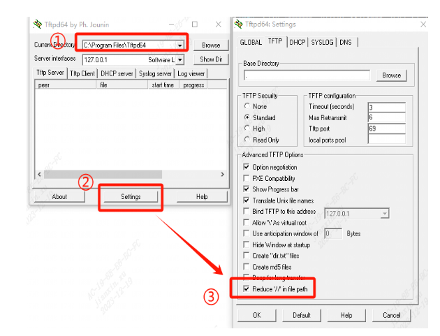
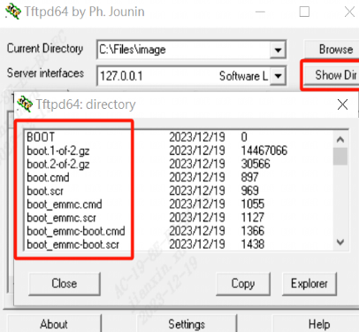

# 算能软件更新方式
## 整包升级 
### SDcard 升级
SDCard 升级需要将SD卡格式化为`FAT32`格式，大小1GB以上，刷机包一般都在`<SDK>/install`目录下，将下载到的`sdcard.tgz`解压到SD卡根目录下面，将设备断电，插入SD卡并连接串口终端，自动进入刷机流程，结束后会看到拔掉SD卡并重启设备的提示，依照操作执行就好了
### USB 升级
### TFTP 升级
首先Window或者Linux系统安装TFTP服务
- Window下，需要下载tftp工具`https://pjo2.github.io/tftpd64/`
    
    1. `Current Directory`设置为进行tftp文件传输的路径
    2. 在设置里面勾选`Reduce // in the path` 
    3. 检查目录内容
    
    4. 在设备端，进入U-Boot模式
        ```bash
        setenv serverip 192.168.5.223
        dhcp
        tftp ${scriptaddr}  boot.scr
        source ${scriptaddr} 
        ```

- Linux下，使用TFTP升级
    1. 安装TFTP工具
        ```bash
        sudo apt-get update
        sudo apt-get install tftp-hpa tftpd-hpa
        ```
    2. 配置TFTP服务，编写`/etc/default/tftpd-hpa`文件
        ```bash
        # /etc/default/tftpd-hpa
        TFTP_USERNAME="tftp"
        TFTP_DIRECTORY="/srv/tftp"
        TFTP_ADDRESS=":69" 
        TFTP_OPTIONS="--secure"
        ```
    3. 将TFTP升级的内容放到`/srv/tftp`目录下
        ```bash
        cp -r install/soc_edge_wevb_emmc/package_edge/tftp/* /srv/tftp/
        ```
    4. 在设备端，进入U-Boot模式
        ```bash
        setenv serverip 192.168.5.223
        dhcp
        # 一定要测试网络联通性
        ping ${serverip}
        tftp ${scriptaddr}  boot.scr
        source ${scriptaddr} 
        ```
**0x120000000 对应1688的地址**
**0x310000000 对应1684的地址**

### OTA 升级 
## 部分更新
### 更新u-boot
- 拉取编译更新之后的`fip.bin`到当前目录
    ```bash
    scp ubuntu@192.168.5.223:/home/ubuntu/workspace/Sophgo/bm1688/BM1688_EDGEs_v2_1/install/soc_edge_wevb_emmc/fip.bin .
    scp lzx@192.168.5.223:/home/lzx/work/SOPHGO/BM1688/v1_9/1688_v1.9_source/fsbl/build/edge_wevb_emmc/fip.bin .
    ```
- 在当前目录下执行
    ```bash
    # 拉取方式任意
    sudo bash << 'EOF'
    echo 0 > /sys/block/mmcblk0boot0/force_ro
    dd if=./fip.bin of=/dev/mmcblk0boot0 bs=512 count=2048
    sync
    echo 1 > /sys/block/mmcblk0boot0/force_ro
    reboot
    EOF
    ```

### 更新kernel
#### BM1688
- 拉取编译更新之后的`boot.itb`替换原有的`/boot/boot.itb`
    ```bash
    # 拉取方式任意
    scp ubuntu@192.168.5.223:/home/ubuntu/workspace/Sophgo/bm1688/BM1688_EDGEs_v2_1/ramdisk/build/edge_wevb_emmc/workspace/boot.itb /boot/boot.itb
    scp lzx@192.168.5.223:/home/lzx/work/SOPHGO/BM1688/v1_9/1688_v1.9_source/ramdisk/build/edge_wevb_emmc/workspace/boot.itb /boot/boot.itb
    ```
#### BM1684X
- 拉取编译更新之后的`emmcboot.itb`替换原有的`/boot/emmcboot.itb`
    ```bash 
    # 拉取方式任意
    scp ubuntu@192.168.5.223:/data/users/ubuntu/workspace/Sophgo/bm1684/bm1684x_v23_09/neutral_version/install/soc_bm1684/emmcboot.itb /boot/emmcboot.itb
    ```
- 重启
### uboot 更换DTS
```
setenv DTS_TYPE dtb
bootd
``` 
